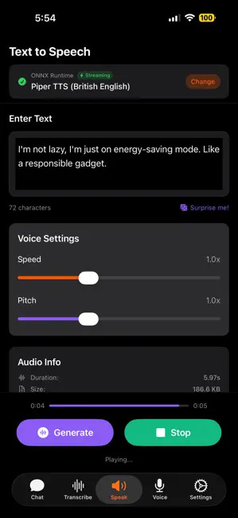
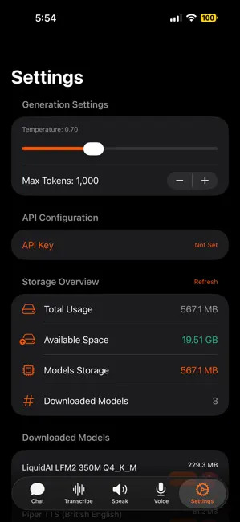

# RunAnywhere SDKs

<p align="center">
  
</p>

[](https://opensource.org/licenses/Apache-2.0)
[](sdk/runanywhere-swift/)
[](sdk/runanywhere-kotlin/)
[](sdk/runanywhere-react-native/)
[](sdk/runanywhere-flutter/)
[](https://github.com/RunanywhereAI/runanywhere-sdks)

**Privacy-first, on-device AI SDKs** that bring powerful language models directly to your mobile applications. RunAnywhere enables intelligent AI execution with automatic optimization for performance, privacy, and user experience across iOS, Android, React Native, and Flutter.

## 🚀 Current Status

### ✅ iOS SDK - **Available**
The iOS SDK provides high-performance on-device text generation, complete voice AI pipeline with VAD/STT/LLM/TTS, structured outputs with type-safe JSON generation, and thinking model support for privacy-first AI applications. [View iOS SDK →](sdk/runanywhere-swift/)

### ✅ Android SDK - **Available**
The Android Kotlin Multiplatform SDK provides high-performance on-device text generation with streaming support, comprehensive model management, structured outputs with JSON generation, and thinking model support for privacy-first AI applications. [View Android SDK →](sdk/runanywhere-kotlin/)

### 🧪 React Native SDK - **Beta**
The React Native SDK brings on-device AI to cross-platform mobile apps with a TypeScript API, native bridges using Nitrogen/Nitro for performance, and support for LLM, STT, TTS, and VAD capabilities. [View React Native SDK →](sdk/runanywhere-react-native/)

### 🧪 Flutter SDK - **Beta**
The Flutter SDK provides Dart bindings for on-device AI with platform channels for native communication. [View Flutter SDK →](sdk/runanywhere-flutter/)

## 🎯 See It In Action

<p align="center">
  <a href="https://www.youtube.com/watch?v=GG100ijJHl4">
    
  </a>
  <a href="https://testflight.apple.com/join/xc4HVVJE">
    
  </a>
  <a href="https://runanywhere.ai">
    
  </a>
</p>

<p align="center">
  
  
  
  
</p>

## 📦 What's Included

### iOS Components (Available Now)
- **[iOS SDK](sdk/runanywhere-swift/)** - Swift Package with comprehensive on-device AI capabilities
- **[iOS Demo App](examples/ios/RunAnywhereAI/)** - Full-featured sample app showcasing all SDK features

### Android Components (Available Now)
- **[Android SDK](sdk/runanywhere-kotlin/)** - Kotlin Multiplatform SDK with JVM and Android targets
- **[Android Demo App](examples/android/RunAnywhereAI/)** - Full-featured sample app showcasing text generation

### React Native Components (Beta)
- **[React Native SDK](sdk/runanywhere-react-native/)** - TypeScript SDK with native bridges for iOS and Android
- **[React Native Demo App](examples/react-native/RunAnywhereAI/)** - Sample app demonstrating chat, voice, and analytics features

### Flutter Components (Beta)
- **[Flutter SDK](sdk/runanywhere-flutter/)** - Dart SDK with platform channels for iOS and Android
- **[Flutter Demo App](examples/flutter/RunAnywhereAI/)** - Sample app demonstrating SDK features

## ✨ SDK Features

### iOS SDK Features

#### Core Capabilities
- **💬 Text Generation** - High-performance on-device text generation with streaming support
- **🎙️ Voice AI Pipeline** - Complete voice workflow with VAD, STT, LLM, and TTS components
- **📋 Structured Outputs** - Type-safe JSON generation with schema validation using `Generatable` protocol
- **🧠 Thinking Models** - Support for models with thinking tags (`<think>...</think>`)
- **🏗️ Model Management** - Automatic model discovery, downloading, and lifecycle management
- **📊 Performance Analytics** - Real-time metrics with comprehensive event system
- **🎯 Intelligent Routing** - Automatic on-device vs cloud decision making

#### Technical Highlights
- **🔒 Privacy-First** - All processing happens on-device by default with intelligent cloud routing
- **🚀 Multi-Framework** - GGUF (llama.cpp), Apple Foundation Models, WhisperKit, Core ML, MLX, TensorFlow Lite
- **⚡ Native Performance** - Optimized for Apple Silicon with Metal and Neural Engine acceleration
- **🧠 Smart Memory** - Automatic memory optimization, cleanup, and pressure handling
- **📱 Cross-Platform** - iOS 16.0+, macOS 12.0+, tvOS 14.0+, watchOS 7.0+
- **🎛️ Component Architecture** - Modular components for flexible AI pipeline construction

### Android SDK Features

#### Core Capabilities
- **💬 Text Generation** - High-performance on-device text generation with streaming support via Kotlin Flow
- **📋 Structured Outputs** - Type-safe JSON generation with schema validation
- **🧠 Thinking Models** - Support for models with thinking tags (`<think>...</think>`)
- **🏗️ Model Management** - Automatic model discovery, downloading with progress tracking, and lifecycle management
- **📊 Performance Analytics** - Real-time metrics with comprehensive event system
- **🔐 Device Registration** - Lazy device registration with automatic retry logic

#### Technical Highlights
- **🔒 Privacy-First** - All processing happens on-device by default
- **🚀 GGUF Support** - llama.cpp integration for quantized models (GGUF/GGML)
- **⚡ Native Performance** - JNI-based native integration for optimal performance
- **🔄 Kotlin Flow** - Modern reactive streams for streaming generation
- **📱 Cross-Platform** - Android 7.0+ (API 24+), JVM desktop applications
- **🎛️ Component Architecture** - Modular LLM components with provider pattern
- **✅ SHA-256 Verification** - Automatic model integrity checking on download

## 🗺️ Roadmap

### Next Release
- [ ] **Android SDK** - Full parity with iOS features
- [ ] **Hybrid Routing** - Intelligent on-device + cloud execution
- [ ] **Advanced Analytics** - Usage insights and performance dashboards

### Upcoming Features
- [ ] **Remote Configuration** - Dynamic model and routing updates
- [ ] **Enterprise Features** - Team management and usage controls
- [ ] **Extended Model Support** - ONNX, TensorFlow Lite, Core ML optimizations

### Future Vision
- [ ] **Multi-Modal Support** - Image and audio understanding

## 🚀 Quick Start

### iOS SDK (Available Now)

```swift
import RunAnywhere
import LlamaCPPRuntime
import WhisperKitTranscription

// 1. Initialize the SDK
try await RunAnywhere.initialize(
    apiKey: "dev",           // Any string works in dev mode
    baseURL: "localhost",    // Not used in dev mode
    environment: .development
)

// 2. Register framework adapters
await LlamaCPPServiceProvider.register()

let options = AdapterRegistrationOptions(
    validateModels: false,
    autoDownloadInDev: false,
    showProgress: true
)

try await RunAnywhere.registerFrameworkAdapter(
    LlamaCPPCoreAdapter(),
    models: [
        try! ModelRegistration(
            url: "https://huggingface.co/prithivMLmods/SmolLM2-360M-GGUF/resolve/main/SmolLM2-360M.Q8_0.gguf",
            framework: .llamaCpp,
            id: "smollm2-360m",
            name: "SmolLM2 360M",
            memoryRequirement: 500_000_000
        )
    ],
    options: options
)

// 3. Download and load model
try await RunAnywhere.downloadModel("smollm2-360m")
try await RunAnywhere.loadModel("smollm2-360m")

// 4. Generate text with analytics
let result = try await RunAnywhere.generate(
    "Explain quantum computing in simple terms",
    options: RunAnywhereGenerationOptions(
        maxTokens: 100,
        temperature: 0.7
    )
)

print("Generated: \(result.text)")
print("Speed: \(result.performanceMetrics.tokensPerSecond) tok/s")
print("Tokens: \(result.tokensUsed)")
```

[View full iOS documentation →](sdk/runanywhere-swift/)

### Android SDK (Available Now)

```kotlin
import com.runanywhere.sdk.public.RunAnywhere
import com.runanywhere.sdk.llm.llamacpp.LlamaCppModule
import com.runanywhere.sdk.models.RunAnywhereGenerationOptions
import com.runanywhere.sdk.data.models.SDKEnvironment

// 1. Initialize the SDK
suspend fun initializeSDK() {
    // Register LlamaCpp module for GGUF model support
    LlamaCppModule.register()

    // Initialize SDK
    RunAnywhere.initialize(
        apiKey = "dev",           // Any string works in dev mode
        baseURL = "https://api.runanywhere.ai",
        environment = SDKEnvironment.DEVELOPMENT
    )
}

// 2. Download and load model
suspend fun setupModel() {
    // Download model with progress tracking
    RunAnywhere.downloadModel("smollm2-360m").collect { progress ->
        println("Download progress: ${(progress * 100).toInt()}%")
    }

    // Load model
    val success = RunAnywhere.loadModel("smollm2-360m")
    if (success) {
        println("Model loaded successfully")
    }
}

// 3. Generate text (non-streaming)
suspend fun generateText() {
    val result = RunAnywhere.generate(
        prompt = "Explain quantum computing in simple terms",
        options = RunAnywhereGenerationOptions(
            maxTokens = 100,
            temperature = 0.7f
        )
    )
    println("Generated: $result")
}

// 4. Generate text with streaming
suspend fun streamText() {
    RunAnywhere.generateStream(
        prompt = "Explain quantum computing in simple terms",
        options = RunAnywhereGenerationOptions(
            maxTokens = 100,
            temperature = 0.7f
        )
    ).collect { token ->
        print(token) // Print each token as it arrives
    }
}

// 5. Get current model info
val currentModel = RunAnywhere.currentModel
println("Current model: ${currentModel?.name}")

// 6. Unload model when done
suspend fun cleanup() {
    RunAnywhere.unloadModel()
}
```

[View full Android documentation →](sdk/runanywhere-kotlin/)

## 📋 System Requirements

### iOS SDK
- **Platforms**: iOS 16.0+ / macOS 12.0+ / tvOS 14.0+ / watchOS 7.0+
- **Development**: Xcode 15.0+, Swift 5.9+
- **Recommended**: iOS 17.0+ for full feature support

### Android SDK
- **Minimum SDK**: 24 (Android 7.0)
- **Target SDK**: 36
- **Kotlin**: 2.1.21+
- **Gradle**: 8.11.1+
- **Java**: 17

## 🛠️ Installation

### iOS SDK

#### Swift Package Manager (Recommended)

Add RunAnywhere to your project:

#### Via Xcode (Recommended)
1. In Xcode, select **File > Add Package Dependencies**
2. Enter the repository URL: `https://github.com/RunanywhereAI/runanywhere-sdks`
3. **Select version rule:**
   - **Latest Release (Recommended)**: Choose **Up to Next Major** from `0.15.2`
   - **Specific Version**: Choose **Exact** and enter `0.15.2`
   - **Development Branch**: Choose **Branch** and enter `main`
4. Select products based on your needs:
   - `RunAnywhere` - Core SDK (required)
   - `RunAnywhereLlamaCPP` - GGUF/GGML models via llama.cpp (optional, iOS 16+)
   - `RunAnywhereWhisperKit` - Speech-to-text (optional, iOS 16+)
   - `RunAnywhereFluidAudio` - Speaker diarization (optional, iOS 17+)
5. Click **Add Package**

#### Via Package.swift

```swift
dependencies: [
    .package(url: "https://github.com/RunanywhereAI/runanywhere-sdks", from: "0.15.8")
],
targets: [
    .target(
        name: "YourApp",
        dependencies: [
            .product(name: "RunAnywhere", package: "runanywhere-sdks"),
            .product(name: "RunAnywhereLlamaCPP", package: "runanywhere-sdks"),
            .product(name: "RunAnywhereWhisperKit", package: "runanywhere-sdks")
        ]
    )
]
```


### Android SDK

#### Gradle (Kotlin DSL)

**Latest Release (Recommended):**
```kotlin
dependencies {
    implementation("com.runanywhere.sdk:RunAnywhereKotlinSDK-android:0.1.0")

    // LlamaCpp module for GGUF model support
    implementation("com.runanywhere.sdk:runanywhere-llm-llamacpp-android:0.1.0")
}
```

**JVM Target (for IntelliJ plugins, desktop apps):**
```kotlin
dependencies {
    implementation("com.runanywhere.sdk:RunAnywhereKotlinSDK-jvm:0.1.0")

    // LlamaCpp module for GGUF model support
    implementation("com.runanywhere.sdk:runanywhere-llm-llamacpp-jvm:0.1.0")
}
```

#### Gradle (Groovy)

```gradle
dependencies {
    implementation 'com.runanywhere.sdk:RunAnywhereKotlinSDK-android:0.1.0'
    implementation 'com.runanywhere.sdk:runanywhere-llm-llamacpp-android:0.1.0'
}
```

#### Maven

```xml
<dependencies>
    <dependency>
        <groupId>com.runanywhere.sdk</groupId>
        <artifactId>RunAnywhereKotlinSDK-jvm</artifactId>
        <version>0.1.0</version>
    </dependency>
    <dependency>
        <groupId>com.runanywhere.sdk</groupId>
        <artifactId>runanywhere-llm-llamacpp-jvm</artifactId>
        <version>0.1.0</version>
    </dependency>
</dependencies>
```

#### Local Maven (for development)

```bash
# Build and publish to local Maven repository
cd sdk/runanywhere-kotlin
./scripts/sdk.sh publish

# Then in your app's build.gradle.kts:
repositories {
    mavenLocal()
}
```

## 💡 Example Use Cases

### Privacy-First Chat Application
```swift
// All processing stays on-device with analytics
let result = try await RunAnywhere.generate(
    userMessage,
    options: RunAnywhereGenerationOptions(maxTokens: 150)
)

print("Response: \(result.text)")
print("Speed: \(result.performanceMetrics.tokensPerSecond) tok/s")
```

### Voice Assistant
```swift
// Voice pipeline with VAD, STT, LLM, TTS
let config = ModularPipelineConfig(
    components: [.vad, .stt, .llm, .tts],
    stt: VoiceSTTConfig(modelId: "whisper-base"),
    llm: VoiceLLMConfig(modelId: "default", maxTokens: 100)
)

let pipeline = try await RunAnywhere.createVoicePipeline(config: config)
for try await event in pipeline.process(audioStream: audioStream) {
    // Handle voice events
}
```

### Structured Data Generation
```swift
// Type-safe JSON generation with Generatable protocol
struct Quiz: Codable, Generatable {
    let title: String
    let questions: [Question]

    static var jsonSchema: String {
        return """
        {
            "type": "object",
            "properties": {
                "title": {"type": "string"},
                "questions": {"type": "array"}
            }
        }
        """
    }
}

let quiz = try await RunAnywhere.generateStructured(
    Quiz.self,
    prompt: "Create a quiz about Swift programming",
    options: options
)
```

### Analytics & Performance Metrics

All generation methods return comprehensive analytics:

```swift
let result = try await RunAnywhere.generate(prompt, options: options)

// Access performance metrics
print("Speed: \(result.performanceMetrics.tokensPerSecond) tok/s")
print("First token: \(result.performanceMetrics.timeToFirstTokenMs ?? 0)ms")
print("Total time: \(result.latencyMs)ms")
print("Memory: \(result.memoryUsed / 1024 / 1024)MB")

// For thinking models (models that support <think> tags)
if let thinkingTokens = result.thinkingTokens {
    print("Thinking tokens: \(thinkingTokens)")
    print("Response tokens: \(result.responseTokens)")
}
```

### Streaming with Final Metrics

Streaming returns both real-time tokens and final analytics:

```swift
let streamResult = try await RunAnywhere.generateStream(prompt, options: options)

// Display tokens in real-time
for try await token in streamResult.stream {
    print(token, terminator: "")
}

// Get complete analytics after streaming finishes
let metrics = try await streamResult.result.value
print("\nSpeed: \(metrics.performanceMetrics.tokensPerSecond) tok/s")
print("Total tokens: \(metrics.tokensUsed)")
```

### Model Management

```swift
// Download with progress tracking
let progressStream = try await RunAnywhere.downloadModelWithProgress("model-id")
for try await progress in progressStream {
    print("Progress: \(Int(progress.percentage * 100))%")
}

// Load and unload models
try await RunAnywhere.loadModel("model-id")
try await RunAnywhere.unloadModel()

// List available models
let models = try await RunAnywhere.listAvailableModels()

// Check current model
if let current = RunAnywhere.currentModel {
    print("Currently loaded: \(current.name)")
}
```

### Token Estimation

```swift
let count = RunAnywhere.estimateTokenCount("Your prompt here")
print("Estimated: \(count) tokens")

// Check if prompt fits in context window
if count + maxTokens > 4096 {
    print("Warning: May exceed context limit")
}
```

## 📖 Documentation

### iOS SDK
- **[iOS SDK Documentation](sdk/runanywhere-swift/)** - Complete API reference and guides
- **[iOS Sample App](examples/ios/RunAnywhereAI/)** - Full-featured demo application
- **[Architecture Overview](sdk/runanywhere-swift/docs/ARCHITECTURE_V2.md)** - Technical deep dive

### Android SDK
- **[Android SDK Documentation](sdk/runanywhere-kotlin/)** - Complete API reference and guides
- **[Android Sample App](examples/android/RunAnywhereAI/)** - Full-featured demo application
- **[Kotlin SDK Architecture](sdk/runanywhere-kotlin/docs/KOTLIN_SDK_DOCUMENTATION.md)** - Technical deep dive

## 🤝 Contributing

We welcome contributions from the community! Here's how you can help:

### Ways to Contribute
- 🐛 **Report bugs** - Help us identify and fix issues
- 💡 **Suggest features** - Share your ideas for improvements
- 📝 **Improve documentation** - Help make our docs clearer
- 🔧 **Submit pull requests** - Contribute code directly

### Getting Started
1. Fork the repository
2. Create your feature branch (`git checkout -b feature/amazing-feature`)
3. Commit your changes (`git commit -m 'Add amazing feature'`)
4. Push to the branch (`git push origin feature/amazing-feature`)
5. Open a Pull Request

See our [Contributing Guidelines](CONTRIBUTING.md) for detailed instructions.

## 📄 License

This project is licensed under the Apache License 2.0 - see the [LICENSE](LICENSE) file for details.

### Third-Party Licenses

This project includes code from third-party open source projects.
See [THIRD_PARTY_LICENSES.md](THIRD_PARTY_LICENSES.md) for the complete list of third-party licenses
and acknowledgments, including:

- **llama.cpp** (MIT License) - GGUF model support
- **MLC-LLM** (Apache License 2.0) - Universal LLM deployment engine

## 💬 Community & Support

- **Discord**: [Join our community](https://discord.gg/pxRkYmWh)
- **GitHub Issues**: [Report bugs or request features](https://github.com/RunanywhereAI/runanywhere-sdks/issues)
- **Email**: founders@runanywhere.ai
- **Twitter**: [@RunanywhereAI](https://twitter.com/RunanywhereAI)

## 🙏 Acknowledgments

Built with ❤️ by the RunAnywhere team. Special thanks to:
- The open-source community for inspiring this project
- Our early adopters and beta testers
- Contributors who help make this SDK better

---

**Ready to build privacy-first AI apps?** [Get started with our iOS SDK →](sdk/runanywhere-swift/)
