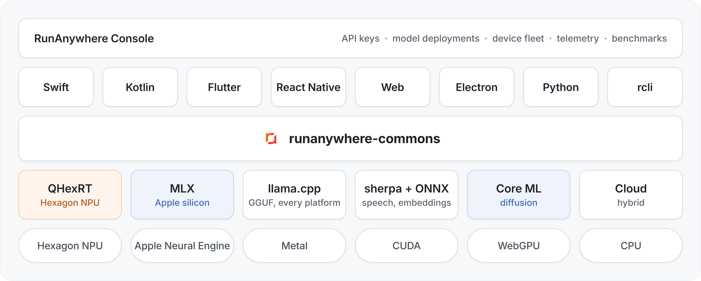
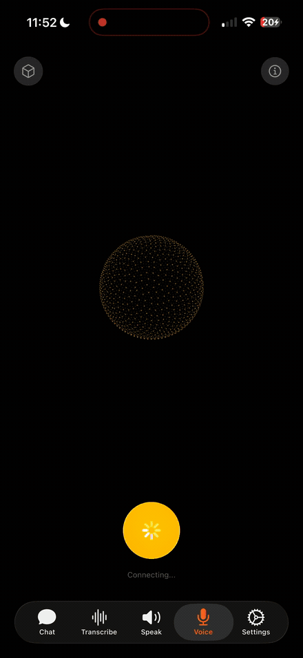
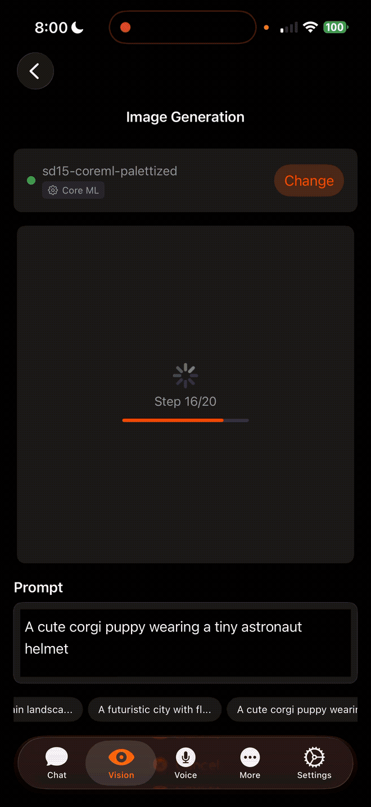

<p align="center">
  
</p>

<h1 align="center">RunAnywhere</h1>

<p align="center">
  <strong>One SDK. Every device.</strong><br/>
  LLMs, vision, speech, voice agents, RAG, embeddings, and image generation, running locally on
  phones, browsers, desktops, and servers.<br/>
  Private by default. Offline by design. Accelerated by whatever silicon the device has.
</p>

<p align="center">
  <a href="https://apps.apple.com/us/app/runanywhere/id6756506307"></a>&nbsp;&nbsp;<a href="https://play.google.com/store/apps/details?id=com.runanywhere.runanywhereai"></a>
</p>

<p align="center">
  <a href="https://github.com/RunanywhereAI/runanywhere-sdks/stargazers"></a> <a href="LICENSE"></a> <a href="https://docs.runanywhere.ai"></a> <a href="https://huggingface.co/runanywhere/models"></a> <a href="https://discord.gg/N359FBbDVd"></a>
</p>

<br/>

<p align="center">
  
</p>

<p align="center">
  <sub>Eight SDKs, one C++ core. A capability registry routes every call to the best engine on the device,
  and the Console manages your fleet from above.</sub>
</p>

---

## What you can build

Every capability below runs fully on-device, behind one API that is identical on all eight platforms:

- **LLM chat**: Llama, Qwen, Gemma, Phi, LFM, SmolLM, DeepSeek, and more, with token streaming, multi-turn history, and LoRA adapters
- **Structured output**: JSON constrained by a grammar compiled from your schema, so the result always parses
- **Tool calling**: grammar-constrained tool calls, parallel calls, and an agent loop
- **Vision (VLM)**: image understanding, live camera description, and photo Q&A
- **Speech-to-Text**: Whisper and Moonshine transcription, streaming and batch
- **Text-to-Speech**: neural voices from Piper, Kokoro, Kitten, MeloTTS, and Magpie
- **Voice agents**: wake word, VAD, STT, LLM, and TTS in one pipeline, with sentence-streaming playback
- **Embeddings**: L2-normalized vectors for search and retrieval
- **RAG**: local document ingestion and retrieval-augmented answers, with streaming
- **Image generation**: Stable Diffusion on Core ML, plus inpainting on the Hexagon NPU

Your code never picks hardware. Engines register what they can run, and the highest-priority engine that fits the device wins: **QHexRT** on the Snapdragon Hexagon NPU, **MLX** on Apple silicon, **llama.cpp** everywhere (Metal on Apple, CUDA on NVIDIA as an opt-in build, WebGPU in the browser), **sherpa + ONNX** for speech and embeddings, and **Core ML** for diffusion, dispatching across CPU, GPU, and the Apple Neural Engine.

---

## See it in action

<div align="center">
<table>
  <tr>
    <td align="center" width="50%">
      <br/><br/>
      <strong>Text Generation</strong><br/>
      <sub>LLM inference, 100% on-device</sub>
    </td>
    <td width="40"></td>
    <td align="center" width="50%">
      <br/><br/>
      <strong>Voice AI</strong><br/>
      <sub>STT → LLM → TTS pipeline, fully offline</sub>
    </td>
  </tr>
  <tr><td colspan="3" height="30"></td></tr>
  <tr>
    <td align="center" width="50%">
      <br/><br/>
      <strong>Image Generation</strong><br/>
      <sub>On-device diffusion model</sub>
    </td>
    <td width="40"></td>
    <td align="center" width="50%">
      <br/><br/>
      <strong>Visual Language Model</strong><br/>
      <sub>Vision + language understanding on-device</sub>
    </td>
  </tr>
</table>
</div>

---

## Quick start

The fastest way to feel it. Install, load, generate, all local:

```bash
pip install runanywhere
```

```python
from runanywhere import RunAnywhere

with RunAnywhere() as ra:
    llm = ra.load_llm("qwen2.5-0.5b")  # downloads on first use
    print(llm.generate_text("Explain on-device AI in one sentence."))
```

Prefer a terminal? The same core ships as a CLI:

```bash
brew install runanywhere-ai/tap/rcli
rcli run qwen3 "Explain on-device AI in one sentence."
```

Building for mobile, web, or desktop? Every platform below speaks the same API.

<details>
<summary><b>Swift</b> (iOS / macOS)</summary>

<br/>

```swift
import RunAnywhere
import LlamaCPPRuntime

// 1. Initialize
LlamaCPP.register()
try RunAnywhere.initialize()

// 2. Load a model
var load = RAModelLoadRequest()
load.modelID = "smollm2-360m"
load.category = .language
load.framework = .llamaCpp
_ = await RunAnywhere.loadModel(load)

// 3. Generate
var req = RALLMGenerateRequest()
req.prompt = "What is the capital of France?"
let result = try await RunAnywhere.generate(req)
print(result.text) // "Paris is the capital of France."
```

Add the MLX backend (`import RunAnywhereMLX; MLX.register()`) for Apple-native LLM, VLM, STT, TTS, and embeddings on Apple silicon.

Install via Swift Package Manager:

```
https://github.com/RunanywhereAI/runanywhere-sdks
```

[Documentation](https://docs.runanywhere.ai/swift/introduction) · [Source](sdk/runanywhere-swift/)

</details>

<details>
<summary><b>Kotlin</b> (Android)</summary>

<br/>

```kotlin
import ai.runanywhere.proto.v1.ModelCategory
import ai.runanywhere.proto.v1.SDKEnvironment
import com.runanywhere.sdk.llm.llamacpp.LlamaCPP
import com.runanywhere.sdk.public.RunAnywhere
import com.runanywhere.sdk.public.extensions.*
import com.runanywhere.sdk.public.types.RAModelInfo
import com.runanywhere.sdk.public.types.RAModelLoadRequest

// 1. Initialize (in a coroutine scope)
LlamaCPP.register()
RunAnywhere.initialize(
    context = this,
    environment = SDKEnvironment.SDK_ENVIRONMENT_DEVELOPMENT,
)

// 2. Download and load a model
val modelId = "smollm2-360m-instruct-q8_0"
RunAnywhere.downloadModelStream(RAModelInfo(id = modelId)).collect { /* progress */ }
RunAnywhere.loadModel(
    RAModelLoadRequest(model_id = modelId, category = ModelCategory.MODEL_CATEGORY_LANGUAGE),
)

// 3. Generate
val result = RunAnywhere.generate("What is the capital of France?")
println(result.text) // "Paris is the capital of France."
```

Install via Gradle (Maven Central):

```kotlin
dependencies {
    implementation("io.github.sanchitmonga22:runanywhere-sdk:0.20.11")
    implementation("io.github.sanchitmonga22:runanywhere-llamacpp:0.20.11")
    // Optional: STT / TTS / VAD
    // implementation("io.github.sanchitmonga22:runanywhere-onnx:0.20.11")
}
```

[Documentation](https://docs.runanywhere.ai/kotlin/introduction) · [Source](sdk/runanywhere-kotlin/)

</details>

<details>
<summary><b>Flutter</b></summary>

<br/>

```dart
import 'package:runanywhere/runanywhere.dart';
import 'package:runanywhere_llamacpp/runanywhere_llamacpp.dart';

// 1. Initialize
LlamaCpp.register();
await RunAnywhere.initialize();

// 2. Download and load a model
await RunAnywhere.downloadModel('smollm2-360m');
await RunAnywhere.llm.load('smollm2-360m');

// 3. Generate
final response = await RunAnywhere.llm.chat('What is the capital of France?');
print(response); // "Paris is the capital of France."
```

Install via pub.dev:

```yaml
dependencies:
  runanywhere: ^0.20.11
  runanywhere_llamacpp: ^0.20.11  # LLM/VLM text generation
  # runanywhere_onnx: ^0.20.11    # STT, TTS, VAD, voice agent
  # runanywhere_mlx: ^0.20.11     # Apple-native LLM/VLM/STT/TTS/embeddings
  # runanywhere_qhexrt: ^0.20.11  # Snapdragon Hexagon NPU
```

[Documentation](https://docs.runanywhere.ai/flutter/introduction) · [Source](sdk/runanywhere-flutter/)

</details>

<details>
<summary><b>React Native</b></summary>

<br/>

```typescript
import { RunAnywhere, SDKEnvironment } from '@runanywhere/core';
import { LlamaCPP } from '@runanywhere/llamacpp';

// 1. Initialize
await RunAnywhere.initialize({ environment: SDKEnvironment.SDK_ENVIRONMENT_DEVELOPMENT });
LlamaCPP.register();

// 2. Download and load a model
await RunAnywhere.downloadModel('smollm2-360m');
await RunAnywhere.loadModel('smollm2-360m');

// 3. Generate
const result = await RunAnywhere.generate('What is the capital of France?');
console.log(result.text); // "Paris is the capital of France."
```

Install via npm:

```bash
npm install @runanywhere/core@0.20.11 @runanywhere/llamacpp@0.20.11
# optional backends: @runanywhere/onnx @runanywhere/mlx @runanywhere/qhexrt
```

[Documentation](https://docs.runanywhere.ai/react-native/introduction) · [Source](sdk/runanywhere-react-native/)

</details>

<details>
<summary><b>Web</b> (TypeScript, WASM + WebGPU)</summary>

<br/>

```typescript
import { RunAnywhere, SDKEnvironment } from '@runanywhere/web';
import { LlamaCPP } from '@runanywhere/web-llamacpp';

// 1. Initialize
await RunAnywhere.initialize({ environment: SDKEnvironment.SDK_ENVIRONMENT_DEVELOPMENT });
await LlamaCPP.register({ acceleration: 'auto' }); // WebGPU when available, WASM otherwise
await RunAnywhere.completeServicesInitialization();

// 2. Load a model
await RunAnywhere.loadModel({ modelId: 'qwen2.5-0.5b' });

// 3. Generate
const result = await RunAnywhere.generate({
  prompt: 'What is the capital of France?',
});
console.log(result.text); // "Paris is the capital of France."
```

Install via npm:

```bash
npm install @runanywhere/web@0.20.11 @runanywhere/web-llamacpp@0.20.11
# @runanywhere/web-onnx for STT/TTS/VAD/embeddings in the browser
```

[Source](sdk/runanywhere-web/) · [Web starter app](https://github.com/RunanywhereAI/web-starter-app)

</details>

<details>
<summary><b>Electron</b> (Windows-first desktop)</summary>

<br/>

```js
const { RunAnywhere } = require('@runanywhere/electron');

// 1. Initialize
RunAnywhere.initialize();

// 2. Load a model (catalog id or a local path)
const llm = await RunAnywhere.loadLLM('qwen2.5-0.5b');

// 3. Generate (streaming)
for await (const token of llm.generate('What is the capital of France?')) {
  process.stdout.write(token);
}

llm.unload();
RunAnywhere.shutdown();
```

A native N-API addon over the C core. Inference runs in an isolated Electron utility process and streams to the renderer over a MessagePort. LLM, VLM, STT, TTS, embeddings, RAG, structured output, tool calling, and a voice pipeline, with a prebuilt `win32-x64` addon. CUDA is available as an opt-in source build.

Install: build from source (Windows x64 preview), see the [SDK README](sdk/runanywhere-electron/) for steps.

</details>

<details>
<summary><b>Python</b> (Windows / macOS / Linux)</summary>

<br/>

```python
from runanywhere import RunAnywhere

with RunAnywhere() as ra:
    # 1. Load a model (auto-downloads on first use)
    llm = ra.load_llm("qwen2.5-0.5b")

    # 2. Stream tokens (sync)
    for token in llm.generate("What is the capital of France?"):
        print(token, end="", flush=True)

    # 2b. Or async
    # async for token in llm.agenerate("..."):
    #     ...

    # 3. Or grab the full text
    print(llm.generate_text("Capital of France? One word."))  # "Paris"
```

Every method has an async twin. LLM, VLM, STT, TTS, embeddings (numpy), VAD, voice agent, RAG, structured output, and tool calling, with prebuilt wheels that bundle the native runtime. CUDA is available as an opt-in source build.

Install via pip:

```bash
pip install runanywhere==0.20.11
```

[Source](sdk/runanywhere-python/)

</details>

<details>
<summary><b>rcli</b> (terminal)</summary>

<br/>

```console
$ rcli pull qwen3
pulling qwen3-0.6b ▕████████████▏ 100%  639 MB/639 MB  32 MB/s
$ rcli run qwen3 "Reply with exactly: RCLI WORKS" --no-think
RCLI WORKS
$ rcli tts --text "RunAnywhere runs models on device." --output hello.wav
$ rcli stt --input hello.wav
 Run anywhere runs models on device.
$ rcli voice --input question.wav --output reply.wav   # full STT > LLM > TTS turn
$ rcli serve qwen3        # OpenAI-compatible API on :8080
```

Also: `rcli run --image photo.jpg` (VLM), `rcli vad`, `rcli embed`, `rcli image` (diffusion, Apple), `rcli lora`, and `--json` on everything.

Install (macOS Apple Silicon, Linux x86_64/aarch64, Windows x86_64):

```bash
brew install runanywhere-ai/tap/rcli
# or
curl -fsSL https://raw.githubusercontent.com/RunanywhereAI/runanywhere-sdks/main/sdk/runanywhere-cli/scripts/install.sh | sh
```

[CLI README](sdk/runanywhere-cli/)

</details>

---

## SDKs

| SDK | Platforms | Status | Install | Docs |
|-----|-----------|--------|---------|------|
| **Swift** | iOS 17.5+, macOS 14.5+ | Stable | Swift Package Manager | [docs.runanywhere.ai/swift](https://docs.runanywhere.ai/swift/introduction) |
| **Kotlin** | Android API 24+ | Stable | Gradle (`io.github.sanchitmonga22:runanywhere-sdk`) | [docs.runanywhere.ai/kotlin](https://docs.runanywhere.ai/kotlin/introduction) |
| **Flutter** | iOS, Android | Beta | pub.dev (`runanywhere`) | [docs.runanywhere.ai/flutter](https://docs.runanywhere.ai/flutter/introduction) |
| **React Native** | iOS, Android | Beta | npm (`@runanywhere/core`) | [docs.runanywhere.ai/react-native](https://docs.runanywhere.ai/react-native/introduction) |
| **Web** | Chromium, Safari, Firefox | Beta | npm (`@runanywhere/web`) | [SDK README](sdk/runanywhere-web/) |
| **Electron** | Windows x64 desktop | Preview | [Build from source](sdk/runanywhere-electron/) | [SDK README](sdk/runanywhere-electron/) |
| **Python** | Windows, macOS, Linux | Alpha | pip (`runanywhere`) | [SDK README](sdk/runanywhere-python/) |
| **rcli** | macOS, Linux, Windows | Stable | Homebrew / install script | [CLI README](sdk/runanywhere-cli/) |

All SDKs ship on one version line, currently **0.20.11**, from a single C++ core. Pin the same version across the core package and its backends. See [Releases](https://github.com/RunanywhereAI/runanywhere-sdks/releases) for what is published today.

---

## Features

| Feature | Swift | Kotlin | Flutter | RN | Web | Electron | Python | rcli |
|---------|:-:|:-:|:-:|:-:|:-:|:-:|:-:|:-:|
| LLM generation + streaming | Yes | Yes | Yes | Yes | Yes | Yes | Yes | Yes |
| Vision language models (VLM) | Yes | Yes | Yes | Yes | Yes | Yes | Yes | Yes |
| Speech-to-Text | Yes | Yes | Yes | Yes | Yes | Yes | Yes | Yes |
| Text-to-Speech | Yes | Yes | Yes | Yes | Yes | Yes | Yes | Yes |
| Voice activity detection | Yes | Yes | Yes | Yes | Yes | Yes | Yes | Yes |
| Voice agent pipeline | Yes | Yes | Yes | Yes | Yes | Yes | Yes | Yes |
| Wake word | Yes | Yes | Yes | Yes | Yes | Yes | Yes | Yes |
| Embeddings | Yes | Yes | Yes | Yes | Yes | Yes | Yes | Yes |
| RAG (with streaming) | Yes | Yes | Yes | Yes | Yes | Yes | Yes | n/a |
| Structured output (JSON) | Yes | Yes | Yes | Yes | Yes | Yes | Yes | n/a |
| Tool calling | Yes | Yes | Yes | Yes | Yes | Yes | Yes | n/a |
| Image generation (diffusion) | Yes | Yes | Yes | Yes | n/a | n/a | n/a | Yes |
| LoRA adapters | Yes | Yes | Yes | Yes | Yes | n/a | n/a | Yes |
| Hexagon NPU (QHexRT) | n/a | Yes | Yes | Yes | n/a | n/a | n/a | n/a |
| MLX (Apple silicon) | Yes | n/a | Yes | Yes | n/a | n/a | n/a | Yes |
| OpenAI-compatible server | n/a | n/a | n/a | n/a | n/a | n/a | Yes | Yes |
| Model download + progress | Yes | Yes | Yes | Yes | Yes | Yes | Yes | Yes |
| **Connect (LAN host/client)** | Host (macOS) / Client (iOS, iPadOS) | Client | — | — | — | — | — | — |

### Connect (trusted LAN)

Connect lets a **macOS Swift app** host a loaded language model on the local network so **iOS, iPadOS, and Android** clients can discover it and stream generation without downloading that model. It is **app-scoped** (lives with the host app process), not an OS daemon.

| Role | Supported today | Not in this release |
|------|-----------------|---------------------|
| **Host** | macOS (Swift example / SDK) | Windows, Electron, Web, RN, Flutter |
| **Client** | iOS, iPadOS (Swift), Android (Kotlin) | React Native, Flutter, Web, Electron |

- **Discovery:** Bonjour / NSD service type `_runanywhere-connect._tcp`
- **Transport:** framed TCP on the LAN; commons owns protocol version, role policy, session accounting, and generation validation (`idl/connect.proto`, `rac_connect_*`)
- **Lifecycle:** the host app selects and loads the model, starts hosting, and supplies generation; stopping the host disconnects clients
- **Threat model:** **trusted LAN only** — no TLS, pairing PIN, or mutual auth in this release. Do not expose Connect across untrusted networks. Future work may add TLS/pairing, Windows hosting, or a daemon; those change lifecycle and security and are out of scope here
- **Electron note:** `RunAnywhereMain.connect()` is **local MessagePort / utility-process IPC** inside one Electron app. It is unrelated to LAN Connect

---

## Inference engines

Every SDK is a thin binding over `runanywhere-commons`, a single C++ core behind a pure C ABI. Engines plug into a capability registry and declare, per modality, what they can run. At inference time the highest-priority engine that serves the modality on the current device wins. Same code, different silicon, no branching in your app.

| Engine | Modalities | Runs on | Notes |
|---|---|---|---|
| **QHexRT** | LLM, VLM, STT, TTS, embeddings, inpainting | Snapdragon Hexagon NPU (v75 / v79 / v81) | RunAnywhere's own NPU runtime, [details below](#hexagon-npu-acceleration-qhexrt) |
| **MLX** | LLM, VLM, STT, TTS, embeddings | Apple silicon | Apple-native inference via mlx-swift, safetensors models |
| **llama.cpp** | LLM, VLM | Everywhere: Metal on Apple, CUDA opt-in on Windows/Linux, WebGPU + WASM in the browser, CPU with NEON/AVX | GGUF models |
| **sherpa + ONNX** | STT, TTS, VAD, embeddings | All platforms | sherpa-onnx for speech, ONNX Runtime for embeddings and RAG |
| **Core ML** | Image generation (diffusion) | iOS, macOS | Core ML dispatches each layer across CPU, GPU, and the Apple Neural Engine |
| **Platform** | Apple Foundation Models, system TTS | iOS, macOS, Android | Native OS capabilities behind the same API |
| **Cloud** | Hybrid STT | All platforms | Optional confidence-cascade routing to hosted providers |

**MetalRT**, RunAnywhere's proprietary GPU inference engine for Apple silicon, powers [RCLI](https://github.com/RunanywhereAI/RCLI), our on-device voice assistant for macOS with local RAG and 40+ system actions at sub-200 ms latency. Signed binaries live at [metalrt-binaries](https://github.com/RunanywhereAI/metalrt-binaries).

---

## Hexagon NPU acceleration (QHexRT)

QHexRT is RunAnywhere's inference runtime for the Qualcomm Hexagon NPU. It runs LLM, vision, speech, and text-to-speech models directly on the Snapdragon NPU (Hexagon v75 / v79 / v81) and ships as a built-in accelerator: your app calls the same `loadModel` and `generate`, and it uses the NPU automatically on supported devices.

- Runs LLM, VLM, speech-to-text, and text-to-speech on the NPU, including text-to-speech, which other runtimes run on the CPU.
- Runs Mixture-of-Experts and hybrid-attention models on the NPU (Phi-tiny-MoE, Qwen3.5), plus the 1-bit Bonsai family up to Bonsai-27B (Hexagon v81).
- Runs NVIDIA's Cosmos3-Edge and Magpie-TTS Multilingual, and handles embeddings and image inpainting (LaMa) on the NPU as well.
- Hybrid streaming voice agents: LLM on the NPU, STT and TTS on the CPU, with sentence-by-sentence streaming playback.
- Fast prefill and low time-to-first-token, with context that extends past the compiled window.
- Prebuilt model bundles published on [Hugging Face](https://huggingface.co/runanywhere/models); the SDK downloads the one matching the device.

Measured on a Samsung Galaxy S25 (Snapdragon 8 Elite, Hexagon v79):

| Model | Task | Params | Decode | Time to first token |
|---|---|---|---|---|
| LFM2.5-230M | LLM | 0.23 B | 164 tok/s | 32 ms |
| Qwen3-0.6B | LLM | 0.6 B | 33 tok/s (prefill up to 3,692 tok/s) | 127 ms |
| Llama-3.2-1B | LLM | 1.2 B | 16.3 tok/s | 56 ms |
| Phi-tiny-MoE | MoE LLM | 3.8 B (1.1 B active) | 5-7 tok/s | ~2.5 s |
| InternVL3.5-1B | VLM | 1 B | 37 tok/s | 290 ms |
| Whisper base | ASR | 74 M | ~5x real-time | n/a |
| MeloTTS-EN | TTS | n/a | ~4.5x real-time | n/a |

Available on the Kotlin, Flutter, and React Native SDKs. Snapdragon (Android arm64) only.

---

## OpenAI-compatible server

The Python SDK and rcli both expose the local runtime as a drop-in OpenAI API, so anything that speaks the OpenAI client works against models running on your machine:

```bash
pip install "runanywhere[server]"
runanywhere serve        # http://127.0.0.1:8000
```

```python
from openai import OpenAI

client = OpenAI(base_url="http://localhost:8000/v1", api_key="not-needed")
reply = client.chat.completions.create(
    model="qwen2.5-0.5b",
    messages=[{"role": "user", "content": "Hello from the edge."}],
)
```

Endpoints: `/v1/chat/completions` (streaming and non-streaming, text and vision), `/v1/completions`, `/v1/embeddings`, `/v1/audio/transcriptions`, `/v1/audio/speech`, and `/v1/models`. `rcli serve` offers the same on port 8080.

---

## RunAnywhere Console

The Console is the control plane for on-device AI fleets. SDKs authenticate with an API key, register the device with its hardware profile, pull their assigned models, and report per-modality telemetry.

- **Deploy models over the air**: assign catalog or bring-your-own models to an API key, and devices fetch them on their next sync. New models without an app release.
- **Device fleet**: every registered device with its chip, memory, and NPU capability.
- **Analytics**: usage, latency, and errors per modality across the fleet.
- **Benchmarks**: compare local models against hosted providers.

The Console is optional. Every SDK runs fully offline without an API key, and telemetry is scoped per modality when enabled.

---

## Models

### Hexagon NPU (QHexRT)

Prebuilt bundles published on [Hugging Face](https://huggingface.co/runanywhere/models); the SDK downloads the one matching the device.

| Model | Task | Params | Bundle |
|---|---|---|---|
| Llama-3.2-1B | LLM | 1.2 B | [llama3_2_1b_HNPU](https://huggingface.co/runanywhere/llama3_2_1b_HNPU) |
| LFM2.5-230M / 350M | LLM | 0.23 / 0.35 B | [lfm2_5_230m_HNPU](https://huggingface.co/runanywhere/lfm2_5_230m_HNPU) · [lfm2_5_350m_HNPU](https://huggingface.co/runanywhere/lfm2_5_350m_HNPU) |
| LFM2.5-2.6B | LLM | 2.6 B | [lfm2_5_2_6b_HNPU](https://huggingface.co/runanywhere/lfm2_5_2_6b_HNPU) |
| Qwen3.5-0.8B / 2B / 4B | LLM | 0.8-4 B | [qwen3_5_0_8b_HNPU](https://huggingface.co/runanywhere/qwen3_5_0_8b_HNPU) · [2b](https://huggingface.co/runanywhere/qwen3_5_2b_HNPU) · [4b](https://huggingface.co/runanywhere/qwen3_5_4b_HNPU) |
| Bonsai 1-bit family | LLM | 1.7 / 4 / 8 / 27 B | 1-bit and ternary builds; Bonsai-27B runs on Hexagon v81 |
| Gemma-4-E2B / E4B | LLM + VLM | ~2 / 4 B | [gemma4_e2b_HNPU](https://huggingface.co/runanywhere/gemma4_e2b_HNPU) · [gemma4_e4b_HNPU](https://huggingface.co/runanywhere/gemma4_e4b_HNPU) |
| Phi-tiny-MoE | MoE LLM | 3.8 B | [phi_tiny_moe_HNPU](https://huggingface.co/runanywhere/phi_tiny_moe_HNPU) |
| DeepSeek-R1-Distill-Qwen | LLM | 1.5 / 7 B | [1.5b](https://huggingface.co/runanywhere/deepseek_r1_distill_qwen_1_5b_HNPU) · [7b](https://huggingface.co/runanywhere/deepseek_r1_distill_qwen_7b_HNPU) |
| Cosmos3-Edge | LLM | edge | NVIDIA model family, Hexagon v79 |
| Qwen3-VL-2B | VLM | 2 B | [qwen3_vl_HNPU](https://huggingface.co/runanywhere/qwen3_vl_HNPU) |
| InternVL3.5-1B | VLM | 1 B | [internvl3_5_1b_HNPU](https://huggingface.co/runanywhere/internvl3_5_1b_HNPU) |
| Whisper base / small | ASR | 74 / 244 M | [whisper_base_HNPU](https://huggingface.co/runanywhere/whisper_base_HNPU) · [whisper_small_HNPU](https://huggingface.co/runanywhere/whisper_small_HNPU) |
| Moonshine tiny / base | ASR | n/a | [moonshine_base_HNPU](https://huggingface.co/runanywhere/moonshine_base_HNPU) |
| MeloTTS-EN | TTS | n/a | [melotts_en_HNPU](https://huggingface.co/runanywhere/melotts_en_HNPU) |
| Magpie-TTS Multilingual | TTS | 357 M | [magpie_tts_357m_HNPU](https://huggingface.co/runanywhere/magpie_tts_357m_HNPU) |
| Kitten TTS mini / micro | TTS | n/a | Hexagon v75 |
| EmbeddingGemma-300M | Embeddings | 300 M | [embeddinggemma_300m_HNPU](https://huggingface.co/runanywhere/embeddinggemma_300m_HNPU) |

[Browse all models on Hugging Face](https://huggingface.co/runanywhere/models)

### Cross-platform

| Type | Models | Engine |
|---|---|---|
| LLM | SmolLM2, Qwen 3 / 2.5, Llama 3.2, LFM2, Mistral 7B (GGUF) | llama.cpp |
| LLM / VLM (Apple) | Qwen3, SmolVLM2, and other mlx-community safetensors models | MLX |
| VLM | SmolVLM2, LFM2-VL, Qwen2-VL (GGUF + mmproj) | llama.cpp |
| Speech-to-Text | Whisper Tiny / Base, Moonshine | sherpa + ONNX |
| Text-to-Speech | Piper voices, Kokoro, Kitten TTS | sherpa + ONNX |
| VAD | Silero VAD | sherpa + ONNX |
| Embeddings | MiniLM, EmbeddingGemma | ONNX Runtime |
| Image generation | Stable Diffusion | Core ML |

Anything not in the catalog can be pulled straight from Hugging Face or a direct URL; the core infers format, framework, and category from the artifact.

---

## Example apps

Full consumer-assistant apps, one per platform, all built on the SDK:

| Platform | Source | Get it |
|----------|--------|--------|
| iOS | [examples/ios/RunAnywhereAI](examples/ios/RunAnywhereAI/) | [App Store](https://apps.apple.com/us/app/runanywhere/id6756506307) |
| Android | [examples/android/RunAnywhereAI](examples/android/RunAnywhereAI/) | [Google Play](https://play.google.com/store/apps/details?id=com.runanywhere.runanywhereai) |
| Web | [examples/web/RunAnywhereAI](examples/web/RunAnywhereAI/) | Build from source |
| React Native | [examples/react-native/RunAnywhereAI](examples/react-native/RunAnywhereAI/) | Build from source |
| Flutter | [examples/flutter/RunAnywhereAI](examples/flutter/RunAnywhereAI/) | Build from source |
| Electron | [examples/electron/RunAnywhereAI](examples/electron/RunAnywhereAI/) | Build from source (Windows) |

The Android, Flutter, and React Native apps include an NPU section that detects the device's Hexagon arch and runs LLM, vision, speech, and text-to-speech on the NPU.

**Starters**, minimal projects to copy from:
[Swift](https://github.com/RunanywhereAI/swift-starter-example) ·
[Kotlin](https://github.com/RunanywhereAI/kotlin-starter-example) ·
[Flutter](https://github.com/RunanywhereAI/flutter-starter-example) ·
[React Native](https://github.com/RunanywhereAI/react-native-starter-app) ·
[Web](https://github.com/RunanywhereAI/web-starter-app)

**Playground**, real projects built on the stack:

- [RCLI](https://github.com/RunanywhereAI/RCLI): on-device voice assistant for macOS with local RAG and 40+ system actions, powered by MetalRT
- [Android Use Agent](Playground/android-use-agent/): an autonomous Android agent driven by an on-device LLM ([benchmarks](Playground/android-use-agent/ASSESSMENT.md))
- [On-Device Browser Agent](Playground/on-device-browser-agent/): a Chrome extension that automates browser tasks with WebLLM and WebGPU
- [YapRun](Playground/YapRun/): on-device dictation for iOS and macOS
- [Linux Voice Assistant](Playground/linux-voice-assistant/): a full voice pipeline in one C++ binary for Raspberry Pi 5, x86_64, and ARM64
- [OpenClaw Hybrid Assistant](Playground/openclaw-hybrid-assistant/): on-device VAD, STT, and TTS with cloud LLM reasoning

---

## Repository layout

Business logic lives in the C++ core, so one fix lands on all eight SDKs at once.

```
runanywhere-sdks/
├── sdk/
│   ├── runanywhere-swift/          # iOS/macOS SDK (XCFramework)
│   ├── runanywhere-kotlin/         # Android SDK (JNI)
│   ├── runanywhere-flutter/        # Flutter SDK (Dart FFI)
│   ├── runanywhere-react-native/   # React Native SDK (Nitro/JSI)
│   ├── runanywhere-web/            # Web SDK (WebAssembly / WebGPU)
│   ├── runanywhere-electron/       # Electron SDK (N-API addon)
│   ├── runanywhere-python/         # Python SDK (pybind11)
│   ├── runanywhere-cli/            # rcli, the terminal SDK
│   └── runanywhere-commons/        # Shared C/C++ core behind a C ABI
│
├── engines/                        # llamacpp, mlx, sherpa, onnx, coreml, qhexrt, cloud
├── runtimes/                       # cpu, coreml, onnxrt compute adapters
├── idl/                            # Protobuf schemas, generated bindings per language
├── examples/                       # Full example apps
├── Playground/                     # Real-world reference apps
└── docs/                           # Documentation
```

---

## Requirements

| Platform | Minimum |
|----------|---------|
| iOS | 17.5+ |
| macOS | 14.5+ |
| Android | API 24 (7.0), arm64 recommended |
| Web | Chrome 96+ / Edge 96+, Chrome 120+ for WebGPU |
| React Native | 0.83.1+, 0.85+ recommended (Node.js 22.12+) |
| Flutter | 3.44+ (Dart 3.12+) |
| Electron | Windows x64 (preview) |
| Python | 3.9+ on Windows, macOS, Linux (3.12+ recommended) |
| rcli | macOS arm64, Linux x86_64 / aarch64, Windows x86_64 |

Hexagon NPU: Snapdragon with Hexagon v75 / v79 / v81, Android arm64.
MLX: Apple silicon, physical devices.
Memory: 2 GB minimum, 4 GB+ recommended for larger models.

---

## Contributing

We welcome contributions. See the [Contributing Guide](CONTRIBUTING.md) for setup and conventions.

```bash
git clone https://github.com/RunanywhereAI/runanywhere-sdks.git
cd runanywhere-sdks

# Doctor / setup helpers
./run doctor
./run setup

# Build the native XCFrameworks into sdk/runanywhere-swift/Binaries/.
# Required for local Swift development.
./sdk/runanywhere-swift/scripts/build-core-xcframework.sh

# Run the iOS sample app
cd examples/ios/RunAnywhereAI
open RunAnywhereAI.xcodeproj
```

---

## Community

- Docs: [docs.runanywhere.ai](https://docs.runanywhere.ai)
- Discord: [Join the community](https://discord.gg/N359FBbDVd)
- Issues: [GitHub Issues](https://github.com/RunanywhereAI/runanywhere-sdks/issues)
- Email: founders@runanywhere.ai
- X: [@RunanywhereAI](https://twitter.com/RunanywhereAI)

---

## License

RunAnywhere License (Apache 2.0 based, with additional commercial-use terms).
See [LICENSE](LICENSE) for details.
