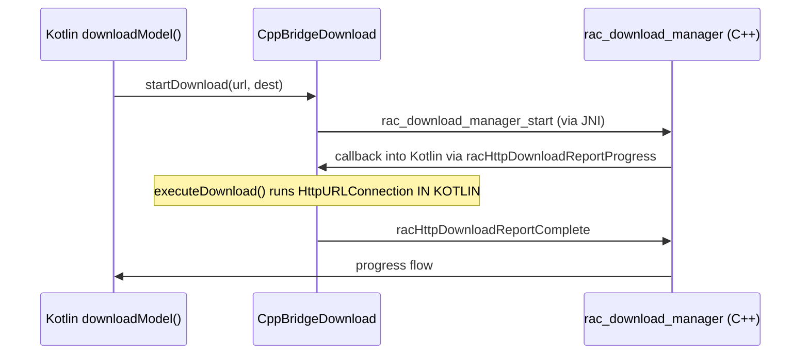

# Kotlin Download Orchestration — GAP 08 #3 Architectural Blocker

_Audit + scope decision from Sprint 3 of the post-v3.1 cleanup
roadmap (April 2026). Closes the v3.2.0 plan with a "deferred until
commons HTTP client decision" status._

## What the original plan called for

> Rewrite Kotlin `RunAnywhere.downloadModel()` (~500 LOC) +
> `CppBridgeDownload.kt` (1,485 LOC) by routing all HTTP through
> the C++ `rac_download_manager_*` API. Net Kotlin -800 LOC.

## What the audit found

The C++ side already has a download manager API
([sdk/runanywhere-commons/include/rac/infrastructure/download/rac_download.h](../sdk/runanywhere-commons/include/rac/infrastructure/download/rac_download.h)):
`rac_download_manager_create / start / cancel / pause / resume /
get_progress`. JNI thunks already exist for it:
[sdk/runanywhere-kotlin/.../RunAnywhereBridge.kt:537+](../sdk/runanywhere-kotlin/src/jvmAndroidMain/kotlin/com/runanywhere/sdk/native/bridge/RunAnywhereBridge.kt)
exposes `racDownloadStart / racDownloadCancel / racDownloadGetProgress`.

The actual architecture today:

The C++ download manager **does NOT do HTTP itself**. It manages
task lifecycle + progress callbacks; the actual HTTP transport is
delegated back to the platform via a callback registered by
`CppBridgeDownload.register()` (line 427). On Android the platform
executor is `HttpURLConnection`; on iOS it would be `NSURLSession`.

## Why this matters for GAP 08 #3

The 1,485 LOC of `CppBridgeDownload.kt` is NOT duplicated
orchestration — it's the **Android HTTP executor implementation**
the C++ manager calls back into. To eliminate it, we'd need:

1. **HTTP client in commons.** Pick libcurl, cpr, or platform-native
   shims (NSURLSession on Apple, OkHttp wrapping on Android, libcurl
   elsewhere). Vendor decision with multi-platform CI implications.

2. **Rework the executor delegation.** Today's pattern is
   "C++ → callback → Kotlin executor → HTTP". The new pattern
   would be "C++ → libcurl → progress callback into Kotlin".
   This breaks every existing `CppBridgeDownload.DownloadListener`
   consumer.

3. **Re-test cross-platform.** Android 16K page alignment, iOS
   background download permissions, certificate trust stores,
   redirect handling, retry/backoff, resume semantics — all
   different per-platform today; would need to converge on commons
   semantics.

4. **Backward compat decision.** Either deprecate
   `CppBridgeDownload` (breaking) or keep it as a shim around the
   new commons HTTP path (minor LOC reduction, lots of plumbing).

Estimated effort: **1-3 months of focused engineering** spanning C++
HTTP integration, multi-platform validation, and consumer migration.

## Sprint 3 deliverable (v3.1.3)

Given the architectural blocker, Sprint 3's actual deliverable is a
small DRY refactor:

- `RunAnywhere.downloadModel()` multi-file path (~150 LOC inline
  `HttpURLConnection`) refactored to delegate per-file HTTP to the
  existing `downloadFileWithHttpURLConnection` helper (~80 LOC saved).

Net Kotlin LOC delta:
  `1,308 → 1,281` for `RunAnywhere+ModelManagement.jvmAndroid.kt`
  (-27 LOC). The bigger ~80 LOC saving is in the inline block; the
  rest is the helper-call boilerplate.

## Recommended next steps (post-v3.2)

If/when GAP 08 #3 is prioritized:

1. **Vendor decision** for commons HTTP client. Strong default:
   libcurl. Already widely used; cross-platform; well-known semantics.
2. **Add `rac_http_*` C ABI** alongside `rac_download_manager_*` —
   the manager calls into rac_http internally; the platform executor
   delegation pattern stays optional for sites that need it.
3. **Migrate Kotlin** `executeDownload()` to a no-op (manager does
   HTTP internally). Keep `CppBridgeDownload` as a thin Flow wrapper.
4. **Migrate iOS** Alamofire path similarly.
5. **CI matrix** validation on Android arm64 / iOS device / Linux.

Until that's done, the existing platform-executor pattern is sound
and the GAP 08 #3 deferral remains correct per the v3.0.0 audit.

## Status

- **GAP 08 #3 status**: DEFERRED (architectural; needs commons HTTP
  client decision).
- **Sprint 3 deliverable**: small DRY refactor (-27 LOC) shipped in
  v3.1.3.
- **Estimated full cost**: 1-3 months once the vendor decision is
  made.
