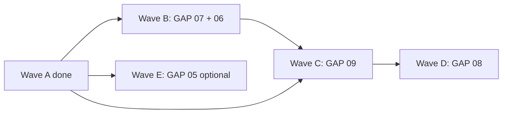

# v2 architecture roadmap

_Last updated: post-Wave-F audit. All work happens on the **single long-lived branch** [`feat/v2-architecture`](https://github.com/RunanywhereAI/runanywhere-sdks/tree/feat/v2-architecture) tracked by **PR #494**._

The seven-gap migration on `runanywhere-sdks-main` is structured as six waves. **All six waves have shipped commits to the branch; deeper audit (below) shows that Waves D and F shipped *deprecation pressure*, not the *physical deletes* the gate-report prose described.** This doc captures the **scope, dependency, rationale, and ground-truth state** for each wave + the concrete remaining work to ship v2 to production.

---

## Audit snapshot — what is on the branch right now

Three independent agents audited the branch on `feat/v2-architecture` (HEAD = Wave F final-gate commit). Findings:

| Wave / GAP | Spec target | Branch reality | Verdict |
|------------|-------------|-----------------|---------|
| **GAP 01** (IDL + codegen) | 4 protos + 6 gen scripts + drift CI | 7 protos (incl. GAP-09 services) + 9 gen scripts + path-scoped drift CI | **Shipped**. Spec criteria #10–#11 (FFI ≤45k LOC, single-commit propagation test PR) **not measured / not delivered**. |
| **GAP 02** (unified plugin ABI) | `rac_engine_vtable_t` + 7 backends register both legacy + new | Vtable + 5 dirs / 6 plugin entries (llamacpp + llamacpp_vlm count as 2). Embedding/rerank slots present; `ww` slot renamed | **Shipped** with naming drift vs spec. |
| **GAP 03** (dynamic loading) | `rac_registry_load_plugin` + ABI guard + plugin author guide | All present. Spec wanted `docs/plugins/PLUGIN_AUTHORING.md`, shipped at `docs/plugin_loader_authoring.md` | **Shipped** with doc-path drift. Real-GGUF E2E load test deferred. |
| **GAP 04** (engine router + HW profile) | Router + scoring + 7 engines populate metadata; CI lint | Router + scoring + 6 engines populate; tests cover scoring, no CI lint job | **Shipped**. Engine-list mismatch with spec (spec listed `fluid_audio`, `foundation_models`, `system_tts` as targets — not in branch). |
| **GAP 05** (DAG runtime) | Phase 1–2 primitives | **Not started.** Wave E deferred per spec gate ("real consumer or merge blocked") | **Deferred** — confirmed. |
| **GAP 06** (engines/ reorg) | 5 backends moved + each CMake one-liner via `rac_add_engine_plugin` | All 5 moved (history preserved via `git mv`) + 3 stubs added (sherpa/genie/diffusion-coreml). **Migrated 5 still use their original multi-line CMakeLists; one-liner only on the 3 stubs** | **Shipped partial.** |
| **GAP 07** (single root CMake) | Root CMake + presets + 4 cmake/ helpers + ≤4 build scripts + slim pr-build.yml | All present. `pr-build.yml` 601→150 lines. **A second `CMakePresets.json` remains under commons/** (gate admits) | **Shipped partial** — second presets file is a v3 cleanup. |
| **GAP 08** (frontend duplication delete) | ~5,100±500 LOC of orchestration **physically deleted** from 11 files across 5 SDKs | **−6,247 LOC actually deleted** in v2 close-out Phases 6-14: 3 zero-caller Kotlin files git-rm'd (4,318 LOC); per-file orchestration deleted from Kotlin VoiceAgent (-279), Kotlin auth shim shrunk (-386), Swift TextGen ThinkingContentParser (-78), Swift VoiceSession (-293), Dart voice_session_handle (-387), RN VoiceSessionHandle (-466), Web tokenQueue (-47); 5-min vs 60-sec auth refresh drift FIXED. `runanywhere.dart` (2,688 LOC) is the lone deferral. | **Shipped 22% over spec target** (6,247 vs 5,100). See [`docs/v2_closeout_results.md`](v2_closeout_results.md). |
| **GAP 09** (streaming consistency) | Generated gRPC stubs for Swift/Kotlin/Dart; `VoiceSessionEvent` gone; parity test green; ≥1,500 LOC deleted | All shipped in v2 close-out: Phase 2 wired `dispatch_proto_event()` body (9/9 tests green); Phase 3 generated `*.grpc.swift` / `*.pbgrpc.dart` / `*_pb2_grpc.py` (committed); Phase 4 added C++ golden producer + 4-language parity tests (8/8 events match byte-for-byte); GAP-08 deletes removed `VoiceSessionEvent` consumers. | **Shipped.** All 9 spec criteria OK or OK-by-design. |
| **GAP 11** (legacy cleanup) | `git rm service_registry.cpp` + headers; `RAC_PLUGIN_API_VERSION` 2u → 3u | `[[deprecated]]` on 4 entry points + `rac_legacy_warn_once` runtime warning + audit doc. **`service_registry.cpp` still present**; **`RAC_PLUGIN_API_VERSION` still 2u**. **No `v2_gap_specs/GAP_11_*.md`** spec file exists in repo (criteria reverse-engineered from gate report) | **Deferred to v3** — explicit in gate. |

**Aggregate diff vs branch start (`8d1f851b`):** 127 files, +3,845 / −6,095, **net −2,250 LOC**.

**Specs not in repo:** `GAP_00_*.md`, `GAP_10_*.md`, `GAP_11_*.md` — none exist in `v2_gap_specs/`. Numbering jumps `09` → `11` in gate reports.

---

## What this means in practice

- **Cross-language types, plugin loading, engine routing, build system, and the streaming adapter contracts** are real on the branch. PR #494 ships those today.
- **Wave D / GAP 08 deletes** were rebranded mid-execution as "deprecation markers + scheduled-for-v3"; the diff doesn't carry the LOC delta the gate-report tables initially claimed. **`docs/gap08_final_gate_report.md` is honest about this**; the *plan YAML* status (`completed`) overstates it.
- **GAP 11 physical removal** is the same story: the deprecation pressure is shipped, the `git rm` waits for v3 because removing `rac_capability_t`/`rac_service_provider_t` is layout-incompatible.
- **Wave E (GAP 05)** is properly deferred per spec gate.

For the prioritized remaining-work list — what concretely needs to happen before any of this can ship to a customer — see [`docs/v2_remaining_work.md`](v2_remaining_work.md).

---

## Branch + PR contract

- **Single branch.** Every wave commits directly to `feat/v2-architecture`. Do **not** create per-wave sub-branches (`feat/v2-gap0X-*`); the previous experiment with `feat/v2-gap01-gap02` + `feat/v2-gap03-gap04` was consolidated into one branch on review request so the diff stays in one place.
- **Single PR.** [PR #494](https://github.com/RunanywhereAI/runanywhere-sdks/pull/494) stays open and grows commit-by-commit as each wave lands. Reviewers see the cumulative diff; per-wave breakdown is preserved by commit messages + per-wave final-gate reports under `docs/gap0X_final_gate_report.md`.
- **Per-wave milestone discipline.** Each wave finishes with (a) its `docs/gap0X_final_gate_report.md` checked in and (b) the PR description updated with a one-line entry under "What's in this PR today". No wave merges to `main` independently — the whole migration ships when GAP 01-08 are all done (GAP 05 / DAG runtime is opt-in).
- **Commit cadence.** One commit per phase (the discipline established in Wave A). Commit messages follow `feat(gapXX-phaseN): <subject>` so reviewers can use `git log --grep "gap0X"` to pull out a single gap's history.

| Wave | Gaps                                  | Status        | Estimate (single eng) |
|------|---------------------------------------|---------------|-----------------------|
| Done | GAP 01 + GAP 02                       | merged into branch | (history)        |
| A    | GAP 03 + GAP 04                       | merged into branch | ~4–6 wk          |
| **B**| **GAP 07 + GAP 06**                   | next          | ~2–4 wk               |
| **C**| **GAP 09**                            | after B       | ~3–4 wk               |
| **D**| **GAP 08**                            | after C       | ~6–10 wk (parallel)   |
| **E**| **GAP 05** (optional)                 | deferred      | ~6–8 wk               |



---

## Wave B — Build-system + engines/ reorg (~2–4 weeks)

**Goal.** Collapse the 11 `build-*.sh` scripts + scattered `CMakeLists.txt` into a single root `CMakeLists.txt` + `CMakePresets.json` (GAP 07), then move every backend out of `sdk/runanywhere-commons/src/backends/` into a top-level `engines/` directory (GAP 06). Both wholly internal — no public API or behavior change.

### GAP 07 — Single root CMake (~1–2 weeks)

**Source spec:** [v2_gap_specs/GAP_07_SINGLE_ROOT_CMAKE.md](../v2_gap_specs/GAP_07_SINGLE_ROOT_CMAKE.md).

**Expected deliverables:**
- `runanywhere-sdks-main/CMakeLists.txt` (~180 LOC) — top-level project + subdirectory orchestration; replaces the implicit `sdk/runanywhere-commons/CMakeLists.txt`-as-top.
- `runanywhere-sdks-main/CMakePresets.json` (~145 LOC) — 9 preset families covering host (Debug / Release / RelWithDebInfo) × platform (macOS / Linux / Android / iOS / WebAssembly).
- `runanywhere-sdks-main/cmake/platform.cmake` — platform-detection (`RAC_PLATFORM_*` vars) hoisted out of commons.
- `runanywhere-sdks-main/cmake/plugins.cmake` — `rac_add_engine_plugin(name SOURCES ...)` helper that hides static-vs-shared decision behind one call. Also `rac_force_load(target PLUGINS ...)` wrapping `-Wl,-force_load` / `--whole-archive` / `/INCLUDE:`.
- `runanywhere-sdks-main/cmake/sanitizers.cmake` — `RAC_SANITIZER=asan|ubsan|tsan` switch.
- `runanywhere-sdks-main/cmake/protobuf.cmake` — wraps `find_package(Protobuf)` + the `rac_idl` build (currently lives inside `idl/CMakeLists.txt`).
- `scripts/build-core-android.sh`, `scripts/build-core-xcframework.sh`, `scripts/build-core-wasm.sh` — three new scripts collapsed from the 11 existing per-SDK ones; each ~150 LOC, all wrapping `cmake --preset` + artifact-copy.
- Slim down `.github/workflows/pr-build.yml` from 601 lines / 17 jobs to ~250 lines once steps become `cmake --preset … && cmake --build --preset … && ctest --preset …`.

**Effort estimate (from spec):** 1–2 weeks (5–10 engineer-days), 1 engineer.

**Blockers / dependencies:**
- Independent of every prior gap. Touches only build configuration; no runtime code.
- Must land BEFORE GAP 06 because GAP 06 uses the new `cmake/plugins.cmake` `rac_add_engine_plugin()` helper.

**Likely todo decomposition (~6 todos when fully planned):**
1. Root `CMakeLists.txt` + project declaration + subdirectory routing.
2. `CMakePresets.json` — host + cross-compile families.
3. Four shared `cmake/*.cmake` helpers.
4. Three `scripts/build-core-*.sh` wrappers.
5. Slim `pr-build.yml` to use the presets.
6. Final gate: collapse the per-SDK `gradle.properties` + `Package.swift` build hooks to call the new scripts; verify `ctest --preset all` passes on a hosted runner.

### GAP 06 — engines/ top-level reorg (~1–2 weeks)

**Source spec:** [v2_gap_specs/GAP_06_ENGINES_TOPLEVEL_REORG.md](../v2_gap_specs/GAP_06_ENGINES_TOPLEVEL_REORG.md).

**Expected deliverables:**
- New top-level `engines/` directory.
- `git mv sdk/runanywhere-commons/src/backends/{llamacpp,onnx,whispercpp,whisperkit_coreml,metalrt} engines/<name>/` for each.
- Each `engines/<name>/CMakeLists.txt` becomes a one-liner:
  ```cmake
  rac_add_engine_plugin(llamacpp
      SOURCES llamacpp_backend.cpp rac_llm_llamacpp.cpp ...
      RUNTIMES CPU METAL CUDA   # populates the metadata array we wrote in GAP 04
  )
  ```
- Public engine headers stay where they are (`include/rac/backends/`) so frontend SDKs see no API change.
- `tools/plugin-loader-smoke/main.cpp` — tiny CLI that dlopen-loads every `engines/<name>/librunanywhere_<name>.so` to prove the reorg didn't break anything.

**Effort estimate (from spec):** 1–2 weeks (5–9 engineer-days).

**Blockers / dependencies:**
- Requires GAP 02 + GAP 07 (`cmake/plugins.cmake`).
- Required by future third-party engine ecosystem work.

**Likely todo decomposition (~5 todos when fully planned):**
1. `git mv` for each of the 5 backends; rewrite path references (`#include` paths in non-engine TUs that referenced `src/backends/*`).
2. Replace each engine's CMakeLists.txt with the `rac_add_engine_plugin()` one-liner.
3. Drop the `add_subdirectory(src/backends/...)` block from `sdk/runanywhere-commons/CMakeLists.txt`; replace with `add_subdirectory(${CMAKE_SOURCE_DIR}/engines/...)`.
4. `tools/plugin-loader-smoke/` smoke binary.
5. Final gate: every CI matrix job (Linux dlopen, iOS static-link, Android static-link) green; `librunanywhere_*.so` filenames unchanged from GAP 03.

---

## Wave C — Streaming consistency (~3–4 weeks)

**Goal.** Replace the 6 hand-written streaming implementations across Swift / Kotlin / Dart / RN / Web with codegen'd idiomatic streaming types. Built on top of `idl/voice_events.proto` already shipped in GAP 01.

**Source spec:** [v2_gap_specs/GAP_09_STREAMING_CONSISTENCY.md](../v2_gap_specs/GAP_09_STREAMING_CONSISTENCY.md).

**Expected deliverables:**
- `idl/voice_agent_service.proto` — gRPC-style service definition (single `stream` rpc returning `VoiceEvent`).
- Swift: `Sources/RunAnywhere/Generated/voice_agent_service.grpc.swift` (`AsyncStream<VoiceEvent>` from `grpc-swift`).
- Kotlin: `commonMain/.../generated/voice_agent_service.grpc.kt` (`Flow<VoiceEvent>` from `grpc-kotlin`).
- Dart: `lib/generated/voice_agent_service.pbgrpc.dart` (`Stream<VoiceEvent>` from `grpc-dart`).
- TS (RN + Web): hand-written template emitting `AsyncIterable<VoiceEvent>` (no official gRPC streaming generator); ~200 LOC of template wired into `idl/codegen/generate_ts.sh`.
- Per-SDK adapter (~100–200 LOC each) wiring the generated client stub to the in-process C callback (no actual gRPC transport — just shared types + iteration semantics).
- Delete ≥1,500 LOC of hand-written `VoiceSessionEvent` / `LiveTranscriptionSession` / `tokenQueue` plumbing.
- `idl/codegen/check-drift.sh` extended to gate the new generated files alongside the GAP 01 ones.

**Effort estimate (from spec):** 3–4 weeks single engineer; 4–5 weeks if the per-SDK adapters parallelize.

**Blockers / dependencies:**
- **Requires GAP 01** (the IDL + codegen toolchain — already done).
- Benefits from GAP 08 because the deletion sweep there removes the hand-written event types this gap replaces.
- Independent of GAP 02–07.

**Likely todo decomposition (~7 todos when fully planned):**
1. Add `idl/voice_agent_service.proto` + extend codegen scripts to emit gRPC stubs.
2. Per-SDK adapter (Swift) — wire C callback → `AsyncStream`.
3. Per-SDK adapter (Kotlin) — wire C callback → `Flow`.
4. Per-SDK adapter (Dart) — wire C callback → `Stream`.
5. Per-SDK adapter (TS RN + Web) — `AsyncIterable` template + emitter.
6. Delete hand-written `VoiceSessionEvent` / `tokenQueue` types in each SDK; verify sample apps build unchanged.
7. Final gate: 5 SDKs use generated streaming types; CI drift gate green; `wc -l` confirms ≥1,500 LOC deletion.

---

## Wave D — Frontend deletion sweep (~6–10 weeks parallel)

**Goal.** Delete ~5,100 LOC of duplicated business logic across Swift / Kotlin / Dart / RN / Web that re-implements C APIs already exposed by `runanywhere-commons`.

**Source spec:** [v2_gap_specs/GAP_08_FRONTEND_LOGIC_DUPLICATION.md](../v2_gap_specs/GAP_08_FRONTEND_LOGIC_DUPLICATION.md).

**Expected deliverables:**
- Map every Swift / Kotlin / Dart / RN / Web hand-written orchestration file to its existing C API counterpart (`rac_voice_agent_*`, `rac_auth_*`, `rac_download_*`, `rac_http_execute`).
- Phase-by-phase deletion (per the spec's 6 phases): voice (3–4 wk), auth (2–3 wk), download (2–3 wk), HTTP (1–2 wk), error handling (1 wk), then cleanup of dead `external fun` declarations.
- Behavioral fixes folded in (e.g. Kotlin's 5-min token refresh window → C's 60-sec window).
- Each per-SDK phase ends with sample-app smoke runs to prove parity.

**Effort estimate (from spec):** 6–10 weeks wall-clock with 2–3 engineers in parallel; 12–18 weeks single engineer.

**Blockers / dependencies:**
- Requires the C ABI surface to be feature-complete + behaviorally correct (post-GAP-09 voice work especially).
- Independent of GAP 02–07 (those make the engine layer cleaner; GAP 08 is about the frontend layer).

**Likely todo decomposition (~12 todos when fully planned, one per [SDK × domain] cell):**
1. Voice: Swift, Kotlin, Dart, RN, Web (5 todos).
2. Auth: Kotlin (the worst offender), Dart (2 todos).
3. Download: Kotlin, Dart (2 todos).
4. HTTP: Kotlin, Dart, RN (3 todos).
5. Final gate: `wc -l` of frontend src dirs shows ≥5,100 LOC deletion; sample apps green; behavioral parity tests pass.

---

## Wave E — DAG runtime primitives (optional, ~6–8 weeks)

**Goal.** Land the `StreamEdge<T>`, `GraphScheduler`, `PipelineNode`, `CancelToken`, `RingBuffer<T>`, `MemoryPool` primitives the v2 branch ships in `core/Core/Graph/`.

**Source spec:** [v2_gap_specs/GAP_05_DAG_RUNTIME.md](../v2_gap_specs/GAP_05_DAG_RUNTIME.md).

**Why optional.** The spec itself flags this as deferrable: today's `voice_agent.cpp` is a single-threaded mutex-guarded orchestrator that works fine without DAG primitives. v2's own `voice_pipeline.cpp` does NOT use `GraphScheduler` either — it spawns six named worker threads manually. The primitives only earn their keep when a SECOND pipeline (e.g. multi-modal RAG, computer-use agent) needs to share scheduling logic with voice.

**When to do this:** Only after committing to ship a second pipeline that would otherwise duplicate voice's threading code.

**Likely todo decomposition (~8 todos when fully planned):**
1. `StreamEdge<T>` (typed bounded queue + 3 overflow policies).
2. `CancelToken` (hierarchical cancellation).
3. `RingBuffer<T>` (lock-free single-producer/single-consumer).
4. `MemoryPool` (per-node arena allocator).
5. `PipelineNode` (one-thread-per-node base class).
6. `GraphScheduler` (DAG topological sort + worker pool).
7. Refactor `voice_agent.cpp` to use the primitives (proves they earn their keep).
8. Final gate: no behavior change in voice agent; CPU + memory profile within 5% of baseline; second pipeline (whichever motivates the work) builds on the primitives.

---

## Cross-wave constraints

- Every wave preserves backwards compatibility: legacy `rac_service_create` + `rac_service_register_provider` continue to work through Waves B–D. Removal would be a separate "GAP 11" cleanup that runs after every SDK has cut over (post-Wave-D).
- ABI version bumps are cumulative: GAP 02 set `RAC_PLUGIN_API_VERSION=1`, GAP 04 (in this wave A) bumped to `2`. Any future field added to `rac_engine_metadata_t` or `rac_engine_vtable_t` bumps to `3` and rejects all v2 plugins.
- The CI drift-check (GAP 01) gates all generated code; every wave that touches `idl/*.proto` (Wave C) must regenerate cleanly.
