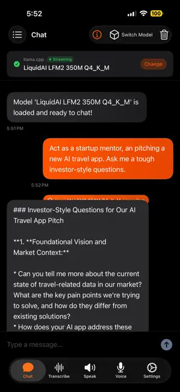

# RunAnywhereAI - Android Example

A sample Android app demonstrating the RunAnywhere Kotlin SDK's on-device AI capabilities.

## Features

- **AI Chat** - Interactive conversations with streaming responses
- **Model Management** - Download, load, and manage AI models
- **Speech-to-Text** - Real-time voice transcription
- **Text-to-Speech** - Neural voice synthesis
- **Settings** - Configure generation parameters

## Screenshots

<p align="center">
  
</p>

## Requirements

- Android Studio Hedgehog (2023.1.1) or later
- Android SDK 24+ (Android 7.0)
- ~2GB free storage for models

## Building

```bash
# Clone the repo
git clone https://github.com/RunanywhereAI/runanywhere-sdks.git
cd runanywhere-sdks/examples/android/RunAnywhereAI

# Build debug APK
./gradlew assembleDebug

# Install on device
./gradlew installDebug
```

## Running

1. Open the project in Android Studio
2. Select a device/emulator (arm64 recommended)
3. Click **Run** (▶️)

Or via command line:
```bash
./gradlew installDebug
adb shell am start -n com.runanywhere.runanywhereai.debug/.MainActivity
```

## Architecture

- **Jetpack Compose** - Modern declarative UI
- **MVVM** - ViewModel + StateFlow
- **Coroutines** - Async operations with Flow for streaming

## SDK Integration

The app demonstrates:

```kotlin
// Initialize SDK
RunAnywhere.initialize(environment = SDKEnvironment.DEVELOPMENT)

// Download model with progress
RunAnywhere.downloadModel(modelId).collect { progress ->
    // Update UI
}

// Stream text generation
RunAnywhere.generateStream(prompt).collect { token ->
    // Display real-time
}
```

See the [Kotlin SDK documentation](../../../sdk/runanywhere-kotlin/README.md) for full API reference.

## Contributing

See [CONTRIBUTING.md](../../../CONTRIBUTING.md) for guidelines.

## License

Apache License 2.0 - See [LICENSE](../../../LICENSE)
