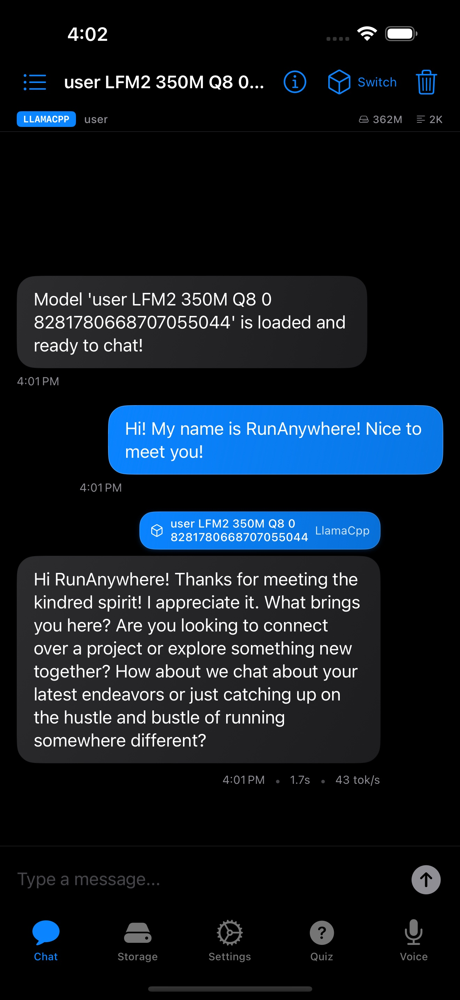

# RunAnywhere AI - Android Example

<p align="center">
  
</p>

<p align="center">
  <a href="https://play.google.com/store/apps/details?id=com.runanywhere.runanywhereai">
    
  </a>
</p>

<p align="center">
  
  
  
  
</p>

**A production-ready reference app demonstrating the [RunAnywhere Kotlin SDK](../../../sdk/runanywhere-kotlin/) capabilities for on-device AI.** This app showcases how to build privacy-first, offline-capable AI features with LLM chat, speech-to-text, text-to-speech, and a complete voice assistant pipeline—all running locally on your device.

---

## Running This App (Local Development)

> **Important:** This sample app consumes the [RunAnywhere Kotlin SDK](../../../sdk/runanywhere-kotlin/) as local Gradle project dependencies. A clean clone needs Android SDK/NDK configuration plus locally staged JNI libraries before the app can package real SDK backends.

### Clean-Clone Bring-Up

Prerequisites:

- Android Studio Hedgehog or newer.
- Android SDK 24+, platform tools, build tools, CMake, and NDK; export `ANDROID_HOME` and `ANDROID_NDK_HOME`.
- JDK 17 on `PATH`.
- An arm64-v8a device is recommended for runtime smoke tests; emulator builds are useful for compile checks.

Create `local.properties` from your Android SDK location if Android Studio has not created it:

```properties
sdk.dir=/path/to/Android/sdk
```

From a fresh checkout:

```bash
cd examples/android/RunAnywhereAI

# Build or refresh local SDK JNI artifacts when this checkout has no staged binaries.
cd ../../..
./scripts/build-core-android.sh arm64-v8a
cd examples/android/RunAnywhereAI

./gradlew :app:assembleDebug
```

Notes:

- `settings.gradle.kts` wires the sample to `sdk/runanywhere-kotlin` and its local backend modules.
- `scripts/build-core-android.sh` stages JNI libraries into the Kotlin SDK core and backend module `jniLibs` directories.
- Keep `local.properties` machine-local; do not commit host-specific SDK paths.
- `scripts/verify.sh` checks SDK/NDK configuration and runs `./gradlew :app:assembleDebug`; set `REFRESH_NATIVE=1` to rebuild the local JNI artifacts first.

### How It Works

This sample app uses `settings.gradle.kts` with a `flatDir` repository to consume the Kotlin SDK as a pre-built AAR:

```
This Sample App → runanywhere-sdk.aar (examples/android/RunAnywhereAI/libs/)
                          ↑
     Staged by: ./scripts/stage-sdk-aars.sh
                          ↑
     Built by: ./scripts/build-core-android.sh arm64-v8a
```

The `build-core-android.sh` script:
1. Builds the native C++ libraries from `runanywhere-commons` for the target ABI
2. Compiles the Kotlin SDK and packages it as `runanywhere-sdk.aar`
3. Copies the AAR into `examples/android/RunAnywhereAI/libs/`
4. JNI `.so` files are bundled inside the AAR (located at `sdk/runanywhere-kotlin/src/main/jniLibs/`)

### After Modifying the SDK

- **Kotlin SDK code changes**: Re-run `./scripts/stage-sdk-aars.sh`, then rebuild in Android Studio or run `./gradlew assembleDebug`
- **C++ code changes** (in `runanywhere-commons`):
  ```bash
  ./scripts/build-core-android.sh arm64-v8a
  ./scripts/stage-sdk-aars.sh
  ```

---

## Try It Now

<p align="center">
  <a href="https://play.google.com/store/apps/details?id=com.runanywhere.runanywhereai">
    
  </a>
</p>

Download the app from Google Play Store to try it out.

---

## Screenshots

<p align="center">
  
</p>

---

## Features

This sample app demonstrates the full power of the RunAnywhere SDK:

| Feature | Description | SDK Integration |
|---------|-------------|-----------------|
| **AI Chat** | Interactive LLM conversations with streaming responses | `RunAnywhere.generateStream()` |
| **Thinking Mode** | Support for models with `<think>...</think>` reasoning | Thinking tag parsing |
| **Real-time Analytics** | Token speed, generation time, inference metrics | `MessageAnalytics` |
| **Speech-to-Text** | Voice transcription with batch & live modes | `RunAnywhere.transcribe()` |
| **Text-to-Speech** | Neural voice synthesis with Piper TTS | `RunAnywhere.synthesize()` |
| **Voice Assistant** | Full STT -> LLM -> TTS pipeline with auto-detection | `RunAnywhere.processVoiceTurn()` |
| **Model Management** | Download, load, and manage multiple AI models | `RunAnywhere.downloadModel()` |
| **Storage Management** | View storage usage and delete models | `RunAnywhere.getStorageInfo()` |
| **Offline Support** | All features work without internet | On-device inference |

---

## Architecture

The app follows modern Android architecture patterns:

```
┌─────────────────────────────────────────────────────────────────┐
│                      Jetpack Compose UI                          │
│  ┌──────────┐ ┌──────────┐ ┌──────────┐ ┌──────────┐ ┌────────┐ │
│  │  Chat    │ │   STT    │ │   TTS    │ │  Voice   │ │Settings│ │
│  │  Screen  │ │  Screen  │ │  Screen  │ │  Screen  │ │ Screen │ │
│  └────┬─────┘ └────┬─────┘ └────┬─────┘ └────┬─────┘ └───┬────┘ │
├───────┼────────────┼────────────┼────────────┼───────────┼──────┤
│       ▼            ▼            ▼            ▼           ▼      │
│  ┌──────────┐ ┌──────────┐ ┌──────────┐ ┌──────────┐ ┌────────┐ │
│  │  Chat    │ │   STT    │ │   TTS    │ │  Voice   │ │Settings│ │
│  │ViewModel │ │ViewModel │ │ViewModel │ │ViewModel │ │ViewModel│
│  └────┬─────┘ └────┬─────┘ └────┬─────┘ └────┬─────┘ └───┬────┘ │
├───────┴────────────┴────────────┴────────────┴───────────┴──────┤
│                                                                  │
│                    RunAnywhere Kotlin SDK                        │
│  ┌──────────────────────────────────────────────────────────┐   │
│  │  Extension Functions (generate, transcribe, synthesize)   │   │
│  │  EventBus (LLMEvent, STTEvent, TTSEvent, ModelEvent)     │   │
│  │  Model Management (download, load, unload, delete)        │   │
│  └──────────────────────────────────────────────────────────┘   │
│                              │                                   │
│           ┌──────────────────┴──────────────────┐               │
│           ▼                                      ▼               │
│  ┌─────────────────┐                  ┌─────────────────┐       │
│  │   LlamaCpp      │                  │   ONNX Runtime  │       │
│  │   (LLM/GGUF)    │                  │   (STT/TTS)     │       │
│  └─────────────────┘                  └─────────────────┘       │
└─────────────────────────────────────────────────────────────────┘
```

### Key Architecture Decisions

- **MVVM Pattern** — ViewModels manage UI state with `StateFlow`, Compose observes changes
- **Single Activity** — Jetpack Navigation Compose handles all screen transitions
- **Coroutines & Flow** — All async operations use Kotlin coroutines with structured concurrency
- **EventBus Pattern** — SDK events (model loading, generation, etc.) propagate via `EventBus.events`
- **Repository Abstraction** — `ConversationStore` persists chat history

---

## Project Structure

```
RunAnywhereAI/
├── app/
│   ├── src/main/
│   │   ├── java/com/runanywhere/runanywhereai/
│   │   │   ├── RunAnywhereApplication.kt      # SDK initialization, model registration
│   │   │   ├── MainActivity.kt                # Entry point, initialization state handling
│   │   │   │
│   │   │   ├── data/
│   │   │   │   └── ConversationStore.kt       # Chat history persistence
│   │   │   │
│   │   │   ├── domain/
│   │   │   │   ├── models/
│   │   │   │   │   └── ChatMessage.kt         # Message data model with analytics
│   │   │   │   └── services/
│   │   │   │       └── AudioCaptureService.kt # Microphone audio capture
│   │   │   │
│   │   │   ├── presentation/
│   │   │   │   ├── chat/
│   │   │   │   │   ├── ChatScreen.kt          # LLM chat UI with streaming
│   │   │   │   │   ├── ChatViewModel.kt       # Chat logic, thinking mode
│   │   │   │   │   └── components/
│   │   │   │   │       └── MessageInput.kt    # Chat input component
│   │   │   │   │
│   │   │   │   ├── stt/
│   │   │   │   │   ├── SpeechToTextScreen.kt  # STT UI with waveform
│   │   │   │   │   └── SpeechToTextViewModel.kt # Batch & live transcription
│   │   │   │   │
│   │   │   │   ├── tts/
│   │   │   │   │   ├── TextToSpeechScreen.kt  # TTS UI with playback
│   │   │   │   │   └── TextToSpeechViewModel.kt # Synthesis & audio playback
│   │   │   │   │
│   │   │   │   ├── voice/
│   │   │   │   │   ├── VoiceAssistantScreen.kt # Full voice pipeline UI
│   │   │   │   │   └── VoiceAssistantViewModel.kt # STT→LLM→TTS orchestration
│   │   │   │   │
│   │   │   │   ├── settings/
│   │   │   │   │   ├── SettingsScreen.kt      # Storage & model management
│   │   │   │   │   └── SettingsViewModel.kt   # Storage info, cache clearing
│   │   │   │   │
│   │   │   │   ├── models/
│   │   │   │   │   ├── ModelSelectionBottomSheet.kt # Model picker UI
│   │   │   │   │   └── ModelSelectionViewModel.kt   # Download & load logic
│   │   │   │   │
│   │   │   │   ├── navigation/
│   │   │   │   │   └── AppNavigation.kt       # Bottom nav, routing
│   │   │   │   │
│   │   │   │   └── common/
│   │   │   │       └── InitializationViews.kt # Loading/error states
│   │   │   │
│   │   │   └── ui/theme/
│   │   │       ├── Theme.kt                   # Material 3 theming
│   │   │       ├── AppColors.kt               # Color palette
│   │   │       ├── Type.kt                    # Typography
│   │   │       └── Dimensions.kt              # Spacing constants
│   │   │
│   │   ├── res/                               # Resources (icons, strings)
│   │   └── AndroidManifest.xml                # Permissions, app config
│   │
│   ├── src/test/                              # Unit tests
│   └── src/androidTest/                       # Instrumentation tests
│
├── build.gradle.kts                           # Project build config
├── settings.gradle.kts                        # Module settings
└── README.md                                  # This file
```

---

## Quick Start

### Prerequisites

- **Android Studio** Hedgehog (2023.1.1) or later
- **Android SDK** 24+ (Android 7.0 Nougat)
- **JDK** 17+
- **Device/Emulator** with arm64-v8a architecture (recommended: physical device)
- **~2GB** free storage for AI models

### Clone & Build

```bash
# Clone the repository
git clone https://github.com/RunanywhereAI/runanywhere-sdks.git
cd runanywhere-sdks/examples/android/RunAnywhereAI

# Build debug APK
./gradlew assembleDebug

# Install on connected device
./gradlew installDebug
```

### Run via Android Studio

1. Open the project in Android Studio
2. Wait for Gradle sync to complete
3. Select a physical device (arm64 recommended) or emulator
4. Click **Run** or press `Shift + F10`

### Run via Command Line

```bash
# Install and launch
./gradlew installDebug
adb shell am start -n com.runanywhere.runanywhereai.debug/.MainActivity
```

---

## SDK Integration Examples

### Initialize the SDK

The SDK is initialized in `RunAnywhereApplication.kt`:

```kotlin
// Initialize SDK (development mode — no API key needed)
RunAnywhere.initialize(
    context = appContext,
    environment = SDKEnvironment.SDK_ENVIRONMENT_DEVELOPMENT,
)
// Phase 2 (device registration) runs lazily on the first feature call
// via RunAnywhere.ensureServicesReady(). No explicit call needed here.

// Register AI backends
LlamaCPP.register(priority = 100)  // LLM backend (GGUF models)
ONNX.register(priority = 100)      // STT/TTS backend

// Register models
RunAnywhere.registerModel(
    id = "smollm2-360m-q8_0",
    name = "SmolLM2 360M Q8_0",
    url = "https://huggingface.co/prithivMLmods/SmolLM2-360M-GGUF/...",
    framework = InferenceFramework.INFERENCE_FRAMEWORK_LLAMA_CPP,
    modality = ModelCategory.MODEL_CATEGORY_TEXT_GENERATION,
    artifactType = null,
    memoryRequirement = 500_000_000L,
    supportsThinking = false,
    supportsLora = false,
)
```

### Download & Load a Model

```kotlin
// Download with progress tracking (pass the registered RAModelInfo)
val modelInfo = RunAnywhere.registerModel(/* ... */)
RunAnywhere.downloadModel(modelInfo).collect { progress ->
    println("Download: ${(progress.progress * 100).toInt()}%")
}

// Load into memory
RunAnywhere.loadModel(
    RAModelLoadRequest(
        model_id = "smollm2-360m-q8_0",
        category = ModelCategory.MODEL_CATEGORY_TEXT_GENERATION,
    )
)
```

### Stream Text Generation

```kotlin
// Generate with streaming
RunAnywhere.generateStream(prompt).collect { token ->
    // Display token in real-time
    displayToken(token)
}

// Or non-streaming
val result = RunAnywhere.generate(prompt)
println("Response: ${result.text}")
```

### Speech-to-Text

```kotlin
// Load STT model via the unified loadModel API
RunAnywhere.loadModel(
    RAModelLoadRequest(
        model_id = "sherpa-onnx-whisper-tiny.en",
        category = ModelCategory.MODEL_CATEGORY_SPEECH_RECOGNITION,
    )
)

// Transcribe audio bytes
val transcription = RunAnywhere.transcribe(audioBytes, RASTTOptions())
println("Transcription: ${transcription.text}")
```

### Text-to-Speech

```kotlin
// Load TTS model via the unified loadModel API
RunAnywhere.loadModel(
    RAModelLoadRequest(
        model_id = "vits-piper-en_US-lessac-medium",
        category = ModelCategory.MODEL_CATEGORY_SPEECH_SYNTHESIS,
    )
)

// Synthesize speech
val result = RunAnywhere.synthesize(text, RATTSOptions())
// result.audio_data contains raw Float32 PCM audio bytes
```

### Voice Pipeline (STT → LLM → TTS)

```kotlin
// Initialize the voice agent from currently-loaded STT/LLM/TTS models
RunAnywhere.initializeVoiceAgentWithLoadedModels()

// Process a single voice turn through the full pipeline
val result = RunAnywhere.processVoiceTurn(audioData)

if (result.transcription.isNotEmpty()) {
    println("User said: ${result.transcription}")
    println("AI response: ${result.response_text}")
    // result.tts_audio contains synthesized TTS audio bytes
}
```

---

## Key Screens Explained

### 1. Chat Screen (`ChatScreen.kt`)

**What it demonstrates:**
- Streaming text generation with real-time token display
- Thinking mode support (`<think>...</think>` tags)
- Message analytics (tokens/sec, time to first token)
- Conversation history management
- Model selection bottom sheet integration

**Key SDK APIs:**
- `RunAnywhere.generateStream()` — Streaming generation
- `RunAnywhere.generate()` — Non-streaming generation
- `RunAnywhere.cancelGeneration()` — Stop generation
- `EventBus.events.filterIsInstance<LLMEvent>()` — Listen for LLM events

### 2. Speech-to-Text Screen (`SpeechToTextScreen.kt`)

**What it demonstrates:**
- Batch mode: Record full audio, then transcribe
- Live mode: Real-time streaming transcription
- Audio level visualization
- Transcription metrics (confidence, RTF, word count)

**Key SDK APIs:**
- `RunAnywhere.loadModel(RAModelLoadRequest(..., MODEL_CATEGORY_SPEECH_RECOGNITION))` — Load Whisper model
- `RunAnywhere.transcribe()` — Batch transcription
- `RunAnywhere.transcribeStream()` — Streaming transcription

### 3. Text-to-Speech Screen (`TextToSpeechScreen.kt`)

**What it demonstrates:**
- Neural voice synthesis with Piper TTS
- Speed and pitch controls
- Audio playback with progress
- Fun sample texts for testing

**Key SDK APIs:**
- `RunAnywhere.loadModel(RAModelLoadRequest(..., MODEL_CATEGORY_SPEECH_SYNTHESIS))` — Load TTS model
- `RunAnywhere.synthesize()` — Generate speech audio
- `RunAnywhere.stopSynthesis()` — Cancel synthesis

### 4. Voice Assistant Screen (`VoiceAssistantScreen.kt`)

**What it demonstrates:**
- Complete voice AI pipeline
- Automatic speech detection with silence timeout
- Continuous conversation mode
- Model status tracking for all 3 components (STT, LLM, TTS)

**Key SDK APIs:**
- `RunAnywhere.initializeVoiceAgentWithLoadedModels()` — Initialize voice agent from loaded models
- `RunAnywhere.processVoiceTurn()` — Process audio through full STT→LLM→TTS pipeline
- `RunAnywhere.getVoiceAgentComponentStates()` — Check STT/LLM/TTS component status

### 5. Settings Screen (`SettingsScreen.kt`)

**What it demonstrates:**
- Storage usage overview
- Downloaded model management
- Model deletion with confirmation
- Cache clearing

**Key SDK APIs:**
- `RunAnywhere.getStorageInfo()` — Get storage details
- `RunAnywhere.deleteStorage(StorageDeleteRequest(...))` — Remove downloaded model
- `RunAnywhere.clearCache()` / `RunAnywhere.cleanTempFiles()` — Clear temporary files

---

## Testing

### Run Unit Tests

```bash
./gradlew test
```

### Run Instrumentation Tests

```bash
./gradlew connectedAndroidTest
```

### Run Lint & Static Analysis

```bash
# Detekt static analysis
./gradlew detekt

# ktlint formatting check
./gradlew ktlintCheck

# Android lint
./gradlew lint
```

---

## Debugging

### Enable Verbose Logging

Filter logcat for RunAnywhere SDK logs:

```bash
adb logcat -s "RunAnywhere:D" "RunAnywhereApp:D" "ChatViewModel:D"
```

### Common Log Tags

| Tag | Description |
|-----|-------------|
| `RunAnywhereApp` | SDK initialization, model registration |
| `ChatViewModel` | LLM generation, streaming |
| `STTViewModel` | Speech transcription |
| `TTSViewModel` | Speech synthesis |
| `VoiceAssistantVM` | Voice pipeline |
| `ModelSelectionVM` | Model downloads, loading |

### Memory Profiling

1. Open Android Studio Profiler
2. Select your app process
3. Record memory allocations during model loading
4. Expected: ~300MB-2GB depending on model size

---

## Configuration

### Build Variants

| Variant | Description |
|---------|-------------|
| `debug` | Development build with debugging enabled |
| `release` | Optimized build with R8/ProGuard |
| `benchmark` | Release-like build for performance testing |

### Environment Variables (for release builds)

```bash
export KEYSTORE_PATH=/path/to/keystore.jks
export KEYSTORE_PASSWORD=your_password
export KEY_ALIAS=your_alias
export KEY_PASSWORD=your_key_password
```

---

## Supported Models

### LLM Models (LlamaCpp/GGUF)

| Model | Size | Memory | Description |
|-------|------|--------|-------------|
| SmolLM2 360M Q8_0 | ~400MB | 500MB | Fast, lightweight chat |
| Qwen 2.5 0.5B Q6_K | ~500MB | 600MB | Multilingual, efficient |
| LFM2 350M Q4_K_M | ~200MB | 250MB | LiquidAI, ultra-compact |
| Llama 2 7B Chat Q4_K_M | ~4GB | 4GB | Powerful, larger model |
| Mistral 7B Instruct Q4_K_M | ~4GB | 4GB | High quality responses |

### STT Models (ONNX/Whisper)

| Model | Size | Description |
|-------|------|-------------|
| Sherpa Whisper Tiny (EN) | ~75MB | English transcription |

### TTS Models (ONNX/Piper)

| Model | Size | Description |
|-------|------|-------------|
| Piper US English (Medium) | ~65MB | Natural American voice |
| Piper British English (Medium) | ~65MB | British accent |

---

## Known Limitations

- **ARM64 Only** — Native libraries built for `arm64-v8a` only (x86 emulators not supported)
- **Memory Usage** — Large models (7B+) require devices with 6GB+ RAM
- **First Load** — Initial model loading takes 1-3 seconds (cached afterward)
- **Thermal Throttling** — Extended inference may trigger device throttling on some devices

---

## Contributing

See [CONTRIBUTING.md](../../../CONTRIBUTING.md) for guidelines.

### Development Setup

```bash
# Fork and clone
git clone https://github.com/YOUR_USERNAME/runanywhere-sdks.git
cd runanywhere-sdks/examples/android/RunAnywhereAI

# Create feature branch
git checkout -b feature/your-feature

# Make changes and test
./gradlew assembleDebug
./gradlew test
./gradlew detekt ktlintCheck

# Commit and push
git commit -m "feat: your feature description"
git push origin feature/your-feature

# Open Pull Request
```

---

## License

This project is licensed under the Apache License 2.0 - see [LICENSE](../../../LICENSE) for details.

---

## Support

- **Discord**: [Join our community](https://discord.gg/N359FBbDVd)
- **GitHub Issues**: [Report bugs](https://github.com/RunanywhereAI/runanywhere-sdks/issues)
- **Email**: san@runanywhere.ai
- **Twitter**: [@RunanywhereAI](https://twitter.com/RunanywhereAI)

---

## Related Documentation

- [RunAnywhere Kotlin SDK](../../../sdk/runanywhere-kotlin/README.md) — Full SDK documentation
- [iOS Example App](../../ios/RunAnywhereAI/README.md) — iOS counterpart
- [React Native Example](../../react-native/RunAnywhereAI/README.md) — Cross-platform option
- [Main README](../../../README.md) — Project overview
