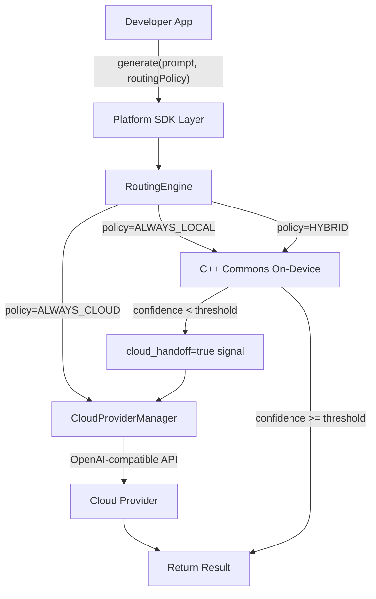

# Hybrid Cloud Fallback for RunAnywhere SDK

**Status**: All phases completed (Phase 1-5).

## Architecture Overview

The design follows a **"signal from C++, action from SDK"** pattern:

- **C++ commons**: Computes confidence scores during on-device inference and signals when cloud handoff is needed
- **Platform SDKs**: Implement cloud provider management, HTTP calls to cloud APIs, and automatic fallback orchestration

This keeps the core inference engine language-agnostic while letting each platform use its native HTTP/networking stack for cloud calls.



---

## Phase 1: C++ Commons - Confidence Scoring and Handoff Signal ✅

**Goal**: Make the on-device engine self-aware of its confidence level and signal when a query is too complex.

### 1a. Confidence Tracking in LLM Component

Added entropy-based confidence computation to the token generation loop.

**Key files modified:**

- `sdk/runanywhere-commons/include/rac/features/llm/rac_llm_types.h` - Added `confidence_threshold` to `rac_llm_options_t`, added `confidence`, `cloud_handoff`, `handoff_reason` to `rac_llm_result_t`
- `sdk/runanywhere-commons/src/backends/llamacpp/llamacpp_backend.cpp` - Added `RACConfidenceTracker` (rolling window of 10 tokens), compute per-token uncertainty from logits via `rac_compute_token_uncertainty()`
- `sdk/runanywhere-commons/include/rac/features/llm/rac_llm.h` - Exposed new result fields in C API

**Logic**:

- After each token decode, compute token uncertainty via Shannon entropy from the logit distribution
- Normalize: `confidence = 1.0 - (uncertainty / max_entropy)`
- **First-token check**: If first token confidence < threshold, immediately return `cloud_handoff=true` with zero decode tokens (early bail-out)
- **Rolling window check**: Track rolling average over last 10 tokens; if it drops below threshold, stop generation and flag `cloud_handoff=true` (mid-generation bail-out)

### 1b. Handoff Signal in Generation Results

Every generation result (both streaming and non-streaming) includes:

- `cloud_handoff` (bool) - whether the engine recommends cloud fallback
- `confidence` (float, 0.0-1.0) - the model's confidence score
- `handoff_reason` (enum) - `FIRST_TOKEN_LOW_CONFIDENCE`, `ROLLING_WINDOW_DEGRADATION`, `NONE`

For streaming, added `rac_llm_handoff_callback_fn` that fires when handoff is triggered mid-stream.

### 1c. Backend Integration

Entropy/logit access wired through the backend abstraction:

- `sdk/runanywhere-commons/src/backends/llamacpp/` - llama.cpp exposes logits via `llama_get_logits_ith()`; wired to `rac_compute_token_uncertainty()`
- `sdk/runanywhere-commons/src/backends/llamacpp/rac_llm_llamacpp.cpp` - C wrapper maps confidence fields between C++ and C API

---

## Phase 2: C++ Commons - Routing Policy Types and Configuration ✅

**Goal**: Define the policy/configuration system in C++ so all platforms share the same routing semantics.

### 2a. Routing Types

New header: `include/rac/features/llm/rac_routing.h`

```c
typedef enum {
    RAC_ROUTING_ALWAYS_LOCAL = 0,
    RAC_ROUTING_ALWAYS_CLOUD = 1,
    RAC_ROUTING_HYBRID_AUTO = 2,
    RAC_ROUTING_HYBRID_MANUAL = 3
} rac_routing_mode_t;

typedef struct {
    rac_routing_mode_t mode;
    float confidence_threshold;      // 0.0-1.0, default 0.7
    uint32_t max_local_latency_ms;   // 0 = no limit
    float cost_cap_usd;              // 0.0 = no cap
    rac_bool_t prefer_streaming;
} rac_routing_policy_t;
```

### 2b. Policy Defaults and Validation

- `sdk/runanywhere-commons/src/features/llm/rac_routing.cpp` - `rac_routing_policy_create_default()`, `rac_routing_policy_validate()`
- Default: `HYBRID_MANUAL` mode with `confidence_threshold=0.7`
- Validation: threshold in [0.0, 1.0], modes are valid enum values

---

## Phase 3: Platform SDKs - Cloud Provider Infrastructure ✅

**Goal**: Each platform SDK implements cloud provider management using its native networking stack.

### 3a. Cloud Provider Protocol/Interface

Defined in each SDK:

| SDK | File | Type |
|-----|------|------|
| Swift | `Public/Extensions/Cloud/CloudProvider.swift` | `protocol CloudProvider` |
| Kotlin | `public/extensions/Cloud/CloudProvider.kt` | `interface CloudProvider` |
| React Native | `cloud/CloudProvider.ts` | `interface CloudProvider` |
| Flutter | `features/cloud/cloud_provider.dart` | `abstract class CloudProvider` |

### 3b. Built-in OpenAI-Compatible Provider

Each SDK ships `OpenAICompatibleProvider` that works with any OpenAI-compatible API:

- Platform-native HTTP: URLSession (Swift), Ktor (Kotlin), fetch (RN), dart:io (Flutter)
- SSE streaming support for `generateStream`
- Configurable: base URL, API key, model name, additional headers
- Works with: OpenAI, Groq, Together, Ollama, vLLM, etc.

### 3c. Cloud Provider Manager

Each SDK has a `CloudProviderManager` singleton:

- Register/unregister providers at runtime
- Select provider by ID or use default
- First registered provider becomes default
- Thread-safe: actor (Swift), Mutex (Kotlin), sync (RN/Flutter)

---

## Phase 4: Platform SDKs - Routing Engine Integration ✅

**Goal**: Wire the confidence signal from C++ to the cloud provider, making fallback seamless.

### 4a. RoutingEngine per SDK

Each SDK has a `RoutingEngine` that orchestrates generation:

```
RoutingEngine.generate(prompt, policy):
  1. ALWAYS_CLOUD → CloudProviderManager.generate()
  2. ALWAYS_LOCAL → CppBridge.generate() (existing path)
  3. HYBRID_AUTO → on-device first, auto-fallback if cloud_handoff=true
  4. HYBRID_MANUAL → on-device first, return handoff signal (app decides)
```

### 4b. Public API

```swift
// Register cloud provider
await RunAnywhere.registerCloudProvider(OpenAICompatibleProvider(apiKey: "sk-...", model: "gpt-4o-mini"))

// Set routing policy
await RunAnywhere.setDefaultRoutingPolicy(.hybridAuto(confidenceThreshold: 0.7))

// Generate with routing
let result = try await RunAnywhere.generateWithRouting("prompt", routingPolicy: .hybridAuto())
print(result.routingDecision.executionTarget) // .onDevice, .cloud, or .hybridFallback
```

### 4c. Streaming with Routing

For streaming in `HYBRID_AUTO` mode, the C++ layer stops generation on low confidence and signals handoff. The RoutingEngine transparently switches to cloud streaming.

### 4d. Generation Result Enrichment

Every `RoutedGenerationResult` includes:

- `executionTarget`: `.onDevice` | `.cloud` | `.hybridFallback`
- `confidence`: Float (0.0-1.0)
- `routingDecision`: Full routing metadata (reason, provider used, model, etc.)

---

## Phase 5: Advanced Features ✅

### 5a. Cost Tracking

- `CloudCostTracker` singleton tracks per-request cloud costs (input/output tokens, USD)
- Per-provider cost breakdowns
- Budget enforcement via `costCapUSD` in `RoutingPolicy` (throws `BudgetExceeded` error)
- Public API: `RunAnywhere.cloudCostSummary()`, `RunAnywhere.resetCloudCosts()`

### 5b. Telemetry Integration

- `RoutingEvent` - emitted on every routing decision (mode, target, confidence, latency)
- `CloudCostEvent` - emitted on cloud cost incurred (analytics-only)
- `ProviderFailoverEvent` - emitted on provider failover
- `LatencyTimeoutEvent` - emitted on TTFT timeout cloud fallback
- All events flow through existing `EventBus` infrastructure

### 5c. Latency-Based Routing

- If `maxLocalLatencyMs` set in routing policy, local generation races against a timeout
- Uses platform-native concurrency: `withThrowingTaskGroup` (Swift), `select`/`async` (Kotlin), `Promise.race` (RN), `Completer` (Flutter)
- If local exceeds timeout, falls back to cloud automatically

### 5d. Provider Failover Chain

- `ProviderFailoverChain` with priority ordering (higher = preferred)
- Circuit breaker pattern: N consecutive failures → provider temporarily removed
- Configurable threshold and cooldown period
- Public API: `RunAnywhere.setProviderFailoverChain()`, `RunAnywhere.failoverChainHealthStatus()`

---

## Files Created/Modified

### New Files (38)

**C++ Commons (2)**
- `sdk/runanywhere-commons/include/rac/features/llm/rac_routing.h`
- `sdk/runanywhere-commons/src/features/llm/rac_routing.cpp`

**Swift (9)**
- `sdk/runanywhere-swift/Sources/RunAnywhere/Public/Extensions/Cloud/CloudProvider.swift`
- `sdk/runanywhere-swift/Sources/RunAnywhere/Public/Extensions/Cloud/CloudTypes.swift`
- `sdk/runanywhere-swift/Sources/RunAnywhere/Public/Extensions/Cloud/RunAnywhere+CloudRouting.swift`
- `sdk/runanywhere-swift/Sources/RunAnywhere/Features/Cloud/OpenAICompatibleProvider.swift`
- `sdk/runanywhere-swift/Sources/RunAnywhere/Features/Cloud/CloudProviderManager.swift`
- `sdk/runanywhere-swift/Sources/RunAnywhere/Features/Cloud/RoutingEngine.swift`
- `sdk/runanywhere-swift/Sources/RunAnywhere/Features/Cloud/CloudCostTracker.swift`
- `sdk/runanywhere-swift/Sources/RunAnywhere/Features/Cloud/ProviderFailoverChain.swift`
- `sdk/runanywhere-swift/Sources/RunAnywhere/Features/Cloud/RoutingTelemetry.swift`

**Kotlin (9)**
- `sdk/runanywhere-kotlin/.../public/extensions/Cloud/CloudProvider.kt`
- `sdk/runanywhere-kotlin/.../public/extensions/Cloud/CloudTypes.kt`
- `sdk/runanywhere-kotlin/.../public/extensions/RunAnywhere+CloudRouting.kt`
- `sdk/runanywhere-kotlin/.../features/cloud/OpenAICompatibleProvider.kt`
- `sdk/runanywhere-kotlin/.../features/cloud/CloudProviderManager.kt`
- `sdk/runanywhere-kotlin/.../features/cloud/RoutingEngine.kt`
- `sdk/runanywhere-kotlin/.../features/cloud/CloudCostTracker.kt`
- `sdk/runanywhere-kotlin/.../features/cloud/ProviderFailoverChain.kt`
- `sdk/runanywhere-kotlin/.../features/cloud/RoutingTelemetry.kt`

**React Native (9)**
- `sdk/runanywhere-react-native/.../cloud/CloudProvider.ts`
- `sdk/runanywhere-react-native/.../cloud/CloudTypes.ts`
- `sdk/runanywhere-react-native/.../cloud/OpenAICompatibleProvider.ts`
- `sdk/runanywhere-react-native/.../cloud/CloudProviderManager.ts`
- `sdk/runanywhere-react-native/.../cloud/RoutingEngine.ts`
- `sdk/runanywhere-react-native/.../cloud/CloudCostTracker.ts`
- `sdk/runanywhere-react-native/.../cloud/ProviderFailoverChain.ts`
- `sdk/runanywhere-react-native/.../cloud/RoutingTelemetry.ts`
- `sdk/runanywhere-react-native/.../cloud/index.ts`

**Flutter (8)**
- `sdk/runanywhere-flutter/.../features/cloud/cloud_types.dart`
- `sdk/runanywhere-flutter/.../features/cloud/cloud_provider.dart`
- `sdk/runanywhere-flutter/.../features/cloud/openai_compatible_provider.dart`
- `sdk/runanywhere-flutter/.../features/cloud/cloud_provider_manager.dart`
- `sdk/runanywhere-flutter/.../features/cloud/routing_engine.dart`
- `sdk/runanywhere-flutter/.../features/cloud/cloud_cost_tracker.dart`
- `sdk/runanywhere-flutter/.../features/cloud/provider_failover_chain.dart`
- `sdk/runanywhere-flutter/.../features/cloud/routing_telemetry.dart`

### Modified Files (17)

- `sdk/runanywhere-commons/include/rac/features/llm/rac_llm_types.h` - confidence/handoff fields
- `sdk/runanywhere-commons/include/rac/features/llm/rac_llm.h` - routing header include
- `sdk/runanywhere-commons/exports/RACommons.exports` - new routing symbols
- `sdk/runanywhere-commons/src/backends/llamacpp/llamacpp_backend.h` - confidence fields in TextGenerationResult
- `sdk/runanywhere-commons/src/backends/llamacpp/llamacpp_backend.cpp` - RACConfidenceTracker, rac_compute_token_uncertainty
- `sdk/runanywhere-commons/src/backends/llamacpp/rac_llm_llamacpp.cpp` - confidence threshold wiring
- `sdk/runanywhere-swift/Sources/RunAnywhere/CRACommons/include/rac_llm_types.h` - copied header
- `sdk/runanywhere-swift/Sources/RunAnywhere/CRACommons/include/CRACommons.h` - routing include
- `sdk/runanywhere-swift/Sources/RunAnywhere/Public/Extensions/LLM/LLMTypes.swift` - confidence fields
- `sdk/runanywhere-kotlin/.../public/extensions/LLM/LLMTypes.kt` - confidence fields
- `sdk/runanywhere-kotlin/.../public/extensions/ExtensionTypes.kt` - removed old RoutingPolicy
- `sdk/runanywhere-react-native/.../types/LLMTypes.ts` - confidence fields
- `sdk/runanywhere-react-native/.../types/models.ts` - confidence fields
- `sdk/runanywhere-react-native/.../types/index.ts` - cloud type exports
- `sdk/runanywhere-react-native/.../Public/Extensions/RunAnywhere+TextGeneration.ts` - confidence passing
- `sdk/runanywhere-react-native/.../index.ts` - cloud module exports
- `sdk/runanywhere-flutter/.../public/types/generation_types.dart` - confidence fields

---

## Key Design Decisions

1. **Entropy computation in C++ commons, not per-SDK** - ensures consistent behavior across all platforms
2. **Cloud HTTP calls in platform SDKs, not C++** - each platform has its own optimal networking stack (URLSession, OkHttp/Ktor, fetch, dart:io)
3. **OpenAI-compatible API as the standard** - covers OpenAI, Groq, Together, Ollama, vLLM, etc.
4. **Signal-based handoff as the default** - `HYBRID_MANUAL` is the safe default; apps opt into `HYBRID_AUTO` for seamless fallback
5. **Per-request routing policy** - different queries can have different routing strategies
6. **Swift SDK as source of truth** for Phase 3-5 implementation, then port to Kotlin/RN/Flutter
