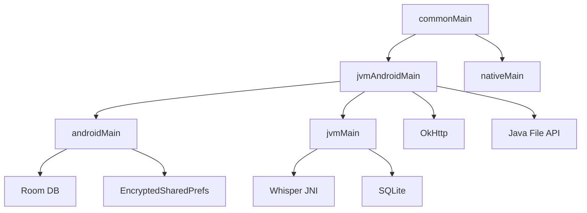
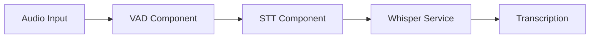
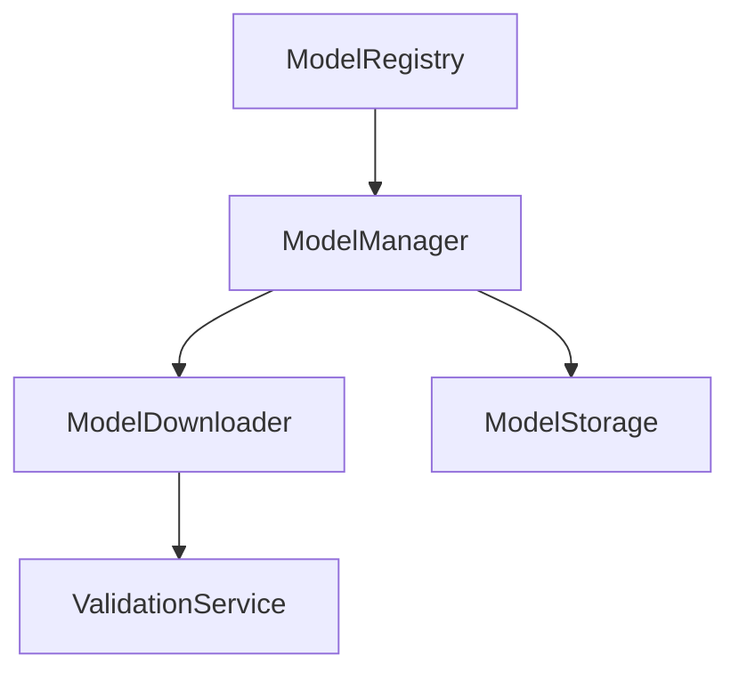
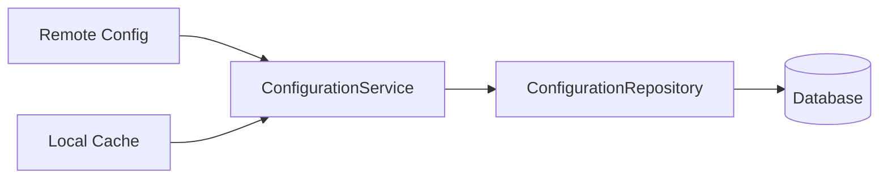
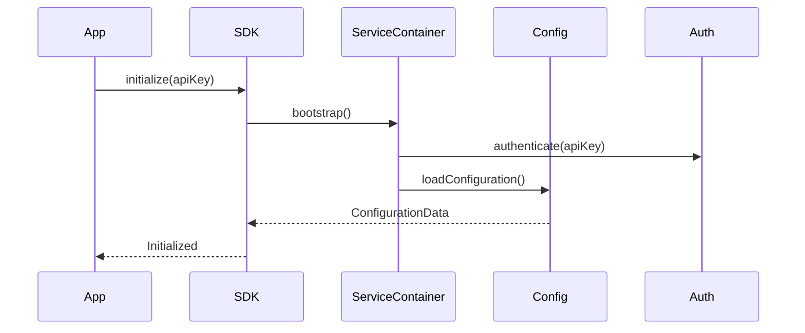
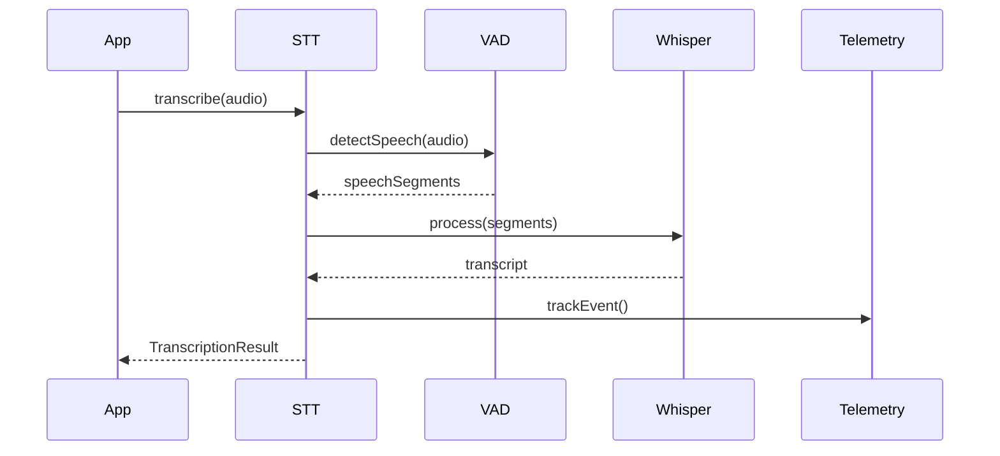

# RunAnywhere SDK Architecture Documentation

## Table of Contents

1. [Overview](#overview)
2. [Project Structure](#project-structure)
3. [Platform Architecture](#platform-architecture)
4. [Core Components](#core-components)
5. [Module Breakdown](#module-breakdown)
6. [Data Flow](#data-flow)
7. [Key Design Patterns](#key-design-patterns)

---

## Overview

RunAnywhere SDK is a **Kotlin Multiplatform (KMP)** project designed for on-device LLM inference
with speech-to-text capabilities. The SDK provides a unified API across Android, JVM (Desktop), and
Native platforms (iOS/macOS placeholders).

### Key Technologies

- **Kotlin Multiplatform**: Share code across platforms
- **Expect/Actual Pattern**: Platform-specific implementations
- **Coroutines**: Asynchronous programming
- **Flow**: Reactive streams
- **Room Database** (Android): Local persistence
- **OkHttp**: Network operations (JVM/Android)
- **Whisper JNI**: Speech-to-text engine

---

## Project Structure

```
sdk/runanywhere-kotlin/
├── src/
│   ├── commonMain/kotlin/      # Shared code for all platforms
│   ├── androidMain/kotlin/     # Android-specific implementations
│   ├── jvmMain/kotlin/         # JVM/Desktop implementations
│   ├── jvmAndroidMain/kotlin/  # Shared code between JVM and Android
│   └── nativeMain/kotlin/      # Native platform placeholders
```

### Module Dependencies



---

## Platform Architecture

### Common Module (`commonMain`)

The common module defines the **shared business logic** and **platform abstractions** that all
platforms must implement.

#### Core Abstractions

1. **Network Layer** (`network/`)
    - `HttpClient` interface - Platform-agnostic HTTP operations
    - `NetworkService` protocol - High-level network operations
    - `APIClient` - Common API client implementation
    - `NetworkChecker` interface - Network connectivity checking

2. **Storage Layer** (`storage/`)
    - `FileSystem` interface - File operations abstraction
    - `PlatformStorage` interface - Key-value storage
    - `SecureStorage` interface - Encrypted storage for sensitive data

3. **Data Models** (`data/models/`)
    - `ConfigurationModels` - SDK configuration data classes
    - `ModelInfoModels` - ML model metadata
    - `DeviceInfoModels` - Device capabilities and info
    - `TelemetryModels` - Analytics and telemetry
    - `AuthenticationModels` - Auth tokens and credentials
    - `SDKError` - Unified error hierarchy

4. **Components** (`components/`)
    - **STT (Speech-to-Text)**
        - `STTComponent` - Main STT component
        - `STTService` interface - Platform STT implementations
        - `WhisperSTTService` - Expect class for Whisper integration
    - **VAD (Voice Activity Detection)**
        - `VADComponent` - Voice detection component
        - `VADService` interface - Platform VAD implementations
    - **Base Architecture**
        - `BaseComponent` - Abstract component foundation
        - `ComponentProtocols` - Component interfaces

5. **Services** (`services/`)
    - `ConfigurationService` - Configuration management
    - `ModelInfoService` - Model registry and metadata
    - `TelemetryService` - Analytics tracking
    - `DeviceInfoService` - Device capability detection
    - `AuthenticationService` - API key and token management
    - `DownloadService` - Model downloading
    - `ValidationService` - Model validation

6. **Foundation** (`foundation/`)
    - `ServiceContainer` - Dependency injection container
    - `SDKLogger` - Unified logging
    - `PlatformContext` - Platform initialization

7. **Public API** (`public/`)
    - `RunAnywhere` - Main SDK entry point (expect object)
    - `BaseRunAnywhereSDK` - Common SDK implementation

### Android Module (`androidMain`)

Android-specific implementations leveraging Android SDK features.

#### Key Components

1. **Database Layer** (`data/database/`)
    - **Room Database Setup**
        - `RunAnywhereDatabase` - Room database definition
        - `DatabaseConverters` - Type converters for complex types
        - **DAOs (Data Access Objects)**
            - `ConfigurationDao` - Configuration persistence
            - `ModelInfoDao` - Model metadata queries
            - `DeviceInfoDao` - Device info persistence
            - `TelemetryDao` - Analytics data
            - `AuthTokenDao` - Secure token storage
        - **Entities**
            - `DatabaseEntities` - Room entity definitions matching data models

2. **Network Implementation**
    - `OkHttpEngine` - OkHttp-based HTTP client
    - `AndroidNetworkChecker` - ConnectivityManager-based network checking

3. **Storage Implementation**
    - `AndroidFileSystem` - Android file operations
    - `AndroidPlatformStorage` - SharedPreferences storage
    - `AndroidSecureStorage` - EncryptedSharedPreferences

4. **Security**
    - `KeychainManager` - Secure credential storage using Android Keystore

5. **Services**
    - `AndroidDeviceInfoService` - Android device detection
    - `WhisperSTTService` - Android STT implementation
    - `WebRTCVADService` - WebRTC-based VAD for Android

6. **File Management**
    - `FileManager` - Android file operations with proper directory structure

### JVM Module (`jvmMain`)

Desktop JVM implementations for development and testing.

#### Key Components

1. **Storage**
    - `JvmFileSystem` - Java NIO file operations
    - `JvmPlatformStorage` - In-memory key-value storage
    - `JvmSecureStorage` - Encrypted properties file storage
    - `DatabaseManager` - SQLite-based local caching
    - `KeychainManager` - Java Preferences API with encryption

2. **Network**
    - `OkHttpEngine` - Shared with Android
    - `JvmNetworkChecker` - InetAddress-based connectivity

3. **Services**
    - `JvmDeviceInfoService` - JVM system property detection
    - `WhisperSTTService` - Whisper JNI integration
    - `JvmVADService` - Energy-based VAD implementation

4. **Native Libraries**
    - `NativeLoader` - Dynamic library loading for JNI

### JVM-Android Shared Module (`jvmAndroidMain`)

Code shared between JVM and Android platforms that use the same JVM runtime.

#### Shared Components

1. **Network Implementation**
   - `OkHttpEngine` - OkHttp-based HTTP client used by both platforms
   - `FileWriter` - File writing operations using Java File API

2. **Native Library Support**
   - `NativeLoader` - Dynamic library loading for JNI, works on both desktop and Android

3. **Utilities**
   - `MD5Service` - MD5 hash calculation using Java MessageDigest
   - `TimeUtils` - Time utilities using System.currentTimeMillis()

This shared source set eliminates code duplication between JVM and Android platforms for components
that have identical implementations.

### Native Module (`nativeMain`)

Placeholder implementations for iOS/macOS platforms.

- Mock implementations for all platform interfaces
- In-memory storage simulators
- Basic stub implementations

---

## Core Components

### 1. Speech-to-Text (STT) Pipeline



**Key Classes:**

- `STTComponent` - Orchestrates transcription
- `WhisperSTTService` - Platform-specific Whisper integration
- `VADComponent` - Voice activity detection
- `TranscriptionResult` - Output data

### 2. Model Management



**Key Classes:**

- `ModelRegistry` - Central model catalog
- `ModelManager` - Model lifecycle management
- `ModelDownloader` - Download with progress
- `ModelStorage` - Local model storage
- `ValidationService` - Model integrity checks

### 3. Configuration Management



**Configuration Priority:**

1. Remote configuration (highest)
2. Database cache
3. Consumer overrides
4. Default values (lowest)

### 4. Telemetry System

**Components:**

- `TelemetryService` - Event tracking
- `AnalyticsTracker` - Analytics aggregation
- `TelemetryRepository` - Persistence
- Event batching and upload

---

## Module Breakdown

### Common Module Components

| Component        | Purpose                | Key Files                                                               |
|------------------|------------------------|-------------------------------------------------------------------------|
| **Data Models**  | Shared data structures | `SDKModels.kt`, `ModelInfoModels.kt`, `ConfigurationModels.kt`          |
| **Repositories** | Data access interfaces | `ModelInfoRepository.kt`, `ConfigurationRepository.kt`                  |
| **Services**     | Business logic         | `ConfigurationService.kt`, `ModelInfoService.kt`, `TelemetryService.kt` |
| **Components**   | Feature modules        | `STTComponent.kt`, `VADComponent.kt`                                    |
| **Network**      | HTTP operations        | `APIClient.kt`, `HttpClient.kt`, `NetworkService.kt`                    |
| **Storage**      | File/data persistence  | `FileSystem.kt`, `PlatformStorage.kt`, `SecureStorage.kt`               |
| **Events**       | Event bus system       | `EventBus.kt`, `STTEvents.kt`                                           |
| **Utils**        | Utilities              | `SDKConstants.kt`, `TimeUtils.kt`                                       |

### Android-Specific Components

| Component         | Android API Used                             | Purpose                     |
|-------------------|----------------------------------------------|-----------------------------|
| **Room Database** | AndroidX Room                                | Local data persistence      |
| **Security**      | Android Keystore, EncryptedSharedPreferences | Secure credential storage   |
| **Network**       | ConnectivityManager                          | Network state monitoring    |
| **Device Info**   | Build, ActivityManager                       | Device capability detection |
| **VAD**           | WebRTC VAD Library                           | Voice activity detection    |

### JVM-Specific Components

| Component       | Technology          | Purpose               |
|-----------------|---------------------|-----------------------|
| **Whisper JNI** | whisper-jni library | Speech-to-text engine |
| **SQLite**      | JDBC SQLite         | Local caching         |
| **Crypto**      | javax.crypto        | API key encryption    |
| **Preferences** | java.util.prefs     | Settings storage      |

---

## Data Flow

### Initialization Flow



### Transcription Flow



---

## Key Design Patterns

### 1. Expect/Actual Pattern

Platform-specific implementations for shared interfaces:

```kotlin
// Common
expect class FileManager {
    suspend fun writeFile(path: String, data: ByteArray)
}

// Android/JVM
actual class FileManager {
    actual suspend fun writeFile(path: String, data: ByteArray) {
        File(path).writeBytes(data)
    }
}
```

### 2. Repository Pattern

Data access abstraction:

```kotlin
interface ModelInfoRepository {
    suspend fun save(entity: ModelInfo)
    suspend fun fetch(id: String): ModelInfo?
}
```

### 3. Service Layer Pattern

Business logic encapsulation:

```kotlin
class ConfigurationService(
    private val repository: ConfigurationRepository
) {
    suspend fun loadConfiguration(): ConfigurationData
}
```

### 4. Component Architecture

Modular, lifecycle-aware components:

```kotlin
abstract class BaseComponent<TService> {
    suspend fun initialize()
    suspend fun cleanup()
    val state: ComponentState
}
```

### 5. Dependency Injection

ServiceContainer for dependency management:

```kotlin
object ServiceContainer {
    val modelInfoService: ModelInfoService by lazy { ... }
    val authService: AuthenticationService by lazy { ... }
}
```

---

## Platform-Specific Considerations

### Android

- **Context Management**: AndroidPlatformContext handles Android context
- **Lifecycle**: Components respect Android lifecycle
- **Permissions**: Microphone permission for STT
- **Background Work**: Coroutines with proper dispatchers

### JVM

- **Native Libraries**: Dynamic loading via NativeLoader
- **File Paths**: User home directory for storage
- **Development Mode**: Mock services available

### Native (iOS/macOS)

- **Placeholder**: Current implementation is mock
- **Future**: Would integrate with iOS Core ML, Swift APIs

---

## Security Considerations

1. **API Key Storage**
    - Android: EncryptedSharedPreferences with Android Keystore
    - JVM: Encrypted properties with AES
    - Never stored in plain text

2. **Token Management**
    - Secure storage for access/refresh tokens
    - Automatic token refresh
    - Token expiry handling

3. **Data Encryption**
    - Sensitive data encrypted at rest
    - Platform-specific secure storage APIs

---

## Performance Optimizations

1. **Caching**
    - Model metadata caching
    - Configuration caching with TTL
    - In-memory caches for frequently accessed data

2. **Lazy Loading**
    - Services initialized on-demand
    - Models loaded when needed

3. **Resource Management**
    - Proper cleanup in component lifecycle
    - Memory pressure monitoring
    - Storage space management

4. **Parallel Processing**
    - Coroutines for concurrent operations
    - Flow for streaming data

---

## Testing Strategy

The architecture supports:

- **Unit Testing**: Service and repository testing
- **Integration Testing**: Component interaction testing
- **Platform Testing**: Platform-specific implementation testing
- **Mock Services**: Development mode with mock implementations

---

## Future Enhancements

1. **iOS/macOS Support**: Proper native implementations
2. **More Models**: Support for additional LLM frameworks
3. **Cloud Sync**: Enhanced cloud synchronization
4. **Offline Mode**: Better offline capabilities
5. **Performance Monitoring**: Advanced telemetry

---

## Conclusion

The RunAnywhere SDK demonstrates a well-structured Kotlin Multiplatform architecture with:

- Clear separation of concerns
- Platform-specific optimizations
- Comprehensive abstraction layers
- Robust error handling
- Security-first design
- Extensible component system

The architecture enables code sharing while allowing platform-specific optimizations, making it
maintainable and scalable across multiple platforms.
