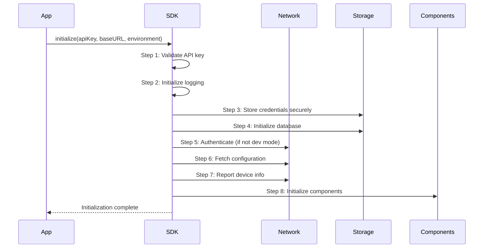
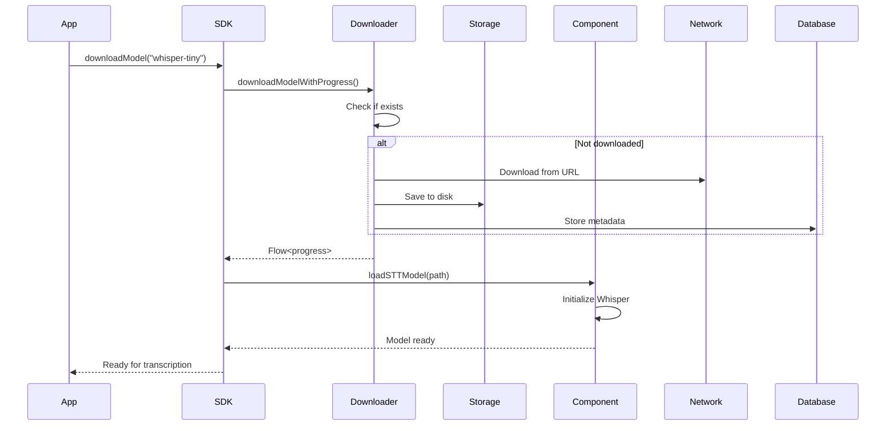
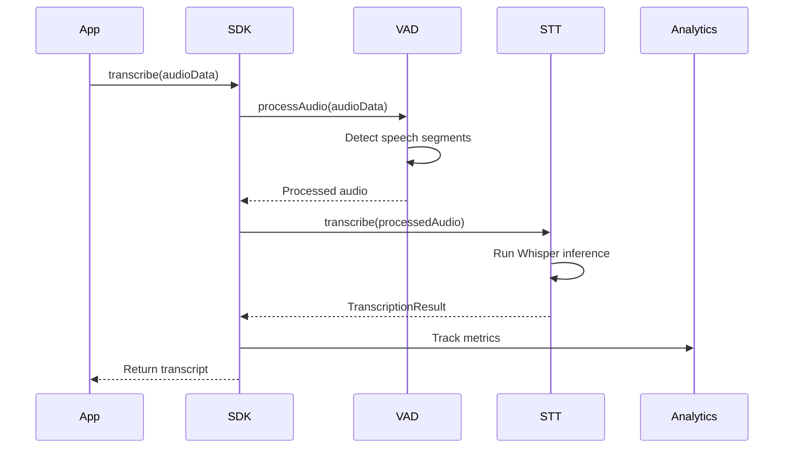

# RunAnywhere Kotlin SDK Architecture Documentation

## Table of Contents
1. [Overview](#overview)
2. [Architecture Principles](#architecture-principles)
3. [Core Components](#core-components)
4. [Platform Architecture](#platform-architecture)
5. [Data Flow](#data-flow)
6. [Component Details](#component-details)
7. [Integration Patterns](#integration-patterns)
8. [Security & Privacy](#security--privacy)
9. [Performance Considerations](#performance-considerations)
10. [API Reference](#api-reference)

## Overview

The RunAnywhere Kotlin SDK is a multiplatform SDK that provides on-device AI capabilities with intelligent routing between local and cloud execution. The SDK is designed to work seamlessly across JVM, Android, and iOS platforms using Kotlin Multiplatform technology.

### Key Features
- **On-device AI execution** with multiple model format support (GGUF, ONNX, CoreML, TFLite)
- **Intelligent routing** between on-device and cloud execution
- **Speech-to-Text (STT)** with Voice Activity Detection (VAD)
- **Real-time cost tracking** and optimization
- **Secure credential management** with platform-specific implementations
- **Event-driven architecture** with comprehensive analytics
- **Offline-first design** with local caching and fallback mechanisms

### Target Platforms
- **JVM**: Desktop applications, JetBrains IDE plugins
- **Android**: Mobile applications (API 24+)
- **iOS**: Mobile applications (iOS 13.0+) via Kotlin/Native

## Architecture Principles

### 1. Clean Architecture
The SDK follows Clean Architecture principles with clear separation of concerns:
- **Presentation Layer**: Public API interfaces (`RunAnywhere` object)
- **Domain Layer**: Business logic and use cases (components, services)
- **Data Layer**: Network, storage, and external integrations

### 2. Dependency Injection
- **ServiceContainer**: Central dependency container managing service lifecycle
- **Lazy initialization**: Services created on-demand to optimize memory usage
- **Platform-specific implementations**: Via `expect/actual` mechanism

### 3. SOLID Principles
- **Single Responsibility**: Each component has a focused responsibility
- **Open/Closed**: Extensible through interfaces, closed for modification
- **Liskov Substitution**: Platform implementations are interchangeable
- **Interface Segregation**: Small, focused interfaces for each capability
- **Dependency Inversion**: Depend on abstractions, not concrete implementations

### 4. Event-Driven Architecture
- **EventBus**: Central event publication/subscription system
- **Kotlin Flow**: Reactive streams for async operations
- **Analytics Integration**: Comprehensive event tracking

## Core Components

### Component Hierarchy

```
RunAnywhere SDK
├── Public API Layer
│   ├── RunAnywhere (Singleton Entry Point)
│   ├── RunAnywhereSDK (Interface)
│   └── BaseRunAnywhereSDK (Common Implementation)
│
├── Service Layer
│   ├── NetworkService (API Communication)
│   ├── ModelDownloader (Model Management)
│   ├── ModelLoadingService (Model Runtime)
│   └── AnalyticsService (Telemetry)
│
├── Component Layer
│   ├── STTComponent (Speech Recognition)
│   ├── VADComponent (Voice Detection)
│   └── BaseComponent (Abstract Base)
│
├── Storage Layer
│   ├── DatabaseManager (SQLite)
│   ├── KeychainManager (Secure Storage)
│   └── FileManager (File System)
│
└── Foundation Layer
    ├── EventBus (Event System)
    ├── SDKLogger (Logging)
    └── ServiceContainer (DI)
```

## Platform Architecture

### Multiplatform Structure

```
sdk/runanywhere-kotlin/
├── src/
│   ├── commonMain/          # Shared code (90%)
│   │   ├── models/          # Data models, enums
│   │   ├── components/      # STT, VAD components
│   │   ├── events/          # Event system
│   │   ├── network/         # Network interfaces
│   │   └── public/          # Public API
│   │
│   ├── jvmMain/            # JVM-specific (10%)
│   │   ├── network/        # HTTP implementation
│   │   ├── storage/        # SQLite, Preferences
│   │   └── public/         # JVM RunAnywhere
│   │
│   ├── androidMain/        # Android-specific
│   │   ├── storage/        # Android KeyStore
│   │   └── audio/          # Android audio
│   │
│   └── iosMain/            # iOS-specific
│       ├── storage/        # iOS Keychain
│       └── audio/          # AVAudioSession
```

### Platform-Specific Implementations

| Component | JVM | Android | iOS |
|-----------|-----|---------|-----|
| Secure Storage | Java Preferences + AES | Android KeyStore | iOS Keychain |
| Database | SQLite JDBC | Room Database | SQLite Swift |
| Network | HttpURLConnection | OkHttp | URLSession |
| File System | java.io.File | Context.filesDir | FileManager |
| Logging | System.out | Android Log | os_log |

## Data Flow

### 1. SDK Initialization Flow



### 2. Model Download & Loading Flow



### 3. Speech-to-Text Flow



## Component Details

### 1. RunAnywhere (Main Entry Point)

**Location**: `src/jvmMain/kotlin/com/runanywhere/sdk/public/RunAnywhere.kt`

The singleton entry point for the SDK, implementing platform-specific initialization:

```kotlin
actual object RunAnywhere : BaseRunAnywhereSDK() {
    // 8-step initialization process
    override suspend fun initializePlatform(...)

    // Core API methods
    suspend fun transcribe(audioData: ByteArray): String
    suspend fun downloadModel(modelId: String): Flow<Float>
    suspend fun availableModels(): List<ModelInfo>
}
```

**Key Responsibilities**:
- SDK lifecycle management
- Service initialization and coordination
- Public API implementation
- Event publishing

### 2. Network Layer

**Location**: `src/jvmMain/kotlin/com/runanywhere/sdk/network/`

Handles all API communication with intelligent fallback:

```kotlin
class JvmNetworkService {
    suspend fun fetchModels(): List<ModelInfo>
    suspend fun fetchConfiguration(): ConfigurationData
    suspend fun reportAnalytics(data: AnalyticsData): Boolean
}
```

**Features**:
- Bearer token authentication
- Automatic retry with exponential backoff
- Fallback to local models on network failure
- Mock service for development mode

### 3. Storage Layer

#### DatabaseManager (SQLite)
**Location**: `src/jvmMain/kotlin/com/runanywhere/sdk/storage/DatabaseManager.kt`

Manages local persistence with three main tables:
- **models**: Downloaded model metadata and paths
- **configuration**: Cached configuration data
- **transcriptions**: Transcription history and metrics

#### KeychainManager (Secure Storage)
**Location**: `src/jvmMain/kotlin/com/runanywhere/sdk/storage/KeychainManager.kt`

Platform-specific secure credential storage:
- **JVM**: Java Preferences API with AES encryption
- **Android**: Android KeyStore
- **iOS**: iOS Keychain Services

#### FileManager
**Location**: `src/commonMain/kotlin/com/runanywhere/sdk/files/FileManager.kt`

Handles file system operations:
- Model file storage in `~/.runanywhere/models/`
- Temporary file management
- Cache directory management

### 4. Model Management

#### ModelDownloader
**Location**: `src/commonMain/kotlin/com/runanywhere/sdk/models/ModelDownloader.kt`

Manages model downloads with progress tracking:
```kotlin
class ModelDownloader {
    suspend fun downloadModelWithProgress(model: ModelInfo): Flow<Float>
    fun isModelDownloaded(model: ModelInfo): Boolean
    fun getModelPath(model: ModelInfo): String
    fun deleteModel(model: ModelInfo): Boolean
}
```

#### ModelLoadingService
**Location**: `src/commonMain/kotlin/com/runanywhere/sdk/models/ModelLoadingService.kt`

Loads models into memory and manages runtime:
- Model format detection (GGUF, ONNX, etc.)
- Framework selection (Whisper.cpp, ONNX Runtime)
- Memory management and optimization

### 5. STT Component

**Location**: `src/commonMain/kotlin/com/runanywhere/sdk/components/stt/STTComponent.kt`

Speech-to-text with comprehensive analytics:

```kotlin
class STTComponent : BaseComponent<STTService> {
    suspend fun transcribe(audioData: ByteArray): TranscriptionResult
    fun transcribeStream(audioStream: Flow<ByteArray>): Flow<TranscriptionEvent>
    suspend fun loadModel(modelPath: String)
}
```

**Features**:
- Whisper model integration
- Streaming transcription with VAD
- Word-level timestamps
- Confidence scores
- Multi-language support

### 6. VAD Component

**Location**: `src/commonMain/kotlin/com/runanywhere/sdk/components/vad/VADComponent.kt`

Voice Activity Detection for optimized transcription:

```kotlin
class VADComponent : BaseComponent<VADService> {
    fun processAudioChunk(audioData: FloatArray): VADResult
    fun enable()
    fun disable()
}
```

**Purpose**:
- Detect speech/silence boundaries
- Reduce unnecessary transcription
- Keep STT pipeline warm
- Optimize battery usage

### 7. Event System

**Location**: `src/commonMain/kotlin/com/runanywhere/sdk/events/EventBus.kt`

Central event publication and subscription:

```kotlin
object EventBus {
    val initializationEvents: SharedFlow<SDKInitializationEvent>
    val modelEvents: SharedFlow<SDKModelEvent>
    val voiceEvents: SharedFlow<SDKVoiceEvent>
    val configurationEvents: SharedFlow<SDKConfigurationEvent>
}
```

**Event Types**:
- **SDKInitializationEvent**: Started, Completed, Failed
- **SDKModelEvent**: Download/Load progress and status
- **SDKVoiceEvent**: Transcription events
- **SDKConfigurationEvent**: Config updates

### 8. Analytics System

Comprehensive metrics tracking throughout the SDK:

**Tracked Metrics**:
- Model download times and sizes
- Transcription latency and accuracy
- API call success rates
- Error rates and types
- Device capabilities
- Usage patterns

**Integration Points**:
- STT component tracks transcription metrics
- Network layer tracks API latencies
- Model loader tracks loading times
- Event bus enables external analytics integration

## Integration Patterns

### 1. JetBrains Plugin Integration

```kotlin
class RunAnywherePlugin : ApplicationComponent {
    override fun initComponent() {
        GlobalScope.launch {
            // Initialize SDK
            RunAnywhere.initialize(
                apiKey = getApiKey(),
                baseURL = "https://api.runanywhere.ai",
                environment = SDKEnvironment.DEVELOPMENT
            )

            // Subscribe to events
            EventBus.shared.initializationEvents.collect { event ->
                when(event) {
                    is SDKInitializationEvent.Completed -> enableFeatures()
                    is SDKInitializationEvent.Failed -> showError(event.error)
                }
            }
        }
    }
}
```

### 2. Android App Integration

```kotlin
class MainActivity : AppCompatActivity() {
    override fun onCreate(savedInstanceState: Bundle?) {
        lifecycleScope.launch {
            RunAnywhere.initialize(
                apiKey = BuildConfig.RUNANYWHERE_API_KEY,
                environment = SDKEnvironment.PRODUCTION
            )

            // Download STT model
            RunAnywhere.downloadModel("whisper-tiny").collect { progress ->
                updateProgressBar(progress)
            }
        }
    }

    suspend fun transcribeAudio(audioData: ByteArray) {
        val result = RunAnywhere.transcribe(audioData)
        displayTranscript(result)
    }
}
```

### 3. Streaming Transcription

```kotlin
fun startStreamingTranscription() {
    val audioFlow = getAudioStream() // Your audio source

    RunAnywhere.getSTTComponent()
        .transcribeStream(audioFlow)
        .collect { event ->
            when(event) {
                is TranscriptionEvent.SpeechStart -> showListening()
                is TranscriptionEvent.PartialTranscription -> updateText(event.text)
                is TranscriptionEvent.FinalTranscription -> finalizeText(event.text)
                is TranscriptionEvent.SpeechEnd -> hideListening()
            }
        }
}
```

## Security & Privacy

### 1. Data Protection
- **API keys** stored in platform-specific secure storage
- **AES encryption** for sensitive data on JVM
- **No telemetry** without explicit consent
- **Local-first** architecture minimizes data transmission

### 2. Network Security
- **HTTPS only** for all API communication
- **Bearer token** authentication
- **Certificate pinning** support (configurable)
- **Request signing** for integrity

### 3. Privacy Features
- **On-device processing** by default
- **No audio recording** without explicit permission
- **Configurable data retention** policies
- **GDPR/CCPA compliant** data handling

## Performance Considerations

### 1. Memory Management
- **Lazy loading** of components
- **Model unloading** when not in use
- **Streaming processing** for large audio files
- **Configurable cache sizes**

### 2. CPU Optimization
- **Native libraries** for intensive operations
- **Coroutines** for async operations
- **Thread pools** for parallel processing
- **VAD** to reduce unnecessary processing

### 3. Battery Optimization
- **Adaptive processing** based on battery level
- **Batch operations** to reduce wake-ups
- **Efficient model formats** (quantized models)
- **Smart caching** to reduce network calls

### 4. Network Optimization
- **Request batching** for analytics
- **Compression** for data transfer
- **Incremental model downloads**
- **Connection pooling**

## API Reference

### Core APIs

```kotlin
// Initialize SDK
RunAnywhere.initialize(
    apiKey: String,
    baseURL: String? = null,
    environment: SDKEnvironment = SDKEnvironment.DEVELOPMENT
)

// Get available models
val models = RunAnywhere.availableModels()

// Download model with progress
RunAnywhere.downloadModel("whisper-tiny").collect { progress ->
    println("Progress: ${(progress * 100).toInt()}%")
}

// Transcribe audio
val transcript = RunAnywhere.transcribe(audioByteArray)

// Stream transcription
RunAnywhere.getSTTComponent()
    .transcribeStream(audioFlow)
    .collect { event -> handleEvent(event) }

// Subscribe to events
EventBus.shared.modelEvents.collect { event ->
    when(event) {
        is SDKModelEvent.DownloadCompleted -> onModelReady(event.modelId)
    }
}

// Cleanup
RunAnywhere.cleanup()
```

### Configuration Options

```kotlin
data class STTConfiguration(
    val modelId: String? = null,
    val language: String = "en",
    val enableTimestamps: Boolean = false,
    val enableVAD: Boolean = true,
    val maxDuration: Int = 30
)

data class VADConfiguration(
    val sensitivity: Float = 0.5f,
    val minSpeechDuration: Int = 250,
    val maxSilenceDuration: Int = 500,
    val energyThreshold: Float = 0.0f
)

enum class SDKEnvironment {
    DEVELOPMENT,  // Local/mock services
    STAGING,      // Staging API
    PRODUCTION    // Production API
}
```

### Error Handling

```kotlin
sealed class SDKError : Exception() {
    object NotInitialized : SDKError()
    data class NetworkError(val code: Int, val message: String) : SDKError()
    data class ModelNotFound(val modelId: String) : SDKError()
    data class TranscriptionFailed(val reason: String) : SDKError()
    data class InvalidConfiguration(val message: String) : SDKError()
}
```

## Development Workflow

### Building the SDK

```bash
# Build all targets
./scripts/sdk.sh all

# Build specific target
./scripts/sdk.sh jvm
./scripts/sdk.sh android
./scripts/sdk.sh ios

# Run tests
./gradlew test

# Generate documentation
./gradlew dokkaHtml
```

### Testing

```kotlin
class RunAnywhereSDKTest {
    @Test
    fun testInitialization() = runTest {
        RunAnywhere.initialize(
            apiKey = "test-key",
            environment = SDKEnvironment.DEVELOPMENT
        )
        assertTrue(RunAnywhere.isInitialized)
    }

    @Test
    fun testModelDownload() = runTest {
        val progress = mutableListOf<Float>()
        RunAnywhere.downloadModel("whisper-tiny").collect {
            progress.add(it)
        }
        assertEquals(1.0f, progress.last())
    }
}
```

### Debugging

Enable verbose logging:
```kotlin
SDKLogger.setLogLevel(LogLevel.DEBUG)
```

Monitor events:
```kotlin
EventBus.shared.apply {
    initializationEvents.collect { println("Init: $it") }
    modelEvents.collect { println("Model: $it") }
    voiceEvents.collect { println("Voice: $it") }
}
```

## Future Enhancements

### Planned Features
1. **Text-to-Speech (TTS)** component
2. **Large Language Model (LLM)** inference
3. **Image recognition** capabilities
4. **Real-time translation**
5. **Custom model training**
6. **Federated learning** support

### Architecture Improvements
1. **Plugin system** for custom components
2. **GraphQL** support for API
3. **WebSocket** for real-time updates
4. **Kotlin/JS** target for web apps
5. **Compose Multiplatform** UI components
6. **Ktor** integration for server-side

## Conclusion

The RunAnywhere Kotlin SDK provides a robust, multiplatform foundation for on-device AI capabilities. Its clean architecture, comprehensive feature set, and focus on privacy and performance make it suitable for a wide range of applications from mobile apps to desktop plugins.

The SDK's modular design allows for easy extension while maintaining backward compatibility. The event-driven architecture enables seamless integration with existing applications and provides comprehensive insights into SDK operations.

For questions or contributions, please refer to the main README.md or contact the RunAnywhere team.
