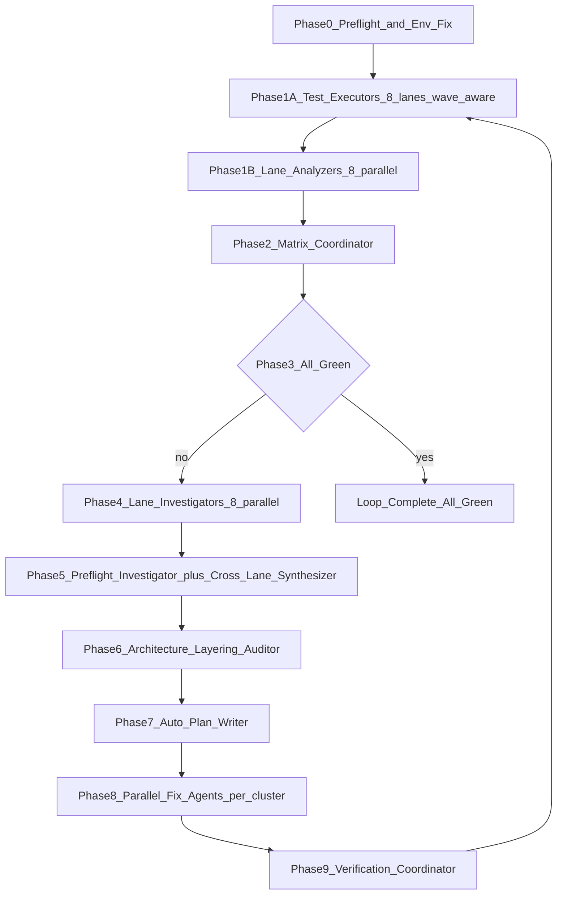

# Reusable Full-Matrix E2E Test-Fix Loop Prompt (Autonomous)

A single, pasteable, **self-contained** prompt that drives an **autonomous test → analyze → fix → re-verify loop** across the full RunAnywhere matrix (8 lanes: Kotlin Android, Swift iOS, RN Android, RN iOS, Flutter Android, Flutter iOS, Web, Commons C++) until **every applicable TC is PASS** (or explicitly `N/A` / `DEFERRED`) and **every preflight, build, lint, and typecheck is green**.

This is the **only** document the orchestrator and every sub-agent needs to read. All sub-prompt templates (Executor, Analyzer, Investigator, Synthesizer, Fix Agent, Verification Coordinator, Architecture Layering Auditor) are inlined in §7. External references are limited to: [`AGENTS.md`](../../AGENTS.md) (architecture rules), [`cross-platform-e2e-test-catalog.md`](cross-platform-e2e-test-catalog.md) (TC definitions + log grep patterns), [`mcp-agent-runbook.md`](mcp-agent-runbook.md) (MCP device-sharing rules), and [`common/`](common/) (pass criteria + report shapes + model list).

---

## 0. How to execute this (Cursor / Claude Code / Codex CLI)

You paste **one** of the two prompt blocks in [§1](#1-the-master-loop-prompt-paste-this) into any modern agentic coding tool. The agent reads this entire file, sets up state, fans out to subagents, and runs the loop until green or escalates.

### 0.1 Prerequisites (run once on the operator machine)

```bash
# A. Repo root sanity
cd /path/to/runanywhere-sdks
git status                                   # must be clean OR on the feature branch you want patched
git rev-parse HEAD                           # record SHA — orchestrator will pin this in LOOP_STATE.json

# B. Devices must be physically available (loop will NOT auto-provision)
adb devices -l                               # exactly 1 Android device required
xcrun simctl list devices booted             # exactly 1 booted iOS simulator (e.g. iPhone 16 Pro) required
node --version                               # Node 18+ for Web lane
which cmake ninja                            # required for Commons lane

# C. Toolchain dirs (no installs by the agent unless asked)
echo "ANDROID_HOME=$ANDROID_HOME"
echo "JAVA_HOME=$JAVA_HOME"

# D. Pre-commit must be installed (loop relies on hooks for lint pass)
pre-commit install
```

If any of A–D is missing the loop will hard-stop in Phase 0 with a clear escalation message. Do not try to make the agent fix toolchains — that is your job.

### 0.2 Agent settings

| Agent | Required setting |
|-------|------------------|
| **Cursor** | Agent / Auto mode with **Auto-run** enabled; allow shell commands, Task tool, MCP (mobile-mcp + cursor-ide-browser). Increase max sub-agents to ≥8. |
| **Claude Code** | `claude --dangerously-skip-permissions` OR pre-approved tool list; allow `Task`, `Bash`, `Read/Edit/Write`. |
| **Codex CLI** | `--full-auto` with shell + spawn agent enabled. |

The orchestrator will spawn **8–12 concurrent subagents per iteration**. Make sure your tool's parallel-agent cap is high enough.

### 0.3 Where state lives (so you can watch it live)

**Everything lives under `test_workflows/`, which is already gitignored** in full (see `.gitignore` line 430 — `test_workflows/`). No additional `.gitignore` entry is needed; nothing the loop writes will ever leak into a commit unless a fix agent explicitly stages it.

Because this prompt is triggered on a weekly cadence, loop folders are **partitioned by ISO week** so you can clean up an entire week with one `rm -rf`. There is still **one folder per loop invocation** that the operator ever has to navigate:

```text
test_workflows/loops/<YYYY-Www>/<LOOP_ID>/               # ← THE single folder. cd here to see everything.
  LOOP_STATE.json                                        # machine-readable current state (resumable)
  LOOP_DASHBOARD.md                                      # human-readable LIVE dashboard
  LOOP_TIMELINE.tsv                                      # append-only event log
  ISSUE_LEDGER.tsv                                       # cross-iteration issue tracker
  COMMITS.tsv                                            # every git commit the loop produced
  ESCALATIONS.md                                         # hard blockers (created on demand)
  iterations.tsv                                         # iter_num \t rac_run_id \t started \t ended \t verdict
  plans/                                                 # auto-plans (one per iteration, no human gate)
    iter-01-remediation.md
    iter-02-remediation.md
  iter-01 → ../../../logs/runs/<RAC_RUN_ID>/             # SYMLINK to the iteration's E2E artifact tree
  iter-02 → ../../../logs/runs/<RAC_RUN_ID>/             # …
  …
test_workflows/loops/archive/                            # move old weeks here (or rm -rf them)
```

`<YYYY-Www>` is ISO week — e.g. `2026-W21`, `2026-W22`. `date +%G-W%V` produces it. Sorting is chronological.

The actual E2E artifacts (`lanes/`, `matrix/`, `remediation/`) physically live under `test_workflows/logs/runs/<RAC_RUN_ID>/` because the existing `run-manage.sh` / `session-manage.sh` / `capture-*-logs.sh` scripts write there. The symlink layer above means the operator **only** needs to know about `test_workflows/loops/<YYYY-Www>/<LOOP_ID>/` — `ls test_workflows/loops/2026-W21/<LOOP_ID>/iter-03/lanes/01_kotlin_android/SUMMARY.md` transparently follows the symlink.

**Watch the dashboard live** in a second terminal:

```bash
LOOP_ID=$(ls -1tr test_workflows/loops/*/  | tail -1)        # newest loop folder, any week
watch -n 5 "cat $LOOP_ID/LOOP_DASHBOARD.md"
tail -F     "$LOOP_ID/LOOP_TIMELINE.tsv"
```

**Weekly cleanup** (when you want to free disk): `rm -rf test_workflows/loops/2026-W19/` removes the entire week. The matching E2E artifact folders under `logs/runs/` can be removed with `find test_workflows/logs/runs -maxdepth 1 -type d -mtime +14 -exec rm -rf {} +` (anything older than 14 days).

---

## 1. The master loop prompt (PASTE THIS)

> Open `test_workflows/instructions/reusable-full-matrix-e2e-loop-prompt.md` and read it **fully** (every section). It is your single source of truth. Do not ask for human approval at any point unless a hard escalation case in §11 fires. Take agency. Launch as many parallel subagents as needed. Make small atomic commits as you fix things; **do not push**. Do not be lazy or skip TCs to save tokens — every applicable TC across all 8 lanes must be graded with evidence and every FAIL/BLOCKED/LIMITED must be remediated.
>
> **Initialize state:**
>
> ```bash
> export LOOP_WEEK="$(date +%G-W%V)"                        # ISO week, e.g. 2026-W21
> export LOOP_ID="$(date +%Y%m%d-%H%M%S)-e2e-loop"
> export LOOP_ROOT="test_workflows/loops/$LOOP_WEEK/$LOOP_ID"
> mkdir -p "$LOOP_ROOT/plans"
> echo "$LOOP_ID" > "$LOOP_ROOT/LOOP_ID"
> ```
>
> Everything you write (state files, timeline, dashboard, plans, iteration symlinks) lives under `$LOOP_ROOT`. The per-iteration E2E artifact trees physically live under `test_workflows/logs/runs/<RAC_RUN_ID>/` (created by `run-manage.sh`) and are reached from the loop folder via `$LOOP_ROOT/iter-NN/` symlinks. The entire `test_workflows/` directory is already gitignored — no new ignore rules needed.
>
> Then write the initial `LOOP_STATE.json`, `LOOP_DASHBOARD.md`, and `LOOP_TIMELINE.tsv` per the schemas in §3. Pin `git rev-parse HEAD`, the branch name, the iso timestamp, and `iteration: 1, phase: "phase0_preflight"`.
>
> **Run the loop.** Each iteration is **Phase 0 → 9** as defined in §5. After every checkpoint that changes state, **rewrite `LOOP_STATE.json` and `LOOP_DASHBOARD.md`** and **append one row to `LOOP_TIMELINE.tsv`**. After every commit, append one row to `COMMITS.tsv`.
>
> **Sequential ordering (mandatory):**
> - Android lanes serial on the one device: Kotlin → RN-Android → Flutter-Android.
> - iOS lanes serial on the one simulator: Swift → RN-iOS → Flutter-iOS.
> - Android chain, iOS chain, Web lane, and Commons lane can overlap each other (different runtimes).
>
> **Architecture rule (non-negotiable):** every fix MUST be planned at the **lowest viable layer** per [`AGENTS.md`](../../AGENTS.md) §"Business Logic Layering Rules" (also restated in §7.0 below). Order of preference: **C++ commons → platform SDK → example UI → harness**. Reject any fix that adds business logic, workarounds, or multi-step bootstrap into example apps; fix the SDK/commons instead. iOS Swift SDK is the source of truth when behavior is ambiguous — copy it, adapt syntax only. The **Architecture Layering Auditor** (§7.9) must approve every plan before fix agents launch.
>
> **Termination:** stop only when §10 termination criteria are met OR a §11 escalation fires. Otherwise keep looping.
>
> **Commits:** small, atomic, one issue per commit, conventional commit message `[E2E-LOOP iter<N> <CLUSTER>/<ISSUE_ID>] <title>`. Run `pre-commit run --files <changed>` before committing. **Never `git push`.** Never amend a commit that touched files outside your cluster's scope.
>
> Begin Phase 0 now.

### 1.1 Resume prompt (paste this if the session disconnects mid-loop)

> Resume the RunAnywhere E2E test-fix loop. Locate the loop folder: `LOOP_ROOT=$(ls -1tr test_workflows/loops/*/ 2>/dev/null | tail -1)`. Read `$LOOP_ROOT/LOOP_STATE.json` to determine current iteration and phase. Read `test_workflows/instructions/reusable-full-matrix-e2e-loop-prompt.md` fully. Continue from the phase recorded in state; do not restart the iteration. If the recorded phase was mid-fan-out, re-scan the iteration folder (`$LOOP_ROOT/iter-NN/`) to determine which subagents actually finished (look for the per-lane output files listed in §3.2) and only re-spawn the ones whose outputs are missing. Update `LOOP_DASHBOARD.md` to reflect the resumed state and append a `RESUME` event to `LOOP_TIMELINE.tsv`.

---

## 2. Loop architecture (one iteration)



| Phase | Owner | Mode | Output | Reads previous |
|-------|-------|------|--------|----------------|
| **0** Preflight + env fix | 1 preflight agent (may spawn small fix subagents) | Agent | `LOOP_ROOT/preflight/REPORT.md` + auto-commits | — |
| **1A** Test execute | 8 lane executors (wave-scheduled) | Agent + MCP | per-lane `actions.jsonl`, `command_summary.tsv`, `logs/`, `screenshots/`, `RUN_MANIFEST.md` | Phase 0 green |
| **1B** Test analyze | 8 lane analyzers, **fully parallel** | Agent (read-only) | per-lane `modality_report.md`, `modality_results.tsv`, `SUMMARY.md` | matching 1A |
| **2** Matrix coordinate | 1 coordinator | Agent (read-only) | `matrix/MATRIX_REPORT.md`, `MATRIX_SUMMARY.tsv`, `MATRIX_BY_TC.tsv`, `sessions.json` | all 1B |
| **3** Green check | orchestrator itself | — | terminate or continue | Phase 2 |
| **4** Triage | 8 lane investigators, **fully parallel** | Agent (read-only) | per-lane `FINDINGS.md` | Phase 2 |
| **5** Synthesize | 1 preflight investigator + 1 matrix synthesizer | Agent (read-only) | `preflight/FINDINGS.md`, `ISSUE_REGISTRY.tsv`, `CROSS_LANE_ANALYSIS.md` | Phase 4 |
| **6** Layering audit | 1 architecture auditor (NEW) | Agent (read-only) | `LAYERING_AUDIT.md` (annotates registry) | Phase 5 |
| **7** Plan write | orchestrator | Agent | `$LOOP_ROOT/plans/iter-NN-remediation.md` | Phase 6 |
| **8** Fix | N fix agents per cluster, parallel where files disjoint | Agent | code changes + small commits + plan checkbox updates | Phase 7 |
| **9** Verify | 1 verification coordinator | Agent | build/lint/typecheck results; targeted re-test results | Phase 8 |
| → next iter | orchestrator | — | new `RAC_RUN_ID`, increment iter, write `iterations.tsv` row | Phase 9 |

---

## 3. State files (the live reporting system)

All state files live at `test_workflows/loops/<LOOP_ID>/`. Sub-agents receive `LOOP_ROOT=test_workflows/loops/<LOOP_ID>` as an env var in their prompt and write only under that root. Per-iteration E2E artifacts live under `test_workflows/logs/runs/<RAC_RUN_ID>/` and are surfaced through the `$LOOP_ROOT/iter-NN/` symlinks created in §6.

### 3.1 `LOOP_STATE.json` (machine-readable, rewritten every checkpoint)

```json
{
  "loop_id": "20260521-110600-e2e-loop",
  "git_sha_start": "abc123…",
  "branch": "feat/v2-architecture",
  "iteration": 3,
  "phase": "phase8_fix",
  "sub_phase": "CLUSTER-04 in progress",
  "iteration_run_id": "20260521-141200-matrix",
  "started_at": "2026-05-21T11:06:00-07:00",
  "last_checkpoint_at": "2026-05-21T14:33:17-07:00",
  "active_subagents": [
    { "id": "fix-cluster-04", "scope": "sdk-kotlin", "started_at": "…", "issues": ["KOTLIN-AND-002"] },
    { "id": "fix-cluster-07", "scope": "commons",     "started_at": "…", "issues": ["COMMONS-001"] }
  ],
  "lane_status": {
    "01_kotlin_android":      { "verdict": "FAIL",  "pass": 14, "fail": 3, "blocked": 0, "limited": 1, "na": 2, "deferred": 1 },
    "02_swift_ios":           { "verdict": "PASS",  "pass": 18, "fail": 0, "blocked": 0, "limited": 0, "na": 2, "deferred": 1 },
    "03_react_native_android":{ "verdict": "BLOCKED","pass": 8, "fail": 0, "blocked": 12,"limited": 0, "na": 2, "deferred": 1 },
    "04_react_native_ios":    { "verdict": "PENDING","pass": 0, "fail": 0, "blocked": 0, "limited": 0, "na": 0, "deferred": 0 },
    "05_flutter_android":     { "verdict": "PENDING" },
    "06_flutter_ios":         { "verdict": "PENDING" },
    "07_web":                 { "verdict": "PASS" },
    "08_commons_cpp":         { "verdict": "PASS" }
  },
  "issues_open": 9,
  "issues_resolved_total": 14,
  "commits_this_iteration": 6,
  "commits_total": 23,
  "escalation": null
}
```

### 3.2 `LOOP_DASHBOARD.md` (human-readable, rewritten every checkpoint)

A compact markdown the human can `cat` or `watch` for a live view. Required sections:

```markdown
# RunAnywhere E2E Loop — `<LOOP_ID>`

**Branch:** `feat/v2-architecture` @ `abc123…`   **Iteration:** 3   **Phase:** `phase8_fix` — CLUSTER-04 in progress
**Started:** 2026-05-21 11:06   **Last checkpoint:** 2026-05-21 14:33

## Lane status (this iteration)
| Lane | Verdict | PASS | FAIL | BLOCKED | LIMITED | N/A | DEFERRED |
| 01_kotlin_android | FAIL | 14 | 3 | 0 | 1 | 2 | 1 |
| 02_swift_ios | PASS | 18 | 0 | 0 | 0 | 2 | 1 |
| 03_rn_android | BLOCKED | 8 | 0 | 12 | 0 | 2 | 1 |
| 04_rn_ios | PENDING | … |
| 05_flutter_android | PENDING |
| 06_flutter_ios | PENDING |
| 07_web | PASS | … |
| 08_commons_cpp | PASS | … |

## Active subagents
- `fix-cluster-04` (sdk-kotlin) — KOTLIN-AND-002 — started 14:31
- `fix-cluster-07` (commons)    — COMMONS-001    — started 14:32

## Recent events (last 10)
(tail of LOOP_TIMELINE.tsv, formatted)

## Open issues (top 5 by severity)
- P0 COMMONS-001 — …
- P0 KOTLIN-AND-002 — …
- P1 WEB-003 — …

## Recent commits this iteration
(tail of COMMITS.tsv)

## Escalations
none
```

### 3.3 `LOOP_TIMELINE.tsv` (append-only event log)

Columns: `iso_ts\titer\tphase\tagent_id\tevent\tstatus\tref\tnotes`

Events to log (one row each):
- `LOOP_START`, `LOOP_END`, `RESUME`
- `PHASE_START`, `PHASE_END`
- `AGENT_SPAWN`, `AGENT_DONE`, `AGENT_FAIL`
- `LANE_START`, `LANE_END` with lane verdict
- `COMMIT` (with commit SHA in `ref`)
- `BUILD_OK`, `BUILD_FAIL` (with platform in `ref`)
- `LINT_OK`, `LINT_FAIL`
- `ISSUE_FOUND`, `ISSUE_RESOLVED`, `ISSUE_REGRESSED`
- `ESCALATION`

Every subagent receives `LOOP_ROOT` in its prompt and is **required** to append at least `AGENT_SPAWN` (parent) → `AGENT_DONE`/`AGENT_FAIL` (self) on completion.

### 3.4 `iterations.tsv`

`iter\trac_run_id\tstarted\tended\tverdict\tissues_open_before\tissues_resolved\tissues_remaining\tcommits`

### 3.5 `ISSUE_LEDGER.tsv` (persists across iterations)

`issue_id\tfirst_seen_iter\tlast_seen_iter\tstatus\tlane_scope\ttc_ids\tseverity\tcategory\tfix_layer\tcluster\tresolved_in_commit\tresolved_in_iter\tregressions`

An issue's `status` is one of: `OPEN`, `IN_PROGRESS`, `RESOLVED`, `REGRESSED`, `ACCEPTED` (only if catalog explicitly allows). The ledger is the cross-iteration source of truth — Phase 5's per-iteration `ISSUE_REGISTRY.tsv` is merged into it at the end of every iteration.

### 3.6 `COMMITS.tsv`

`iso_ts\titer\tcluster\tissue_ids\tcommit_sha\tfiles_changed\tlint_status\ttypecheck_status\tbuild_status\tnotes`

### 3.7 `ESCALATIONS.md`

Free-form. Orchestrator appends a section any time §11 escalation criteria fire. Includes the smallest reproducer log excerpt + recommended human action.

---

## 4. Sequential ordering & parallelism (single Android device, single iOS sim)

```text
Wave 0  ─┬─ Kotlin Android  (device A)        ─────┐
         ├─ Swift iOS        (sim B)               │
         ├─ Web              (browser)             │
         └─ Commons C++      (host)                │
                                                    │
Wave 1  ─┬─ RN Android       (device A — after Kotlin)
         └─ RN iOS           (sim B   — after Swift)
                                                    │
Wave 2  ─┬─ Flutter Android  (device A — after RN-Android)
         └─ Flutter iOS      (sim B   — after RN-iOS)
```

Hard rules:

1. **Only one app foreground on the Android device at a time.** Orchestrator must `adb shell am force-stop <prev pkg>` and `adb uninstall <prev pkg>` (or rely on the next lane's fresh-install uninstall) before starting the next Android lane.
2. **Only one app foreground on the iOS simulator at a time.** `xcrun simctl uninstall booted <prev bundle>` before next iOS lane.
3. **Metro port 8081** must not be double-bound. Kill the previous Metro before the next RN lane.
4. **Web and Commons** can start in Wave 0 alongside Kotlin + Swift and run to completion independently.
5. **Children/sub-executors within a lane** (e.g. the Voice / RAG / LoRA fan-out described in §7.3 "Executor fan-out allowance") run **serially** within their lane.

Concurrency budget per iteration:

| Phase | Max parallel subagents |
|-------|------------------------|
| 0 preflight | 1 (may spawn ≤3 small env-fix children serially) |
| 1A test execute | 4 (one Android, one iOS, one Web, one Commons — never two Android or two iOS at once) |
| 1B analyze | 8 (read-only, fully parallel) |
| 2 matrix | 1 |
| 4 triage | 8 (fully parallel) |
| 5 synth | 2 (preflight investigator + synthesizer can be parallel) |
| 6 audit | 1 |
| 7 plan | orchestrator self |
| 8 fix | as many as **independent clusters** in the registry (typically 3–8). Two clusters on the same file → must serialize via `blocked_by`. |
| 9 verify | 1 coordinator (may spawn lane-targeted re-test executors, same Wave 0–2 rules) |

---

## 5. Phase contracts (what each phase MUST do)

### Phase 0 — Preflight + Env Fix

Spawn **one** Preflight Agent (Agent Mode, write access). Its responsibilities:

1. Run `scripts/validation/e2e/run_global_source_checks.sh` and `scripts/validation/commons/run_commons_proto_checks.sh`. Capture exit codes + logs under `$LOOP_ROOT/preflight/`.
2. Verify devices: `adb devices -l` (exactly 1), `xcrun simctl list devices booted` (exactly 1), Node ≥ 18, `cmake` + `ninja` present.
3. For each platform, run the **lightweight build sanity check** in §8 (typecheck/analyze level — NOT full app build):
   - Commons: `cmake --preset macos-debug` configure only.
   - Kotlin: `./gradlew :runanywhere-kotlin:compileDebugKotlinAndroid -Prunanywhere.useLocalNatives=false`
   - Swift: `swift build` from `sdk/runanywhere-swift/`
   - Flutter: `melos bootstrap && melos run analyze` in `sdk/runanywhere-flutter/`
   - RN: `cd sdk/runanywhere-react-native && yarn typecheck`
   - Web: `cd sdk/runanywhere-web && npm run typecheck -w packages/core`
4. Run linters / formatters:
   - `pre-commit run --all-files` (idempotent; captures trailing-whitespace, gitleaks, EOL fixes)
   - `swiftlint` in `sdk/runanywhere-swift/`
   - `./gradlew :runanywhere-kotlin:runKtlintCheckOverCommonMainSourceSet`
   - `flutter analyze` in `sdk/runanywhere-flutter/`
   - C++: `clang-format` via the existing `scripts/` helpers if present.
5. **Auto-fix what is mechanically fixable** (formatting, trailing whitespace, generated-IDL drift via `./idl/codegen/generate_all.sh`, missing `local.properties`, ktlint-fix, swiftlint-fix). Each fix → **one small commit** following §9 commit policy.
6. **Do NOT** auto-install toolchains (Xcode, NDK, JDK). If a toolchain is missing → write to `ESCALATIONS.md` and exit Phase 0 with status `BLOCKED`.
7. Write `$LOOP_ROOT/preflight/REPORT.md` summarizing pass/fail of each step + list of commits made.
8. Append `PHASE_END phase0_preflight status=OK|BLOCKED` to timeline.

**Exit criteria:** all hard prereqs pass AND no lint/typecheck regressions remain. If anything is still red and not auto-fixable, escalate (§11).

### Phase 1A — Test Executors (8 lanes)

Per the schedule in §4, spawn **lane Executor** subagents using the **Universal Executor sub-prompt template** in §7.3 and the per-lane fills in §7.2 (table of 8 lanes).

Important amendments for the loop:

- Use `RAC_RUN_ID=$(test_workflows/scripts/run-manage.sh new matrix)` for the iteration. Record the run id in `iterations.tsv` and link `$LOOP_ROOT/iter-NN/` to `test_workflows/logs/runs/$RAC_RUN_ID/`.
- Every executor's prompt must include the line: `Append AGENT_SPAWN and AGENT_DONE rows to $LOOP_ROOT/LOOP_TIMELINE.tsv. On any uncaught error append AGENT_FAIL.`
- Executor may fan out child sub-executors per §7.3 "Executor fan-out allowance" — same rule applies; orchestrator does not need to track them, but they must inherit `RAC_RUN_ID` and `LOOP_ROOT`.

### Phase 1B — Lane Analyzers (parallel)

Spawn one Analyzer per finished Executor using the **Universal Analyzer sub-prompt template** in §7.4. Read-only. All 8 analyzers run **in parallel** — they touch only their own lane folder.

### Phase 2 — Matrix Coordinator

Spawn the **Matrix Coordinator** sub-prompt in §7.5. Outputs land in `runs/$RAC_RUN_ID/matrix/`.

### Phase 3 — Green Check (orchestrator itself)

Read `runs/$RAC_RUN_ID/matrix/MATRIX_SUMMARY.tsv` + `MATRIX_BY_TC.tsv`.

| Condition | Decision |
|-----------|----------|
| Every applicable TC PASS / N/A / DEFERRED; lint+typecheck+build all green; preflight green; `ISSUE_LEDGER` has no `OPEN` / `IN_PROGRESS` rows | **Terminate successfully** (§10) |
| Any FAIL / BLOCKED / LIMITED / SMOKE_PASS that catalog does not allow, OR any lint/build/typecheck regression | **Continue to Phase 4** |
| Any catalog `DEFERRED` row newly marked `FAIL` | continue (treat as regression) |

Write the decision to `LOOP_TIMELINE.tsv` as `ITERATION_VERDICT iter=N verdict=GREEN|RED`.

### Phase 4 — Lane Investigators (parallel)

For each lane with non-green TCs, spawn the **Lane Investigator** sub-prompt in §7.6. All 8 in parallel (read-only).

### Phase 5 — Preflight Investigator + Matrix Synthesizer

Spawn both **in parallel**:

1. **Preflight Investigator** — sub-prompt in §7.7. Reads any preflight folders generated this iteration plus `$LOOP_ROOT/preflight/REPORT.md`.
2. **Matrix Synthesizer** — sub-prompt in §7.8. Produces `ISSUE_REGISTRY.tsv` + `CROSS_LANE_ANALYSIS.md` under `runs/$RAC_RUN_ID/remediation/`.

After both finish, **merge** the new `ISSUE_REGISTRY.tsv` into `$LOOP_ROOT/ISSUE_LEDGER.tsv` (preserving prior issue IDs; mark unseen issues `REGRESSED` if they were `RESOLVED` in a prior iteration).

### Phase 6 — Architecture Layering Auditor (mandatory)

Spawn the **Architecture Layering Auditor** (read-only). Prompt template in §7.9. It reviews every issue in this iteration's `ISSUE_REGISTRY.tsv` and verifies:

- The proposed `fix_layer` is the **lowest viable** layer per [`AGENTS.md`](../../AGENTS.md) Business Logic Layering Rules.
- No proposed fix adds business logic, workaround, multi-step bootstrap, or SDK-internal knowledge to any example app.
- For SDK-platform-only fixes, an iOS Swift reference exists (or auditor justifies its absence).
- Cross-lane duplicates that synthesizer missed are flagged.

Output: `runs/$RAC_RUN_ID/remediation/LAYERING_AUDIT.md` with one row per issue: `issue_id\toriginal_layer\taudited_layer\tverdict (ACCEPT|DEMOTE|ESCALATE)\trationale`. Any `DEMOTE`/`ESCALATE` rewrites the registry's `fix_layer` and `fix_agent_cluster` columns before Phase 7. If the auditor finds ≥1 ESCALATE that requires architecture change beyond scope → write to `ESCALATIONS.md` (do not halt; continue with what is fixable).

### Phase 7 — Auto-Plan Writer

Orchestrator (not a subagent) writes `$LOOP_ROOT/plans/iter-NN-remediation.md` using the **Master Plan Template** in §7.10. Differences from a normal hand-written plan:

- **Plan lives inside the loop folder**, not under `thoughts/shared/plans/`. This keeps every artifact for one loop invocation in one place (under the gitignored `test_workflows/` root).
- **Skip the human approval gate.** Mark `Plan status: APPROVED-BY-LOOP` with a note that this is iteration N of `<LOOP_ID>`.
- Auto-fill the "Approval" section as auto-approved (record `LAYERING_AUDIT.md` verdict counts as the audit).
- Include in the "Verification matrix" the exact lanes + TCs to re-run in Phase 9 (only those affected).

### Phase 8 — Parallel Fix Agents

Read the plan's "Fix agent assignments" table. For each `CLUSTER-NN` where `Parallel OK? = Yes` and `blocked_by` is empty or satisfied:

- Spawn one **Fix Agent** with the prompt in §7.11.
- Agents on disjoint file sets run concurrently. The orchestrator must verify file disjointedness from the plan's "Files to modify" column. Conflicts → serialize via `blocked_by`.

Each fix agent commits independently. The orchestrator does not need to coordinate commits — it just appends rows to `COMMITS.tsv` as agents report back.

### Phase 9 — Verification Coordinator

Spawn the **Verification Coordinator** (Agent Mode). Prompt template in §7.12:

1. Pull latest local commits (already on disk — no fetch needed).
2. Re-run **per-platform build + lint + typecheck** for every platform whose source changed this iteration (matrix in §8).
3. If any build/lint regressed → spawn additional fix subagents bound to the offending cluster; do not exit Phase 9 until green or 3 retries exhausted (then escalate).
4. Once build/lint green, kick off **targeted re-test** = a new `RAC_RUN_ID` with **only the affected lanes** running per the verification matrix in the plan. Use the Executor + Analyzer sub-prompts again but constrain the TC scope to the verification TC list.
5. Update `ISSUE_LEDGER.tsv`: mark resolved issues `RESOLVED` with `resolved_in_iter=N` and `resolved_in_commit=<sha>`. Any issue still failing → mark `REGRESSED` (NEVER silently close).
6. Append `ITERATION_END iter=N issues_resolved=X issues_remaining=Y commits=Z` to timeline.

Hand control back to orchestrator. Increment iteration counter. Go to Phase 1A.

---

## 6. Iteration counter & per-iteration symlinks

After Phase 0 / right before Phase 1A of iteration N, the orchestrator creates a symlink so the operator never has to remember the per-iteration `RAC_RUN_ID`:

```bash
ITER_PAD=$(printf "%02d" "$ITER")
mkdir -p "$LOOP_ROOT"
# $LOOP_ROOT = test_workflows/loops/<YYYY-Www>/<LOOP_ID>
# Target     = test_workflows/logs/runs/<RAC_RUN_ID>
# Symlink is relative so the loop folder stays portable.
ln -sfn "../../../logs/runs/$RAC_RUN_ID" "$LOOP_ROOT/iter-$ITER_PAD"
printf "%s\t%s\t%s\t\t\t\t\n" "$ITER" "$RAC_RUN_ID" "$(date -Iseconds)" >> "$LOOP_ROOT/iterations.tsv"
```

This lets a human `cat $LOOP_ROOT/iter-03/lanes/01_kotlin_android/SUMMARY.md` (or `matrix/MATRIX_REPORT.md`, `remediation/ISSUE_REGISTRY.tsv`, etc.) without remembering run ids. The symlink target is **relative** so the loop folder remains portable across machines.

---

## 7. Sub-prompts

Every sub-agent in §7.2–§7.12 is launched via the Task tool with the matching template below filled in. Every sub-agent receives `LOOP_ROOT`, `RAC_RUN_ID`, and `iteration N` as inputs. Every sub-agent appends `AGENT_SPAWN`, then `AGENT_DONE` or `AGENT_FAIL`, to `$LOOP_ROOT/LOOP_TIMELINE.tsv`.

### 7.0 Artifact interpretation cheatsheet (every analyzer / investigator reads this first)

**Status vocabulary** (from [`common/run_contract.md`](common/run_contract.md)):

| Status | Means | Fix implication |
|--------|-------|-----------------|
| `PASS` | Full download → load → inference, clean logs + screenshot | No fix unless cross-lane regression |
| `FAIL` | Workflow attempted; wrong output, crash, hang, runtime error | Product/SDK bug — trace to lowest fix layer |
| `BLOCKED` | Prerequisite missing: build fail, install fail, no device, app stuck | Env, harness, or hard blocker — may be infra not product |
| `LIMITED` | Partially exercised; required step missing | Often harness incomplete OR partial product gap |
| `PASS` (§7.0 UI-proves) | Executor drove TC (`actions.jsonl`), screenshot keyframe present, no app `FATAL EXCEPTION` / TC counter-evidence in logs — success log marker absent | Harness regrade only; do not use when load/inference counter-evidence exists |
| `N/A` | Feature not exposed in example app | Document only |
| `DEFERRED` | Catalog explicitly deferred (e.g. TC-17 Solutions) | Backlog only |
| `SMOKE_PASS` | Build/install/launch only | NOT a product pass |

**File reading order per lane** (analyzer / investigator):

1. `SUMMARY.md` — lane verdict + top issues
2. `modality_results.tsv` — one row per TC: `tc_id`, `status`, `notes`
3. `modality_report.md` — per-TC narrative, evidence links, grep excerpts
4. `actions.jsonl` — what the Executor actually did (JSON lines); compare `expected` vs `actual`
5. `command_summary.tsv` — shell/MCP commands: `name`, `status`, `exit_code`, `log`
6. `RUN_MANIFEST.md` — device id, package/bundle, git SHA, capture timeline
7. `logs/` — see grep cheatsheet below
8. `screenshots/` — see keyframes below

**Log grep cheatsheet** (cite smallest exact excerpt + path):

| Pattern | Likely layer | Severity |
|---------|--------------|----------|
| `FATAL EXCEPTION` in app PID | Platform SDK or example | HIGH |
| `FATAL EXCEPTION` in uiautomator / harness PID | Harness noise — filter | INFO |
| `UnsatisfiedLinkError`, `dlopen failed` | Native bridge / JNI / missing .so | HIGH |
| `proto decode failed`, `unknown enum` | IDL drift or hand-written enum | HIGH |
| `Sherpa engine plugin entry not exported` | Flutter/RN backend registration | HIGH for STT/TTS/VAD |
| `SDK Phase 1 ready` / `Phase 1 complete` / `SDK initialization complete` | TC-01 pass (Kotlin/Swift/Flutter native) | — |
| `[App] All models registered` | TC-01 pass (RN) | — |
| `backend registered` / `rac_backend_*` | Backend plugin loaded | — |
| `Download accepted for` / `Registered downloaded model` / `task=download-proto` | Download started/registered — NOT load/inference pass | follow-up |
| `Model load succeeded for` / `LLM model loaded` / `Text model loaded: true` / `Found downloaded chat model` | Load step | MED |
| `LLM stream complete` / `[PARAMS] generateStream` / `Streaming token` | Chat inference pass | — |
| `Batch transcription complete` / `STT model loaded successfully` / `STT model loaded: true` | STT pass markers | — |
| `Speech generation complete` / `Synthesis complete` / `Synthesis completed` | TTS pass markers | — |
| `VLM streaming completed` / `VLM processing complete` / `Starting VLM streaming` | VLM pass markers | — |
| `jetsam`, `OutOfMemoryError` | Resource / model size | MED |
| `EADDRINUSE` port 8081 | Metro collision | MED |
| `DELETE_FAILED_INTERNAL_ERROR` on uninstall | Install race | LOW-MED |
| `SharedArrayBuffer`, COOP/COEP | Web isolation headers | HIGH for web |
| ctest/build failures in commons | C++ core | HIGH — gates all SDKs |

Full pattern catalog: [`cross-platform-e2e-test-catalog.md`](cross-platform-e2e-test-catalog.md) §10.

**Screenshot keyframes** (cross-lane parity diagnosis):

| Missing keyframe | Typical meaning |
|------------------|-----------------|
| `000_app_launch` | Fresh install not captured at launch |
| `002_model_picker` | Model UI not driven |
| `004_model_loaded` | Load step not completed or not captured |
| `006_response_received` | LLM inference not completed |
| `007`–`014` modality tabs | Modality not exercised |

**Cross-lane interpretation:**

- Same TC `BLOCKED` on both Flutter lanes → likely single root cause (env, pubspec, SDK)
- Same TC `LIMITED` on all mobile lanes → likely harness incomplete, not 5 product bugs
- TC `PASS` on Kotlin but `BLOCKED` on RN for same flow → RN-specific bridge gap; check iOS Swift as source of truth
- Commons `FAIL` → banner: all mobile results suspect until commons green

**Business Logic Layering Rules (every issue MUST be assigned a fix layer using this hierarchy):**

1. **C++ commons** — cross-platform, not I/O-specific. All 5 SDKs benefit. Examples: lifecycle, registry, download orchestration, RAG sessions, inference routing.
2. **Platform SDK** — platform-specific I/O or runtime bridging. Examples: `OPFSBridge`, iOS Keychain, Android EncryptedSharedPrefs, WASM MEMFS mirroring.
3. **Example apps** — UI + thin SDK API calls only. NEVER business logic. NEVER workarounds. NEVER multi-step bootstrap. NEVER SDK-internal knowledge (paths, framework→dir maps, etc.).
4. **Harness / scripts** — capture scripts, grep patterns, package ids. Fix here only when product is correct but harness mis-graded.

**iOS Swift SDK (`sdk/runanywhere-swift/`) is the canonical reference** when behavior is ambiguous. Copy logic exactly; adapt only syntax. Full text: [`AGENTS.md`](../../AGENTS.md) §"Business Logic Layering Rules".

---

### 7.1 Per-lane identifiers (used by every Executor / Analyzer / Investigator)

| Lane slug | Platform | Target | Example app dir | Android package | iOS bundle / process | Catalog § | Lane README |
|-----------|----------|--------|-----------------|-----------------|----------------------|-----------|-------------|
| `01_kotlin_android` | `kotlin` | — | `examples/android/RunAnywhereAI` | `com.runanywhere.runanywhereai.debug` | — | §4 | [`kotlin/README.md`](kotlin/README.md) |
| `02_swift_ios` | `swift` | — | `examples/ios/RunAnywhereAI` | — | `com.runanywhere.RunAnywhere` / proc `RunAnywhere` | §5 | [`swift/README.md`](swift/README.md) |
| `03_react_native_android` | `react-native` | `android` | `examples/react-native/RunAnywhereAI` | `com.runanywhereaI` | — | §7 | [`react_native/README.md`](react_native/README.md) |
| `04_react_native_ios` | `react-native` | `ios` | `examples/react-native/RunAnywhereAI` | — | `com.runanywhere.runanywhereai` / proc `RunAnywhereAI` | §7 | [`react_native/README.md`](react_native/README.md) |
| `05_flutter_android` | `flutter` | `android` | `examples/flutter/RunAnywhereAI` | `com.runanywhere.runanywhere_ai` | — | §6 | [`flutter/README.md`](flutter/README.md) |
| `06_flutter_ios` | `flutter` | `ios` | `examples/flutter/RunAnywhereAI` | — | `com.runanywhere.runanywhereAi` / proc `Runner` | §6 | [`flutter/README.md`](flutter/README.md) |
| `07_web` | `web` | — | `examples/web/RunAnywhereAI` | — | URL `http://127.0.0.1:5173` | §8 | [`web/README.md`](web/README.md) |
| `08_commons_cpp` | `commons` | — | `sdk/runanywhere-commons` | — | — | §9 | [`../../sdk/runanywhere-commons/CLAUDE.md`](../../sdk/runanywhere-commons/CLAUDE.md) |

Lane path on disk: `test_workflows/logs/runs/<RAC_RUN_ID>/lanes/<lane-slug>/`, surfaced as `$LOOP_ROOT/iter-NN/lanes/<lane-slug>/`.

**Per-lane Executor preconditions + TC scope** (filled into §7.3 template):

| Lane | Device block | APPLICABLE_TCS | N/A list | Precondition |
|------|--------------|----------------|----------|--------------|
| `01_kotlin_android` | `adb devices -l`; exactly 1; `ANDROID_PACKAGE=com.runanywhere.runanywhereai.debug` | TC-01 → TC-21 minus N/A; include TC-19 Benchmarks, TC-21 LoRA (More → LoRA Adapters), edge cases TC-03a/c/d, TC-Download-interrupt, TC-Inference-cancel | TC-17 DEFERRED, TC-18 N/A | None |
| `02_swift_ios` | `xcrun simctl list devices booted`; boot iPhone 16 Pro; `IOS_PROCESS_FILTER=RunAnywhere` | TC-01 → TC-21 minus N/A; TC-19 via Settings; TC-21 LoRA via Chat toolbar sheet | TC-17, TC-18 | None |
| `03_react_native_android` | `adb devices -l`; `ANDROID_PACKAGE=com.runanywhereaI`; start Metro teed to `logs/metro.log` | all catalog §7; verify `[App] All models registered`; TC-18 Validation tab; TC-21 via Validation | TC-17, TC-19 | Kotlin Executor complete; `adb shell am force-stop com.runanywhere.runanywhereai.debug` |
| `04_react_native_ios` | `xcrun simctl list devices booted`; `IOS_PROCESS_FILTER=RunAnywhereAI`; Metro teed to `logs/metro.log` | all catalog §7 iOS; TC-21 via Validation | TC-17, TC-19 | Swift Executor complete; `xcrun simctl uninstall booted com.runanywhere.RunAnywhere`; kill stray Metro from RN Android |
| `05_flutter_android` | `adb devices -l`; `ANDROID_PACKAGE=com.runanywhere.runanywhere_ai`; `melos bootstrap` + `flutter pub get` + `flutter analyze` first | catalog §6 Android column; if `Sherpa engine plugin entry not exported` appears, propagate to Analyzer for STT/TTS/VAD BLOCKED | TC-06 VAD, TC-17, TC-18, TC-19, TC-21 | RN Android Executor complete; `adb shell am force-stop com.runanywhereaI`; kill Metro |
| `06_flutter_ios` | `xcrun simctl list devices booted`; `IOS_PROCESS_FILTER=Runner` | catalog §6 iOS column | same as Flutter Android | RN iOS Executor complete; `xcrun simctl uninstall booted com.runanywhere.runanywhereai`; kill RN Metro |
| `07_web` | Chrome/Safari version; `web/capture-web-logs.sh init`; `vite-start`; wait for `http://127.0.0.1:5173`; build WASM if missing | catalog §8 incl. TC-Storage-OPFS; cursor-ide-browser `browser_navigate` → clear site storage → `browser_lock` | TC-06, TC-09 (VLM exceeds headless OPFS quota; smolvlm2-256m >1GB persisted — use persistent browser context for full coverage), TC-17, TC-18, TC-19, TC-21 | None — runs independently |
| `08_commons_cpp` | No device; host macOS/Linux; record OS + cmake/preset | `cmake --preset macos-debug -DRAC_BUILD_TESTS=ON`, `ctest`, `./build/macos-debug/tests/test_core --run-all`, parity (`parity_test_cpp`, `perf_producer`, `cancel_producer`) | All mobile TC ids | None |

**Models** (catalog §2): `smollm2-360m-q8_0` (LLM), `sherpa-onnx-whisper-tiny.en` (STT), `vits-piper-en_US-lessac-medium` (TTS), `silero-vad` (VAD), `smolvlm-500m-instruct-q8_0` (VLM mobile, `smolvlm2-256m-video-instruct-q8_0` for Web), `all-minilm-l6-v2` (RAG).

---

### 7.2 Preflight Agent sub-prompt

```text
You are the Preflight Agent for RunAnywhere E2E loop LOOP_ID=<loop-id>, iteration N. Agent Mode.

Inputs:
  LOOP_ROOT=test_workflows/loops/<loop-id>
  Repo root = $PWD

Goal: ensure preflight + lint + per-platform typecheck are all GREEN. Auto-commit mechanical fixes. Escalate hard env blockers.

Reference:
  - AGENTS.md (build/lint commands per platform; cloud VM gotchas)
  - test_workflows/instructions/reusable-full-matrix-e2e-loop-prompt.md §5 Phase 0

Steps:
1. Append PHASE_START phase0_preflight to LOOP_TIMELINE.tsv.
2. Run scripts/validation/e2e/run_global_source_checks.sh and run_commons_proto_checks.sh; copy outputs under $LOOP_ROOT/preflight/.
3. Verify devices and toolchains per §0.1. Missing toolchain → ESCALATION (do not install).
4. Run per-platform typecheck/analyze per §8 build/lint matrix.
5. Run pre-commit run --all-files; if it modifies files, re-run, then commit using §9 policy. Run ktlint-fix/swiftlint-fix/flutter format if drift detected.
6. If IDL drift detected (idl/codegen output differs), run ./idl/codegen/generate_all.sh and commit.
7. Write $LOOP_ROOT/preflight/REPORT.md: pass/fail per step, list of commits made.
8. Append AGENT_DONE / PHASE_END rows to timeline.

Hard rules:
  - NEVER `git push`.
  - NEVER amend commits made before this phase.
  - NEVER install toolchains. Escalate instead.
  - NEVER modify files outside the lint/format scope of a mechanical fixer.
  - Each commit covers a single mechanical concern (e.g. "trailing whitespace", "idl regen", "ktlint-fix in commonMain"). Conventional commit message per §9.

Return: REPORT.md path, commit shas list, overall status (OK|BLOCKED).
```

### 7.3 Universal Lane Executor sub-prompt

Fill `<LANE_SLUG>`, `<PLATFORM>`, `<LANE_TARGET>`, `<CATALOG_SECTION>`, `<LANE_README>`, `<DEVICE_BLOCK>`, `<APPLICABLE_TCS>`, `<NA_LIST>`, `<PRECONDITIONS>` from §7.1.

```text
You are the Executor for the RunAnywhere <LANE_SLUG> lane of an autonomous E2E loop iteration. LOOP_ID=<loop-id>, iteration N, RAC_RUN_ID=<rac-run-id>. Install the app on a real device/simulator/browser, drive every applicable TC through MCP, and capture continuous logs + screenshots. You do NOT write the final modality_report.md — a separate Analyzer sub-agent (§7.4) runs after you. You do NOT git commit anything from this role.

Hard preconditions:
<PRECONDITIONS>

Reference docs (read fully before acting):
- test_workflows/instructions/cross-platform-e2e-test-catalog.md <CATALOG_SECTION>
- <LANE_README>
- test_workflows/instructions/common/run_contract.md
- test_workflows/instructions/common/report_schema.md
- test_workflows/instructions/mcp-agent-runbook.md (device-sharing rules)
- test_workflows/instructions/reusable-full-matrix-e2e-loop-prompt.md §7.1 (per-lane fills) + §7.0 (artifact rules)

Setup:
1. <DEVICE_BLOCK> — record identity for lane RUN_MANIFEST.md.
2. Preflight from repo root (skip if Phase 0 already passed this iteration):
     scripts/validation/e2e/run_global_source_checks.sh
     scripts/validation/commons/run_commons_proto_checks.sh
3. Use the parent run folder: export RAC_RUN_ID=<rac-run-id>.
     test_workflows/scripts/session-manage.sh lane <PLATFORM> [<LANE_TARGET>]
     export RAC_SESSION_ROOT=$(test_workflows/scripts/session-manage.sh path <PLATFORM> [<LANE_TARGET>])
     test_workflows/scripts/<PLATFORM>/capture-<PLATFORM>-logs.sh start "$RAC_RUN_ID" [<LANE_TARGET>]
4. Append AGENT_SPAWN row to $LOOP_ROOT/LOOP_TIMELINE.tsv.
5. **MANDATORY FRESH INSTALL (no exceptions, no "continuation" mode).** Every executor invocation — first attempt, resume after a kill, or Phase 9 re-verification — must perform a clean uninstall + reinstall before any TC:
   - **Android lanes (`01_kotlin_android`, `03_react_native_android`, `05_flutter_android`):**
     * `adb shell am force-stop <package>`
     * `adb uninstall <package>` (run twice if `DELETE_FAILED_INTERNAL_ERROR` first time)
     * Build APK from worktree per <LANE_README>
     * `adb install -r build/<...>.apk` (or `adb install -r build/<...>-debug.apk`)
     * Grant runtime permissions (`adb shell pm grant <package> <perm>` for RECORD_AUDIO, READ_MEDIA_IMAGES, etc.)
     * `adb shell am start -W -n <package>/.MainActivity`
   - **iOS lanes (`02_swift_ios`, `04_react_native_ios`, `06_flutter_ios`):**
     * `xcrun simctl terminate booted <bundle>` (best effort)
     * `xcrun simctl uninstall booted <bundle>`
     * If the sim itself has been alive >12h OR previous executor hung: `osascript -e 'tell app "Simulator" to quit'` → `xcrun simctl shutdown all` → `xcrun simctl boot <UDID>` → `open -a Simulator` → `xcrun simctl bootstatus <UDID> -b` (wait for full boot)
     * `xcodebuild build -scheme <scheme> -destination 'id=<UDID>'`
     * Install the `.app` bundle (`xcrun simctl install booted <path>.app`)
     * `xcrun simctl launch booted <bundle>` — record the launch PID
   - **Web lane (`07_web`):**
     * Kill any prior `vite` / `node` dev-server processes bound to port 5173 (`lsof -ti :5173 | xargs -r kill`)
     * Clear all site storage for the example origin via browser MCP: `browser_evaluate "navigator.storage.getDirectory().then(d => d.removeEntry('rac', {recursive:true}).catch(()=>{}))"` plus cookies/localStorage; or open a brand-new browser context
     * Rebuild WASM if missing (or stale per `wasm/scripts/build.sh`)
     * Start Vite (`npm run dev` in `examples/web/RunAnywhereAI`), tee to `logs/vite.log`, wait for `http://127.0.0.1:5173`
     * `browser_navigate "http://127.0.0.1:5173"` from a fresh page
   - **Commons C++ (`08_commons_cpp`):**
     * Wipe stale build artifacts: `rm -rf build/macos-debug` (or use `cmake --fresh`)
     * `cmake --preset macos-debug -DRAC_BUILD_TESTS=ON` from scratch, then `cmake --build build/macos-debug`
   - **Never** "resume on an existing install" — discard prior in-app state, downloaded models, OPFS files, WDA sessions. Every fresh install regenerates everything. Wall-clock budget MUST account for this.
   - **Why this is non-negotiable:** prior runs leave wedged WDAs, stale model files, OPFS residue, stuck simulators, and zombie log streams that contaminate the next executor's baseline and produce misleading PASS/FAIL grades.
6. Update RUN_MANIFEST.md with device/sim/browser id, package or bundle, git SHA, MCP toolchain, plus `Fresh-install timestamp` and `Prior install state` (e.g. "absent" / "uninstalled at HH:MM:SS").

Execute (via mobile-mcp or cursor-ide-browser):
7. Run every TC in <APPLICABLE_TCS>. After each TC:
     - scripts/<PLATFORM>/capture-<PLATFORM>-logs.sh snapshot "$RAC_RUN_ID" [<LANE_TARGET>] tcNN_label
     - screenshot → screenshots/NNN_tcNN_step.png
     - append one line to actions.jsonl per common/report_schema.md
     - append one line to command_summary.tsv per MCP / shell command run
8. <NA_LIST> — record these in actions.jsonl as N/A or DEFERRED with reason, do NOT skip silently.

Executor fan-out allowance:
9. If your TC scope is too large for a single agent (Voice / RAG / LoRA / Validation typically 20+ deep flows), you MAY launch child sub-executor agents via the Task tool. Constraints:
   - Same RAC_RUN_ID; pass RAC_SESSION_ROOT and LOOP_ROOT to the child.
   - Children run SERIALLY against the device/simulator/browser. Never two children parallel on the same device.
   - Each child gets a disjoint TC range; uses `snapshot` (never `start`/`stop`).
   - Children append (never overwrite) actions.jsonl and command_summary.tsv.
   - Parent owns log capture lifecycle (start/stop). Children only snapshot.
10. If the device or simulator becomes unrecoverable, snapshot logs immediately, kill foreground app, record the failure in RUN_MANIFEST.md, append AGENT_FAIL to timeline, then exit cleanly so the Analyzer can still grade partial evidence.

Teardown:
11. scripts/<PLATFORM>/capture-<PLATFORM>-logs.sh stop "$RAC_RUN_ID" [<LANE_TARGET>]
12. Confirm lane folder contains: logs/, screenshots/, actions.jsonl, command_summary.tsv, RUN_MANIFEST.md.
13. Append AGENT_DONE row to $LOOP_ROOT/LOOP_TIMELINE.tsv.

Return: RAC_RUN_ID, absolute lane path, count of TCs executed, fan-out children count, blockers. DO NOT write modality_report.md.
```

### 7.4 Universal Lane Analyzer sub-prompt

Fill `<LANE_SLUG>`, `<LANE_PATH>`, `<CATALOG_SECTION>`, `<APPLICABLE_TCS>`.

```text
You are the Analyzer for the RunAnywhere <LANE_SLUG> lane of E2E loop LOOP_ID=<loop-id>, iteration N. The Executor finished under <LANE_PATH> (test_workflows/logs/runs/<rac-run-id>/lanes/<lane-slug>/, also reachable via $LOOP_ROOT/iter-NN/lanes/<lane-slug>/). Read-only. Grade every TC and write reports in that lane folder only.

Reference docs:
- test_workflows/instructions/cross-platform-e2e-test-catalog.md <CATALOG_SECTION> (TC table) + §10 (grep patterns)
- test_workflows/instructions/common/run_contract.md (status vocabulary)
- test_workflows/instructions/common/report_schema.md (file shapes)
- test_workflows/instructions/reusable-full-matrix-e2e-loop-prompt.md §7.0 (artifact interpretation cheatsheet)

Inputs (all under LANE_PATH):
- logs/ — adb logcat, simctl log, Metro, vite, ctest, etc.
- screenshots/
- actions.jsonl
- command_summary.tsv
- RUN_MANIFEST.md

Method:
1. Append AGENT_SPAWN row to $LOOP_ROOT/LOOP_TIMELINE.tsv.
2. For each TC in <APPLICABLE_TCS>: locate the action line(s) in actions.jsonl, the snapshot log file, and the screenshot. Decide PASS / FAIL / BLOCKED / LIMITED / N/A / DEFERRED using §7.0 status vocabulary.
3. Grep logs for §7.0 patterns. Cite the smallest exact excerpt for each FAIL/BLOCKED.
4. If a TC has no evidence at all, mark it BLOCKED with "no Executor evidence" — NEVER PASS by default.
5. A TC may only be PASS when model downloaded, model loaded, inference produced output, success log line present, AND screenshot proves the state.
6. **PASS-WHEN-UI-PROVES (§7.0 addendum, harness/analyzer regrade only):** When a TC is `LIMITED` solely because a §10 log marker is missing **but** (a) `actions.jsonl` records the executor drove that TC (`action` matches `tc_id`), (b) the modality screenshot keyframe file exists under `screenshots/`, and (c) captured logs contain **no** app `FATAL EXCEPTION` / `AndroidRuntime: FATAL` and **no** TC-specific counter-evidence (`Text model loaded: false`, `no lifecycle LLM model loaded`, `STT model loaded: false`, etc.), regrade scripts may promote `LIMITED → PASS` with note `regrade §7.0: PASS-WHEN-UI-PROVES`. **Never** apply when counter-evidence is present or screenshot is missing (e.g. tc21 with no keyframe → stays `LIMITED`/`DEFERRED`).

Outputs (write into LANE_PATH only):
- SUMMARY.md — lane verdict, device/sim, status counts, top 3 issues
- modality_report.md — TC table: id, title, status, evidence, notes
- modality_results.tsv — tc_id\tstatus\tnotes
- Append "Analysis" to RUN_MANIFEST.md

Do NOT re-run any tests. Do NOT touch logs/, screenshots/, actions.jsonl, or command_summary.tsv. If Executor evidence is insufficient, mark BLOCKED and surface that in your return message so the orchestrator can decide to relaunch the Executor.

Append AGENT_DONE row to $LOOP_ROOT/LOOP_TIMELINE.tsv.

Return: status counts, top issues, path to modality_report.md.
```

### 7.5 Matrix Coordinator sub-prompt

```text
You are the Matrix Coordinator for E2E loop LOOP_ID=<loop-id>, iteration N. Plan Mode (read-only). All Executor + Analyzer pairs for RAC_RUN_ID=<rac-run-id> have completed.

1. Append AGENT_SPAWN row to $LOOP_ROOT/LOOP_TIMELINE.tsv.
2. Write ONLY under: test_workflows/logs/runs/<RAC_RUN_ID>/matrix/  (do NOT create test_workflows/logs/matrix-* at repo root).
3. Read each lane: runs/<RAC_RUN_ID>/lanes/<NN>_<lane>/SUMMARY.md, modality_report.md, modality_results.tsv, RUN_MANIFEST.md.
4. Produce in matrix/:
   - MATRIX_REPORT.md   — executive summary, per-lane links (relative: ../lanes/01_kotlin_android/), cross-platform regressions
   - MATRIX_SUMMARY.tsv — platform\tlane_slug\tdevice\tpass\tfail\tblocked\tlimited\tna\tdeferred\tlane_verdict
   - MATRIX_BY_TC.tsv   — tc_id × each lane column
   - sessions.json      — { run_id, git_sha, lanes: [{ slug, path, device, verdict }, …] }
5. Highlight every FAIL/BLOCKED with smallest log excerpt.
6. If commons lane FAIL: banner "Commons regression — mobile results suspect" at top of MATRIX_REPORT.md.

Read-only on lane folders; write only under runs/<RAC_RUN_ID>/matrix/.

Append AGENT_DONE row to $LOOP_ROOT/LOOP_TIMELINE.tsv.

Return: paths to the 4 matrix files; per-lane verdict map; cross-lane regression count.
```

### 7.6 Universal Lane Investigator sub-prompt

Fill `<LANE_SLUG>`, `<CATALOG_SECTION>`, `<PLATFORM>`, `<ID_PREFIX>` (e.g. `KOTLIN-AND-`, `SWIFT-IOS-`, `RN-AND-`, `RN-IOS-`, `FLUTTER-AND-`, `FLUTTER-IOS-`, `WEB-`, `COMMONS-`).

```text
You are the Lane Investigator (read-only) for RunAnywhere E2E loop LOOP_ID=<loop-id>, iteration N. Plan Mode — do NOT edit code.

Lane: <LANE_SLUG>
Path: $LOOP_ROOT/iter-NN/lanes/<LANE_SLUG>/  (= test_workflows/logs/runs/<RAC_RUN_ID>/lanes/<LANE_SLUG>/)
Catalog: cross-platform-e2e-test-catalog.md <CATALOG_SECTION>
Platform: <PLATFORM>
Issue ID prefix: <ID_PREFIX>

Read §7.0 (artifact interpretation) fully before any analysis.

Inputs — read ALL of:
  SUMMARY.md, modality_report.md, modality_results.tsv
  actions.jsonl, command_summary.tsv (if missing, record as harness gap)
  RUN_MANIFEST.md, logs/, screenshots/

Method:
1. Append AGENT_SPAWN row to $LOOP_ROOT/LOOP_TIMELINE.tsv.
2. List every TC with status FAIL, BLOCKED, or LIMITED (skip PASS / N/A / DEFERRED unless notes cite a latent bug).
3. For each non-pass TC:
   a. Quote evidence: modality_results row + modality_report excerpt + log grep (path:line) + screenshot filename or "missing".
   b. Classify: product_bug | sdk_bridge | example_ui | harness_gap | env_infra | catalog_gap | flake.
   c. Assign fix layer: commons | sdk-<name> | example-<name> | harness | infra (lowest viable layer per §7.0 layering rules).
   d. Estimate severity: P0 (blocks lane) | P1 (blocks TC cluster) | P2 (partial) | P3 (polish).
   e. If Swift iOS likely has working reference, note "check sdk/runanywhere-swift/..." search hint.
4. Scan logs/ for §7.0 patterns even on PASS TCs — latent errors may exist.
5. Compare actions.jsonl scope vs catalog applicable TCs — if executor stopped early, file harness_gap issues separately from product bugs.
6. List missing artifacts (command_summary.tsv, keyframes, snapshots) as harness findings.

Output — write ONLY:
  test_workflows/logs/runs/<RAC_RUN_ID>/remediation/lanes/<LANE_SLUG>/FINDINGS.md

Use this structure:

# Findings: <LANE_SLUG>
## Lane context
- Verdict from SUMMARY.md: …
- Device / env: …
- Git SHA: …

## Issue list
### <ID_PREFIX>001: <short title>
| Field | Value |
| TCs affected | TC-XX, … |
| Status | FAIL / BLOCKED / LIMITED |
| Category | product_bug / harness_gap / env_infra / … |
| Fix layer | commons / sdk-kotlin / example / harness / infra |
| Severity | P0–P3 |
| Evidence | <log path>: "<excerpt>" ; screenshot: <path or missing> |
| Root cause (hypothesis) | … |
| Suggested fix (1–3 sentences) | … |
| iOS reference (if any) | path or "unknown" |
| Verification | Re-run TC-XX after fix |

(repeat for every issue)

## Harness-only findings
- …

## Not actionable (N/A / DEFERRED)
- …

## Summary counts
| Severity | Count |
| P0 | |
| P1 | |
| P2 | |
| P3 | |

Append AGENT_DONE row to $LOOP_ROOT/LOOP_TIMELINE.tsv.

Return: issue count, top 3 P0 titles, FINDINGS.md path.
```

### 7.7 Preflight Investigator sub-prompt

```text
You are the Preflight Investigator (read-only) for E2E loop LOOP_ID=<loop-id>, iteration N. Plan Mode.

Find preflight report folders under test_workflows/logs/ whose timestamps bracket RAC_RUN_ID=<rac-run-id> (same date prefix or RUN_MANIFEST cross-reference). Also include $LOOP_ROOT/preflight/REPORT.md from Phase 0 of this iteration.

Typical folders:
  *-global-source-checks/REPORT.md, summary.tsv, logs/
  *-commons-proto-checks/REPORT.md, summary.tsv, logs/

For each FAIL step in summary.tsv:
  - Read the cited log file
  - Classify: idl_drift | deprecated_api | dirty_worktree | proto_build | cmake | lint_regression | other
  - Assign fix layer and severity per §7.0 layering rules
  - Note if matrix mobile lanes ran on dirty tree (contaminates baseline)

Write: test_workflows/logs/runs/<RAC_RUN_ID>/remediation/preflight/FINDINGS.md (use same structure as §7.6 lane investigator output but lane = "preflight").

Append AGENT_SPAWN / AGENT_DONE rows to $LOOP_ROOT/LOOP_TIMELINE.tsv.

Return: preflight FAIL count, whether mobile results are baseline-trusted.
```

### 7.8 Matrix Synthesizer sub-prompt

```text
You are the Matrix Synthesizer (read-only) for E2E loop LOOP_ID=<loop-id>, iteration N. Plan Mode.

Inputs:
  $LOOP_ROOT/iter-NN/matrix/MATRIX_REPORT.md, MATRIX_SUMMARY.tsv, MATRIX_BY_TC.tsv
  $LOOP_ROOT/iter-NN/remediation/lanes/*/FINDINGS.md  (all 8 lanes)
  $LOOP_ROOT/iter-NN/remediation/preflight/FINDINGS.md

Tasks:
1. Append AGENT_SPAWN row to $LOOP_ROOT/LOOP_TIMELINE.tsv.
2. Merge all per-lane issues into ISSUE_REGISTRY.tsv with columns:
   issue_id\tlane_scope\ttc_ids\tseverity\tcategory\tfix_layer\tstatus\ttitle\tevidence_excerpt\tblocks\tblocked_by\tfix_agent_cluster\tverification_tcs
3. Deduplicate cross-lane duplicates into cluster issues:
   - Same root cause on 05 + 06 → one issue FLUTTER-* with lane_scope "05,06"
   - Same harness gap on all mobile → one HARNESS-* issue
   - Same C++ failure affecting multiple SDKs → one COMMONS-* issue
4. Build dependency graph: blocked_by / blocks (e.g. infra before product retest).
5. Validate every proposed fix against §7.0 Business Logic Layering Rules:
   - Prefer C++ commons when cross-platform
   - Never plan example-app workarounds — escalate to SDK or commons
   - For SDK parity gaps, cite iOS Swift reference path
6. Assign fix_agent_cluster IDs (CLUSTER-01, CLUSTER-02, …) — group issues that one agent can fix in one session without conflicting edits.
7. Write CROSS_LANE_ANALYSIS.md:
   - Executive summary (3–5 bullets)
   - Cross-platform regression table (TC × lanes with same failure mode)
   - Recommended fix order (P0 infra → commons → SDK → example → harness)
   - Estimated parallel fix agent count

Write to: $LOOP_ROOT/iter-NN/remediation/ISSUE_REGISTRY.tsv + CROSS_LANE_ANALYSIS.md (physically: test_workflows/logs/runs/<RAC_RUN_ID>/remediation/).

Append AGENT_DONE row to $LOOP_ROOT/LOOP_TIMELINE.tsv.

Return: total unique issues, cluster count, recommended fix order list.
```

### 7.9 Architecture Layering Auditor sub-prompt

```text
You are the Architecture Layering Auditor for RunAnywhere E2E loop LOOP_ID=<loop-id>, iteration N. Plan Mode (read-only).

Inputs:
  LOOP_ROOT=test_workflows/loops/<YYYY-Www>/<loop-id>
  RAC_RUN_ID=<iter run id>
  Registry:   $LOOP_ROOT/iter-NN/remediation/ISSUE_REGISTRY.tsv   (physical: test_workflows/logs/runs/$RAC_RUN_ID/remediation/ISSUE_REGISTRY.tsv)
  Cross-lane: $LOOP_ROOT/iter-NN/remediation/CROSS_LANE_ANALYSIS.md

Mandatory reading:
  - AGENTS.md §"Business Logic Layering Rules" (decision hierarchy 1–3 + concrete rules + iOS-as-source-of-truth)
  - test_workflows/instructions/reusable-full-matrix-e2e-loop-prompt.md §7.0 (layering rules restated)

Task: review every row of ISSUE_REGISTRY.tsv and verify that the proposed fix_layer is the lowest viable layer. For each row, decide:
  - ACCEPT: layer already optimal.
  - DEMOTE: a lower layer can also serve all consumers (e.g. all 5 SDKs show the same wrong lifecycle behavior → DEMOTE to commons). Rewrite fix_layer + fix_agent_cluster.
  - ESCALATE: the fix would require architecture change beyond this iteration's scope (cross-cutting refactor). Mark for ESCALATIONS.md and propose a minimal patch-layer fix for now.

Hard checks (FAIL the row if any are true):
  - Proposed fix adds business logic to an example app.
  - Proposed fix duplicates SDK-internal knowledge (paths, framework→directory maps, OPFS patterns, MEMFS helpers, package ids) in an example app.
  - Proposed fix adds multi-step bootstrap to an example view (register + reRegisterCatalog + downloadDependency + createPipeline before any UI works).
  - Proposed fix is platform-specific but the same symptom appears on ≥2 platforms (i.e. should likely be commons).
  - Proposed fix touches a platform SDK when iOS Swift already has the correct behavior and the other SDK just needs to copy it — verify the Swift source path is cited.

Output: $LOOP_ROOT/iter-NN/remediation/LAYERING_AUDIT.md (physical: test_workflows/logs/runs/$RAC_RUN_ID/remediation/LAYERING_AUDIT.md) with one row per issue:
  issue_id | original_layer | audited_layer | verdict (ACCEPT|DEMOTE|ESCALATE) | rationale | swift_reference_path

Rewrite ISSUE_REGISTRY.tsv in place if any DEMOTE rows changed fix_layer or fix_agent_cluster. Append AUDIT_REGRESSION rows to LOOP_TIMELINE.tsv for ESCALATE entries.

Return: counts per verdict; ISSUE_REGISTRY.tsv path; LAYERING_AUDIT.md path.
```

### 7.10 Master Plan Template (orchestrator fills this in Phase 7)

The orchestrator writes one plan per iteration to `$LOOP_ROOT/plans/iter-NN-remediation.md`. Use this template, filling every `<placeholder>`. **No human approval gate — mark `APPROVED-BY-LOOP`.**

````markdown
# E2E Loop Remediation Plan — iteration <N> of <LOOP_ID>

| Field | Value |
| Loop ID | `<LOOP_ID>` |
| Iteration | `<N>` |
| Source run | `$LOOP_ROOT/iter-NN/` (= `test_workflows/logs/runs/<RAC_RUN_ID>/`) |
| Matrix report | `iter-NN/matrix/MATRIX_REPORT.md` |
| Git SHA at test | `<sha>` |
| Branch | `<branch>` |
| Layering audit | `iter-NN/remediation/LAYERING_AUDIT.md` — ACCEPT/DEMOTE/ESCALATE counts |
| Plan status | **APPROVED-BY-LOOP** (no human gate; auditor §7.9 has signed off) |
| Created | `<iso-ts>` |

## Executive summary
(3–5 sentences: overall matrix health, top blockers, harness vs product split, layering audit summary)

## Issue statistics
| Severity | Count | Fix layer breakdown |
| P0 | | |
| P1 | | |
| P2 | | |
| P3 | | |

## Fix order (dependency-aware)
1. …
2. …

---

## Issue details
### ISSUE-001 / `<issue_id>`: <title>
| Field | Value |
| Severity | P0 |
| Lanes | 01, 03 |
| TCs | TC-04, TC-05 |
| Category | sdk_bridge |
| Fix layer | sdk-react-native |
| Fix cluster | CLUSTER-02 |
| Blocks | ISSUE-005 retest |
| Evidence | `iter-NN/lanes/03_…/logs/…`: "…" |

**Root cause:** …

**Layering check (§7.0):**
- [ ] Fix is at lowest viable layer (commons → SDK → example UI only)
- [ ] No example-app workaround or bootstrap sequence added
- [ ] iOS Swift reference consulted: `sdk/runanywhere-swift/…`

**Implementation steps:**
- [ ] Step 1: …
- [ ] Step 2: …

**Files to modify:**
- `sdk/…`

**iOS reference:** `sdk/runanywhere-swift/…`

**Verification:**
- [ ] Re-run TC-04, TC-05 on lane 03_react_native_android
- [ ] `yarn typecheck` in sdk/runanywhere-react-native

(repeat for EVERY issue in ISSUE_REGISTRY.tsv)

---

## SUPER DETAILED TODO LIST

### Phase A — Infrastructure & preflight (P0)
- [ ] A.1 …

### Phase B — C++ commons
- [ ] B.1 …

### Phase C — SDK fixes (parallelizable subsections)
#### CLUSTER-01: <title>
- [ ] C1.1 …
#### CLUSTER-02: <title>
- [ ] C2.1 …

### Phase D — Example app UI (only if catalog requires)
- [ ] D.1 …

### Phase E — Harness & capture scripts
- [ ] E.1 …

### Phase F — Verification matrix
- [ ] F.1 Re-run lanes: <comma-separated list> with TC scope <list>
- [ ] F.2 Confirm MATRIX_BY_TC.tsv shows PASS for fixed TCs
- [ ] F.3 Update this plan status to COMPLETE

---

## Fix agent assignments
| Cluster | Agent scope | Issues | Key files | Parallel OK? | Blocked by |
| CLUSTER-01 | … | ISSUE-003 | … | Yes | — |
| CLUSTER-02 | … | ISSUE-001, ISSUE-007 | … | Yes | — |

---

## Out of scope
- TC-17 Solutions (DEFERRED)

---

## Approval
- [x] Architecture Layering Auditor approved (auto-recorded — see LAYERING_AUDIT.md)
- [x] Plan auto-approved by loop (no human gate)

**Auditor counts:** ACCEPT=<n>, DEMOTE=<n>, ESCALATE=<n>
````

### 7.11 Parallel Fix Agent sub-prompt (with build + lint + commit gate)

```text
You are Fix Agent for cluster CLUSTER-<NN>: <title>. Agent Mode. Part of autonomous E2E loop LOOP_ID=<loop-id> iteration N.

Plan: $LOOP_ROOT/plans/iter-NN-remediation.md (read your CLUSTER section)
Issues: <issue_id list>
Fix layer: <commons|sdk-<name>|example-<name>|harness|infra>
Verification commands: <from plan>

Architecture rules (NON-NEGOTIABLE — read AGENTS.md "Business Logic Layering Rules" before coding):
  1. Logic lives at the lowest layer that serves all consumers: C++ commons → Platform SDK → Example UI only.
  2. Example apps: UI + thin SDK API calls only. No business logic, no workarounds, no multi-step bootstrap, no internal SDK knowledge.
  3. iOS Swift (sdk/runanywhere-swift/) is source of truth for ambiguous SDK behavior. Copy logic, adapt syntax only.
  4. If during implementation you discover your assigned fix_layer is wrong (e.g. you need to add bootstrap to the example to make the SDK work) → STOP, append ARCH_REGRESSION to timeline, rewrite the affected row in ISSUE_REGISTRY.tsv with the corrected layer, and propose the fix at the lower layer instead. Do not commit the example-app workaround.

Implementation steps:
1. Append AGENT_SPAWN row to $LOOP_ROOT/LOOP_TIMELINE.tsv.
2. Read the plan's CLUSTER-<NN> issue details and iOS reference paths cited.
3. For each issue:
   a. Read the existing code at the cited file paths fully (no offset/limit unless huge).
   b. Implement the smallest viable change at the planned layer.
   c. Run the platform-specific build + lint + typecheck per §8 build/lint matrix scoped to the files you touched.
   d. If build/lint fails → fix in-place, re-run. Loop locally up to 3 times. If still red, append AGENT_FAIL + reason and exit (do not commit).
   e. If build/lint green → stage your changes with `git add` (only the files you touched).
   f. Commit with conventional message: "[E2E-LOOP iter<N> CLUSTER-<NN>/<ISSUE_ID>] <title>"
      The commit must satisfy pre-commit hooks. If a hook reformats files, re-stage and retry (NOT --no-verify, NOT --amend if amend would touch files outside this issue's scope).
   g. Append COMMIT row to LOOP_TIMELINE.tsv and COMMITS.tsv (iter, cluster, issue, sha, files, lint_status=OK, typecheck_status=OK, build_status=OK).
   h. Tick the plan's todo checkbox(es) for this issue ("Done: <iso-ts> — <sha-short>").
4. After all issues in your cluster: append AGENT_DONE row. Return diff summary, todos completed, todos remaining, any layering-rejection findings.

Hard rules:
  - NEVER `git push`. NEVER `git push --force`.
  - NEVER `git commit --amend` for files outside this issue.
  - NEVER skip pre-commit with --no-verify.
  - NEVER `git reset --hard` against commits made by other fix agents this iteration.
  - NEVER edit files outside the plan's "Files to modify" list. If needed → append to plan and ask orchestrator (return early).
  - NEVER write unit tests unless plan explicitly requires.
  - NEVER add log statements just to debug; remove temporary prints before committing.
  - NEVER add example-app workarounds.

Return JSON-ish:
  files_changed=[...], commits=[sha,...], todos_completed=[...], todos_remaining=[...], escalations=[...], verification_results={lint:OK,typecheck:OK,build:OK}
```

### 7.12 Verification Coordinator sub-prompt

```text
You are the Verification Coordinator for autonomous E2E loop LOOP_ID=<loop-id>, iteration N. Agent Mode.

Inputs:
  Plan: $LOOP_ROOT/plans/iter-NN-remediation.md (Phase F — Verification matrix)
  COMMITS.tsv rows for this iteration (under $LOOP_ROOT)
  ISSUE_LEDGER.tsv (under $LOOP_ROOT)

Steps:
1. Append PHASE_START phase9_verify to LOOP_TIMELINE.tsv.
2. For every platform whose source changed this iteration (check COMMITS.tsv files_changed paths):
   - Run the full per-platform build + lint + typecheck from §8 build/lint matrix.
   - If anything red → identify the cluster responsible (by file path), re-spawn its Fix Agent with the regression as a new sub-issue, wait, retry. Max 3 retries per platform → ESCALATE.
3. Once all platforms build+lint green, create a NEW RAC_RUN_ID: `test_workflows/scripts/run-manage.sh new matrix-verify` and run targeted re-test:
   - Only the lanes listed in plan's "Phase F — Verification matrix".
   - Constrain the executor's <APPLICABLE_TCS> to the verification TC list (not the full catalog) — pass via env var to the executor sub-prompt.
   - Respect Wave 0/1/2 sequential rules.
4. Spawn matching analyzers and a matrix coordinator (Phases 1B + 2 of the loop) for the verify run.
5. Compare verify run's modality_results.tsv vs iteration N's modality_results.tsv for the fixed TC ids:
   - Fixed TC now PASS → mark issue RESOLVED in ISSUE_LEDGER.tsv with resolved_in_iter=N, resolved_in_commit=<sha>.
   - Fixed TC still FAIL/BLOCKED/LIMITED → mark issue REGRESSED. Do NOT silently close.
   - Previously PASS TC newly FAIL → new issue, prepend to next iteration's registry.
6. Update LOOP_DASHBOARD.md with verification results.
7. Append ITERATION_END iter=N issues_resolved=X issues_remaining=Y commits=Z to timeline.

Return: build/lint/typecheck pass per platform, RAC_RUN_ID of the verify run, resolved count, remaining count.
```

---

## 8. Build + lint + typecheck per platform (the gate every fix agent runs)

Fix agents run only the **scope-appropriate** subset; Verification Coordinator runs them all for platforms whose files changed.

| Platform | Build | Typecheck/Analyze | Lint/Format | Required for fix touching… |
|----------|-------|-------------------|-------------|----------------------------|
| **Commons C++** | `cmake --preset macos-debug -DRAC_BUILD_TESTS=ON && cmake --build build/macos-debug && ctest --test-dir build/macos-debug --output-on-failure` | — | `pre-commit run --files <changed>` + `clang-format` via existing helpers | `sdk/runanywhere-commons/`, `engines/`, `runtimes/`, `idl/` |
| **Swift SDK** | `swift build` from `sdk/runanywhere-swift/` + `xcodebuild build -scheme RunAnywhere -destination 'platform=iOS Simulator,name=iPhone 16 Pro'` (only on iOS-source change) | `swift build` is the typecheck | `swiftlint` (run from `sdk/runanywhere-swift/`) | `sdk/runanywhere-swift/**`, `examples/ios/**` |
| **Kotlin SDK** | `./gradlew :runanywhere-kotlin:compileDebugKotlinAndroid -Prunanywhere.useLocalNatives=false` (+ `:assembleDebug` only if app code touched) | same compile command serves both | `./gradlew :runanywhere-kotlin:runKtlintCheckOverCommonMainSourceSet` (and Android source set equivalents) | `sdk/runanywhere-kotlin/**`, `examples/android/**` |
| **Flutter SDK** | `melos bootstrap && melos run build` (or per-package `flutter pub get`) | `melos run analyze` (= `flutter analyze` per package) | `dart format --set-exit-if-changed .` per package + `melos run analyze` | `sdk/runanywhere-flutter/**`, `examples/flutter/**` |
| **RN SDK** | (no separate build — typecheck is the gate) | `yarn typecheck` from `sdk/runanywhere-react-native/` and from `examples/react-native/RunAnywhereAI/` | `yarn lint` if defined; `prettier --check` | `sdk/runanywhere-react-native/**`, `examples/react-native/**` |
| **Web SDK** | `npm run build -w packages/core` (from `sdk/runanywhere-web/`) | `npm run typecheck -w packages/core` (and `-w packages/llamacpp`, `-w packages/onnx`) | `npm run lint -w packages/core` if defined | `sdk/runanywhere-web/**`, `examples/web/**` |
| **All** (always) | — | — | `pre-commit run --files <changed>` | every commit |

If a fix touches **commons**, the fix agent must additionally run the **affected SDK typechecks** (because protobuf changes can break all 5 SDKs). The plan must list every affected SDK in "Files to modify" so the agent knows which checks to run.

---

## 9. Commit policy (small, atomic, no-push)

1. **Granularity.** One issue = one commit. If an issue requires multiple logical sub-steps (e.g. commons header change + SDK adapter update), use one commit per layer with conventional prefixes.
2. **Message format:**

   ```text
   [E2E-LOOP iter<N> CLUSTER-<NN>/<ISSUE_ID>] <short imperative title>

   Lane(s): <01_kotlin_android, 03_react_native_android, …>
   TC(s):   TC-XX, TC-YY
   Layer:   <commons|sdk-kotlin|sdk-swift|…|harness>
   Run id:  <RAC_RUN_ID>

   <2–4 sentences: root cause + change>

   Verification:
     - <command> → OK
     - <command> → OK
   ```

3. **Pre-commit hooks must pass.** Fix agents may NOT use `--no-verify`. If a hook reformats files, restage and retry.
4. **No `git push`.** Loop never pushes. Operator pushes manually when satisfied with the final state.
5. **No `git commit --amend`** unless amending only files within the same issue's scope to satisfy a hook that auto-modified files at commit time.
6. **No rebases, no force operations** during the loop.
7. **Branch.** Operator must put the repo on a feature branch before pasting the master prompt. Loop will not create branches.
8. **COMMITS.tsv** append on every commit (orchestrator does this from fix agent return payloads). Columns: `iso_ts\titer\tcluster\tissue_ids\tcommit_sha\tfiles_changed\tlint_status\ttypecheck_status\tbuild_status\tnotes`.

---

## 10. Termination criteria (loop exit SUCCESS)

All of:

1. Matrix coordinator's `MATRIX_BY_TC.tsv` shows **every applicable TC** for every lane is `PASS`, `N/A`, or `DEFERRED` (no `FAIL`, `BLOCKED`, `LIMITED`, or untoward `SMOKE_PASS`).
2. `ISSUE_LEDGER.tsv` has **zero rows** with `status IN (OPEN, IN_PROGRESS, REGRESSED)`.
3. Every platform passes the full build + lint + typecheck matrix in §8.
4. `pre-commit run --all-files` exits 0.
5. `scripts/validation/e2e/run_global_source_checks.sh` and `run_commons_proto_checks.sh` both exit 0.
6. IDL drift check (`./idl/codegen/generate_all.sh && git diff --exit-code`) clean.

When all six are true:
- Update `LOOP_STATE.json` `phase: "loop_complete"`, `escalation: null`.
- Write a final summary section to `LOOP_DASHBOARD.md` with total iterations, total commits, total issues resolved, total elapsed time.
- Append `LOOP_END status=SUCCESS` to `LOOP_TIMELINE.tsv`.
- Return to operator with a one-paragraph summary + the LOOP_DASHBOARD.md path.

---

## 11. Escalation criteria (loop exit BLOCKED — human required)

Stop the loop and write to `ESCALATIONS.md` (with reproducer + recommended action) when any of these fires:

| # | Trigger | Recommended human action |
|---|---------|--------------------------|
| 1 | Missing/unprovisionable toolchain (Xcode, NDK, JDK 17, Emscripten, Node, cmake) | Install per `AGENTS.md` |
| 2 | No Android device or no booted iOS simulator after Phase 0 device check | Plug in device / `xcrun simctl boot` |
| 3 | Same issue cluster fails verification **3 iterations in a row** with the same root cause | Manual code review needed |
| 4 | A fix introduces a regression in **another lane** that lasts ≥2 iterations | Cross-cutting refactor needed |
| 5 | Architecture Layering Auditor returns ≥1 ESCALATE that the plan can't work around with a minimal patch | Architecture decision required |
| 6 | `git status` shows files outside the planned scope changed by a fix agent | Investigate rogue agent; rollback may be needed |
| 7 | Pre-commit hook blocks repeatedly (≥3 retries) and no auto-fix exists | Manual lint resolution |
| 8 | The matrix coordinator can't be produced because too many lane analyzers returned BLOCKED with "no Executor evidence" | Device or capture script broken |
| 9 | Same TC marked REGRESSED ≥2 iterations after being RESOLVED | Genuine flake or upstream regression |
| 10 | Loop has run ≥10 iterations without converging (configurable via `LOOP_MAX_ITERATIONS` env var, default 10) | Re-scope or split work |

On escalation:
- Append `ESCALATION` row to timeline + section to `ESCALATIONS.md`.
- Set `LOOP_STATE.json` `escalation: { code, reason, timestamp, recommended_action }`.
- Update `LOOP_DASHBOARD.md` with a top-of-file banner.
- Stop spawning new agents. Let any in-flight fix agents finish their current issue (so partial work is committed cleanly).
- Append `LOOP_END status=ESCALATED` to timeline.
- Return to operator with the escalation summary.

---

## 12. Resumability

The loop is fully resumable from `LOOP_STATE.json` + the per-iteration run folders. To survive Cursor session disconnects:

- Every checkpoint (i.e. transition between sub-phases) rewrites `LOOP_STATE.json` and appends to `LOOP_TIMELINE.tsv` **before** spawning the next subagent.
- The resume prompt in [§1.1](#11-resume-prompt-paste-this-if-the-session-disconnects-mid-loop) re-reads state and continues at the recorded phase.
- The resume agent **must NOT** restart any phase that already produced its output files (Phase 1A done if `command_summary.tsv` exists for that lane; Phase 1B done if `modality_report.md` exists; Phase 2 done if `MATRIX_REPORT.md` exists; etc.).
- For Phase 8 specifically, a resumed loop must re-scan `git log --since=<iteration start>` to determine which cluster commits are already in HEAD before spawning fix agents.

---

## 13. Anti-patterns (don't do these)

- Running two Android executors in parallel against the same `adb` device.
- Skipping Phase 0 lint/typecheck because "it'll get caught later" — it won't; tests will pollute the run with environmental noise.
- Running fix agents in parallel on overlapping files. Use `blocked_by` to serialize.
- Letting a fix agent `git push`. Never push from the loop.
- Letting a fix agent `--no-verify`. Pre-commit must pass.
- Adding business logic to example apps to make a TC pass. ALWAYS fix the SDK/commons.
- Marking a TC PASS without `modality_report.md` evidence + screenshot + log excerpt.
- Treating SMOKE_PASS as a green TC.
- Pausing for human approval in any phase unless §11 escalation fires.
- Re-running a previously-failed lane within the same iteration without recording it as a separate `RAC_RUN_ID` — always create a new iteration if you need fresh evidence.
- Editing past iterations' run folders. They are immutable.
- Writing to `test_workflows/logs/matrix-*` at repo root (legacy) instead of `runs/<run-id>/matrix/`.
- Forgetting to append to `LOOP_TIMELINE.tsv` — the dashboard goes stale and operators lose visibility.
- Sub-prompts that don't carry `LOOP_ID` and `LOOP_ROOT` — they can't append to timeline.
- "Lazy" coverage: dropping a TC because it's hard. Mark `BLOCKED` with evidence, never silently skip.
- **Skipping the fresh uninstall + reinstall in §7.3 step 5.** No "continuation" / "resume on existing install" executors — every Executor invocation, including Phase 9 verification re-tests, MUST do a full uninstall + reinstall (Android), sim reboot + uninstall + reinstall (iOS), or fresh browser context + cleared OPFS (Web). Reasoning: prior runs leave wedged WDAs, stale OPFS, stuck simulators, and zombie log streams that contaminate the next executor's evidence.
- Letting the iOS simulator stay alive longer than ~12 hours without a fresh `simctl shutdown all` + `boot`. Long-running sims accumulate stuck WDA sessions and backgrounded apps that look "alive" via `simctl io booted screenshot` but no longer respond to mobile-mcp; the executor will hang. Always reboot the sim before starting a fresh executor if its `etime` is >12h.
- Leaving zombie `log stream`, `vite`, or `Metro` processes from prior runs alive when spawning a new executor — they corrupt log-snapshot windows and waste CPU. Sweep with `pkill -9 -f 'log stream.*RunAnywhere'` / `lsof -ti :5173 | xargs -r kill` / `lsof -ti :8081 | xargs -r kill` before fresh install.

---

## 14. Operator quick-start (full sequence)

```bash
# 1. Repo + branch
cd /path/to/runanywhere-sdks
git checkout feat/v2-architecture          # or whichever branch
git pull
git status                                 # MUST be clean

# 2. Toolchain + devices (see §0.1)
adb devices -l
xcrun simctl list devices booted

# 3. Open in your agent of choice
# Cursor: open the repo; enable Agent / Auto mode; ensure parallel subagent cap ≥ 8.
# Claude Code: `claude --dangerously-skip-permissions` from the repo root.
# Codex CLI: `codex --full-auto` from the repo root.

# 4. Paste the master prompt from §1 into the agent input. Hit send. Walk away.

# 5. (Optional, in a 2nd terminal) Live-tail the dashboard:
LOOP_ID=$(ls -1t test_workflows/loops/ | head -1)
watch -n 5 "cat test_workflows/loops/$LOOP_ID/LOOP_DASHBOARD.md"
tail -F     test_workflows/loops/$LOOP_ID/LOOP_TIMELINE.tsv

# 6. On disconnect / restart, paste the resume prompt from §1.1 (with the LOOP_ID filled in).

# 7. When the agent reports LOOP_END status=SUCCESS:
git log --oneline "$(git merge-base HEAD origin/main)..HEAD"  # review every commit
# Push only after manual review:
git push origin feat/v2-architecture
```

---

## 15. Storage layout cheatsheet (everything is under `test_workflows/`)

```text
test_workflows/                                        ← gitignored (line 430 of .gitignore)
├── instructions/                                      ← this prompt + sub-prompts + catalog
│   ├── reusable-full-matrix-e2e-loop-prompt.md        ← (this file — single entry point)
│   ├── cross-platform-e2e-test-catalog.md             ← TC definitions + §10 log grep patterns
│   ├── mcp-agent-runbook.md                           ← MCP device-sharing rules
│   ├── common/                                        ← run_contract, report_schema, modality_matrix
│   ├── kotlin/, swift/, flutter/, react_native/, web/ ← per-lane install/run notes
│   └── logging/                                       ← capture script docs
├── scripts/                                           ← run-manage, session-manage, capture-*-logs
├── loops/<LOOP_ID>/                                   ← ★ ONE folder per loop invocation ★
│   ├── LOOP_STATE.json                                ← machine-readable; rewritten every checkpoint
│   ├── LOOP_DASHBOARD.md                              ← human-readable live dashboard
│   ├── LOOP_TIMELINE.tsv                              ← append-only event log
│   ├── ISSUE_LEDGER.tsv                               ← cross-iteration issue tracker
│   ├── COMMITS.tsv                                    ← every commit the loop produced
│   ├── ESCALATIONS.md                                 ← hard blockers (created on demand)
│   ├── iterations.tsv                                 ← iter → RAC_RUN_ID map
│   ├── plans/                                         ← auto-plans (no human gate)
│   │   ├── iter-01-remediation.md
│   │   └── iter-02-remediation.md
│   ├── iter-01 → ../../logs/runs/<RAC_RUN_ID>/        ← symlinks for ergonomics
│   ├── iter-02 → ../../logs/runs/<RAC_RUN_ID>/
│   └── …
└── logs/                                              ← physical artifact root (existing scripts write here)
    ├── runs/<RAC_RUN_ID>/                             ← per-iteration E2E artifacts
    │   ├── RUN_MANIFEST.md
    │   ├── lanes/01_kotlin_android/, …, 08_commons_cpp/
    │   │     SUMMARY.md, modality_report.md, modality_results.tsv,
    │   │     actions.jsonl, command_summary.tsv, logs/, screenshots/
    │   ├── matrix/                                    ← MATRIX_REPORT.md, MATRIX_SUMMARY.tsv, …
    │   └── remediation/                               ← FINDINGS.md, ISSUE_REGISTRY.tsv, LAYERING_AUDIT.md
    └── *-global-source-checks/, *-commons-proto-checks/  ← preflight artifacts (existing pattern)
```

**Operator-facing rule of thumb:** you only ever need `test_workflows/loops/<LOOP_ID>/`. The dashboard tells you what's running, the symlinks let you drill into any iteration's evidence, and the plans/ folder shows what's being fixed right now. Nothing here is in git. Nothing leaks. Push happens only when *you* `git push` after the loop reports `LOOP_END status=SUCCESS`.

---

## 16. Relationship to other docs

| Document | Role |
|----------|------|
| **This file** | **Orchestrator + all sub-prompts** — pasted into agent; drives the loop end-to-end (self-contained) |
| [`cross-platform-e2e-test-catalog.md`](cross-platform-e2e-test-catalog.md) | TC definitions + §10 log grep patterns |
| [`common/run_contract.md`](common/run_contract.md) | Status vocabulary + pass criteria |
| [`common/report_schema.md`](common/report_schema.md) | Evidence file shapes (actions.jsonl, command_summary.tsv, modality_*) |
| [`common/modality_matrix.md`](common/modality_matrix.md) | Fixed model + prompt inputs per modality |
| [`mcp-agent-runbook.md`](mcp-agent-runbook.md) | MCP orchestration rules + device sharing constraints |
| [`kotlin/`](kotlin/), [`swift/`](swift/), [`flutter/`](flutter/), [`react_native/`](react_native/), [`web/`](web/) | Per-lane install + run notes |
| [`../../AGENTS.md`](../../AGENTS.md) | **Business Logic Layering Rules** — the architecture spine for every Phase 6 + Phase 8 decision |
