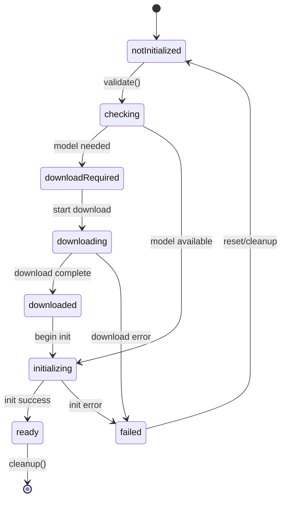
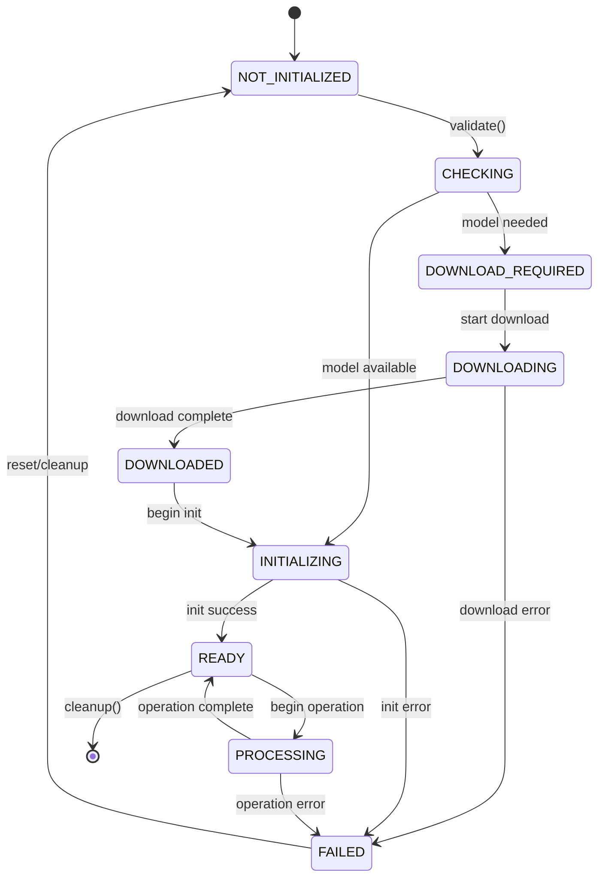

# Component Lifecycle Comparison: iOS vs KMP

## Executive Summary

This analysis compares component lifecycle management between the iOS Swift SDK and Kotlin Multiplatform (KMP) SDK implementations. Both SDKs follow a similar architectural pattern with BaseComponent classes but have key differences in state management, initialization flows, and platform-specific lifecycle integration.

## iOS Implementation

### Component Base Classes

The iOS SDK uses a sophisticated component architecture centered around `BaseComponent<TService>`:

```swift
@MainActor
open class BaseComponent<TService: AnyObject>: Component, @unchecked Sendable {
    // Core properties with MainActor protection
    public private(set) var state: ComponentState = .notInitialized
    public private(set) var service: TService?
    public let configuration: any ComponentConfiguration
    public weak var serviceContainer: ServiceContainer?
    public let eventBus = EventBus.shared
    public private(set) var currentStage: String?
}
```

**Key Characteristics:**
- **Thread Safety**: Uses `@MainActor` for UI thread confinement
- **Memory Management**: Weak references to prevent retain cycles
- **Type Safety**: Generic service type with protocol constraints
- **State Protection**: Private setters with public getters

### State Definitions

iOS defines comprehensive component states with clear transitions:

```swift
public enum ComponentState: String, Sendable {
    case notInitialized = "Not Initialized"
    case checking = "Checking"
    case downloadRequired = "Download Required"
    case downloading = "Downloading"
    case downloaded = "Downloaded"
    case initializing = "Initializing"
    case ready = "Ready"
    case failed = "Failed"

    public var isReady: Bool { self == .ready }
    public var isTransitioning: Bool {
        switch self {
        case .checking, .downloading, .initializing: return true
        default: return false
        }
    }
}
```

**State Features:**
- **8 distinct states** covering full lifecycle
- **Computed properties** for convenience checks
- **String raw values** for debugging and logging
- **Sendable conformance** for concurrency safety

### Initialization Flow

iOS follows a structured 3-stage initialization process:

```swift
public func initialize() async throws {
    guard state == .notInitialized else {
        if state == .ready { return } // Idempotent
        throw SDKError.invalidState("Cannot initialize from state: \(state)")
    }

    updateState(.initializing)

    do {
        // Stage 1: Validation
        currentStage = "validation"
        eventBus.publish(ComponentInitializationEvent.componentChecking(...))
        try configuration.validate()

        // Stage 2: Service Creation
        currentStage = "service_creation"
        eventBus.publish(ComponentInitializationEvent.componentInitializing(...))
        service = try await createService()

        // Stage 3: Service Initialization
        currentStage = "service_initialization"
        try await initializeService()

        // Complete
        currentStage = nil
        updateState(.ready)
        eventBus.publish(ComponentInitializationEvent.componentReady(...))
    } catch {
        updateState(.failed)
        eventBus.publish(ComponentInitializationEvent.componentFailed(...))
        throw error
    }
}
```

**Initialization Features:**
- **Stage tracking** with `currentStage` property
- **Event emission** at each stage transition
- **Comprehensive error handling** with state rollback
- **Idempotent behavior** for multiple calls

### State Transitions

iOS manages state transitions with event emission:

```swift
private func updateState(_ newState: ComponentState) {
    let oldState = state
    state = newState
    eventBus.publish(ComponentInitializationEvent.componentStateChanged(
        component: Self.componentType,
        oldState: oldState,
        newState: newState
    ))
}
```

### Cleanup Procedures

iOS implements thorough cleanup with proper resource management:

```swift
public func cleanup() async throws {
    guard state != .notInitialized else { return }

    state = .notInitialized
    try await performCleanup() // Subclass override
    service = nil
    state = .notInitialized // Double assignment for safety
}
```

### Error Recovery

iOS uses comprehensive error handling:
- **State-aware errors** with context
- **Event emission** for error notifications
- **Graceful degradation** with fallback states
- **Memory cleanup** on failures

## KMP Implementation

### Common Implementation

The KMP SDK provides a similar base component structure in `commonMain`:

```kotlin
abstract class BaseComponent<TService : Any>(
    protected val configuration: ComponentConfiguration,
    serviceContainer: ServiceContainer? = null
) : Component {

    override var state: ComponentState = ComponentState.NOT_INITIALIZED
        protected set
    protected var service: TService? = null
    protected val eventBus = EventBus
    private var serviceContainer: ServiceContainer? = null
    protected var currentStage: String? = null
    private var _status: ComponentStatus = ComponentStatus(ComponentState.NOT_INITIALIZED)
}
```

**Key Differences from iOS:**
- **No MainActor**: Uses traditional thread safety approaches
- **Kotlin idioms**: Property delegates and null safety
- **Enhanced status**: Additional `ComponentStatus` with metadata

### State Management

KMP defines similar but fewer states:

```kotlin
enum class ComponentState {
    NOT_INITIALIZED,
    CHECKING,
    DOWNLOAD_REQUIRED,
    DOWNLOADING,
    DOWNLOADED,
    INITIALIZING,
    READY,
    PROCESSING,  // Additional state not in iOS
    FAILED
}
```

**Differences from iOS:**
- **Enum naming**: Uses SCREAMING_SNAKE_CASE
- **Additional PROCESSING state** for active operations
- **No string raw values** (uses enum names)
- **No computed properties** (handled separately)

### Initialization Pattern

KMP follows a similar but simplified initialization:

```kotlin
suspend fun initialize() {
    if (state != ComponentState.NOT_INITIALIZED) {
        if (state == ComponentState.READY) return // Idempotent
        throw SDKError.InvalidState("Cannot initialize from state: ${state.name}")
    }

    updateState(ComponentState.INITIALIZING)

    try {
        // Stage 1: Validation
        currentStage = "validation"
        eventBus.publish(ComponentInitializationEvent.ComponentChecking(...))
        configuration.validate()

        // Stage 2: Service Creation
        currentStage = "service_creation"
        eventBus.publish(ComponentInitializationEvent.ComponentInitializing(...))
        service = createService()

        // Stage 3: Service Initialization
        currentStage = "service_initialization"
        initializeService()

        // Complete
        currentStage = null
        updateState(ComponentState.READY)
        eventBus.publish(ComponentInitializationEvent.ComponentReady(...))
    } catch (e: Exception) {
        _status = ComponentStatus(
            state = ComponentState.FAILED,
            error = e,
            currentStage = currentStage,
            timestamp = getCurrentTimeMillis()
        )
        updateState(ComponentState.FAILED)
        eventBus.publish(ComponentInitializationEvent.ComponentFailed(...))
        throw e
    }
}
```

**Similarities to iOS:**
- **Same 3-stage process** (validation, service creation, service initialization)
- **Stage tracking** with `currentStage`
- **Event emission** at transitions
- **Error handling** with state rollback

**Differences from iOS:**
- **Enhanced status tracking** with `ComponentStatus`
- **Suspending functions** vs async/await
- **Different event types** (ComponentInitializationEvent vs direct events)

### Platform-Specific Implementation

#### Android

Android platform integration uses Context-based initialization:

```kotlin
// androidMain/PlatformContext.kt
actual class PlatformContext(private val context: Context) {
    actual fun initialize() {
        AndroidPlatformContext.initialize(context)
    }
}
```

**Android-specific features:**
- **Activity/Fragment lifecycle awareness** (through integration points)
- **Memory pressure handling** via Android memory monitors
- **Permission management** for microphone/storage access
- **Background processing** considerations

#### JVM

JVM platform provides desktop/plugin support:

```kotlin
// jvmMain/PlatformContext.kt
actual class PlatformContext(private val workingDirectory: String = System.getProperty("user.dir")) {
    actual fun initialize() {
        System.setProperty("runanywhere.workdir", workingDirectory)
    }
}
```

**JVM-specific features:**
- **File system access** without permission constraints
- **Thread management** for background processing
- **JNI integration** for native libraries
- **IntelliJ plugin lifecycle** integration

## Gaps and Misalignments

### 1. State Differences

| Aspect | iOS | KMP | Gap |
|--------|-----|-----|-----|
| State Count | 8 states | 9 states | KMP has extra PROCESSING state |
| Naming Convention | camelCase with descriptions | SCREAMING_SNAKE_CASE | Inconsistent naming |
| String Values | Raw string values | Enum names only | iOS more debug-friendly |
| Computed Properties | Built-in convenience methods | Separate utility functions | iOS more ergonomic |

### 2. Initialization Gaps

| Feature | iOS | KMP | Status |
|---------|-----|-----|--------|
| Stage Tracking | ✅ currentStage | ✅ currentStage | ✅ Aligned |
| Event Emission | ✅ Comprehensive | ✅ Similar events | ✅ Mostly aligned |
| Error Context | ✅ State-aware errors | ✅ Enhanced with ComponentStatus | ✅ KMP slightly better |
| Idempotent Behavior | ✅ Built-in | ✅ Built-in | ✅ Aligned |
| Progress Reporting | ❌ Limited | ✅ ComponentStatus with progress | ✅ KMP better |

### 3. Cleanup Disparities

| Aspect | iOS | KMP | Gap |
|--------|-----|-----|-----|
| Resource Cleanup | Basic service cleanup | Enhanced with container cleanup | KMP more thorough |
| Error Handling | Throws on cleanup errors | Silent cleanup with logging | Different error strategies |
| Stage Reset | Manual reset | Automatic with status tracking | KMP more automated |
| Memory Management | Weak references + nil assignment | Explicit nulling | iOS safer with weak refs |

### 4. Thread Safety

| Feature | iOS | KMP | Gap |
|---------|-----|-----|-----|
| Concurrency Model | @MainActor confinement | Traditional mutex/coroutines | Different approaches |
| State Access | MainActor protected | Property protection | iOS stricter |
| Event Bus | Thread-safe SharedFlow | Coroutine-based SharedFlow | Similar but different execution contexts |

### 5. Error Recovery

| Aspect | iOS | KMP | Gap |
|--------|-----|-----|-----|
| Error Types | SDKError hierarchy | SDKError with sealed classes | Similar approach |
| Recovery Actions | Manual state reset | ComponentStatus-driven recovery | KMP more automated |
| Error Propagation | Event bus + exceptions | Event bus + exceptions | Aligned |
| Context Preservation | Limited context | Rich ComponentStatus | KMP better |

### 6. Platform Integration

| Platform | iOS | KMP Android | KMP JVM | Gap |
|----------|-----|-------------|---------|-----|
| Lifecycle Hooks | ✅ Full iOS lifecycle | ❌ Limited Activity integration | ❌ No application lifecycle | Missing Android/JVM integration |
| Memory Pressure | ✅ iOS memory warnings | ✅ Android memory monitors | ❌ Basic JVM monitoring | JVM needs improvement |
| Background Processing | ✅ iOS background tasks | ✅ Android services | ✅ JVM threads | Well covered |
| Permission Handling | ✅ iOS permission system | ❌ Manual Android permissions | ✅ JVM no restrictions | Android needs work |

## State Transition Diagrams

### iOS State Transitions



### KMP State Transitions



**Key Difference**: KMP includes `PROCESSING` state for active operations, allowing better tracking of component activity.

## Recommendations to Address Gaps

### 1. State Alignment

**Priority: High**

```kotlin
// Align KMP states with iOS naming and add missing computed properties
enum class ComponentState(val displayName: String) {
    NOT_INITIALIZED("Not Initialized"),
    CHECKING("Checking"),
    DOWNLOAD_REQUIRED("Download Required"),
    DOWNLOADING("Downloading"),
    DOWNLOADED("Downloaded"),
    INITIALIZING("Initializing"),
    READY("Ready"),
    PROCESSING("Processing"), // KMP-specific
    FAILED("Failed");

    val isReady: Boolean get() = this == READY
    val isTransitioning: Boolean get() = when (this) {
        CHECKING, DOWNLOADING, INITIALIZING, PROCESSING -> true
        else -> false
    }
    val isError: Boolean get() = this == FAILED
}
```

### 2. Enhanced iOS Progress Tracking

**Priority: Medium**

```swift
// Add progress tracking to iOS ComponentStatus
public struct ComponentStatus: Sendable {
    public let component: SDKComponent
    public let state: ComponentState
    public let modelId: String?
    public let progress: Double? // Add this field
    public let error: Error?
    public let lastUpdated: Date
    public let currentStage: String? // Add this field
    public let metadata: [String: Any]? // Add this field
}
```

### 3. Standardized Lifecycle Hooks

**Priority: High**

```kotlin
// Add platform-specific lifecycle integration
interface PlatformLifecycleIntegration {
    suspend fun onApplicationStart()
    suspend fun onApplicationStop()
    suspend fun onMemoryPressure(level: MemoryPressureLevel)
    suspend fun onPermissionResult(permission: String, granted: Boolean)
}

// Android implementation
class AndroidLifecycleIntegration(
    private val activity: Activity
) : PlatformLifecycleIntegration {
    override suspend fun onApplicationStart() {
        // Integrate with Activity lifecycle
    }
    // ... other implementations
}
```

### 4. Unified Error Recovery

**Priority: Medium**

```kotlin
// Standardized error recovery across platforms
interface ErrorRecoveryStrategy {
    suspend fun canRecover(error: Throwable, state: ComponentState): Boolean
    suspend fun recover(component: BaseComponent<*>, error: Throwable): ComponentState
    fun getRecoveryOptions(error: Throwable): List<RecoveryAction>
}

sealed class RecoveryAction {
    object Retry : RecoveryAction()
    object Reset : RecoveryAction()
    object Fallback : RecoveryAction()
    data class Custom(val action: suspend () -> Unit) : RecoveryAction()
}
```

### 5. Enhanced Memory Management

**Priority: Medium**

```kotlin
// KMP: Add weak reference support similar to iOS
class WeakServiceContainer {
    private var _container: ServiceContainer? = null

    var container: ServiceContainer?
        get() = _container?.takeIf { it.isActive }
        set(value) { _container = value }
}

// iOS: Add automatic cleanup on memory pressure
extension BaseComponent {
    @objc private func handleMemoryWarning() {
        Task {
            if state != .ready {
                try? await cleanup()
            }
        }
    }
}
```

### 6. Event Bus Standardization

**Priority: Low**

```kotlin
// Standardize event types across platforms
sealed class ComponentLifecycleEvent {
    abstract val component: SDKComponent
    abstract val timestamp: Long

    data class StateChanged(
        override val component: SDKComponent,
        val oldState: ComponentState,
        val newState: ComponentState,
        override val timestamp: Long = currentTimeMillis()
    ) : ComponentLifecycleEvent()

    data class StageChanged(
        override val component: SDKComponent,
        val stage: String,
        val progress: Float? = null,
        override val timestamp: Long = currentTimeMillis()
    ) : ComponentLifecycleEvent()

    // ... other events
}
```

## Implementation Priority

### Phase 1 (Immediate - High Priority)
1. **State alignment** between iOS and KMP
2. **Platform-specific lifecycle integration** for Android
3. **Standardized error recovery** strategies

### Phase 2 (Short-term - Medium Priority)
1. **Enhanced progress tracking** in iOS
2. **Memory management improvements** in KMP
3. **JVM lifecycle integration**

### Phase 3 (Long-term - Low Priority)
1. **Event bus standardization**
2. **Advanced error recovery** automation
3. **Performance optimizations**

## Conclusion

Both iOS and KMP SDKs follow similar component lifecycle patterns with good architectural alignment. The main gaps are in state naming consistency, platform-specific lifecycle integration, and enhanced error recovery. The KMP implementation actually provides some improvements over iOS in areas like progress tracking and error context preservation.

Key architectural strengths:
- **Consistent 3-stage initialization** across platforms
- **Comprehensive state management** with event emission
- **Extensible service provider pattern**
- **Strong type safety** with generics

The recommended improvements focus on standardizing the interface while preserving platform-specific optimizations, ensuring both SDKs can evolve together while maintaining their respective platform advantages.
